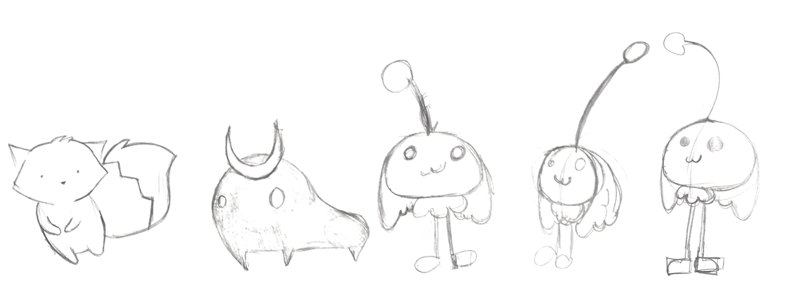
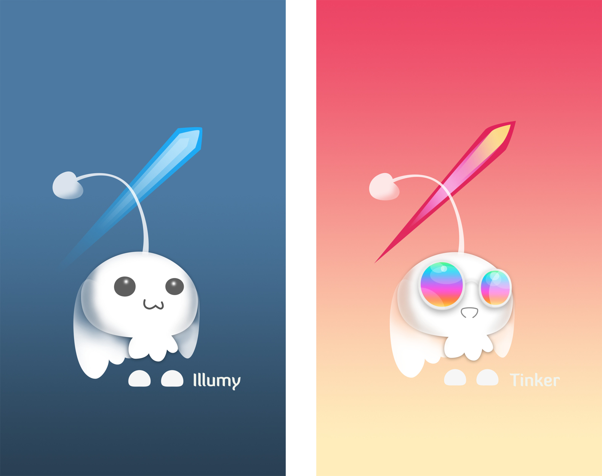
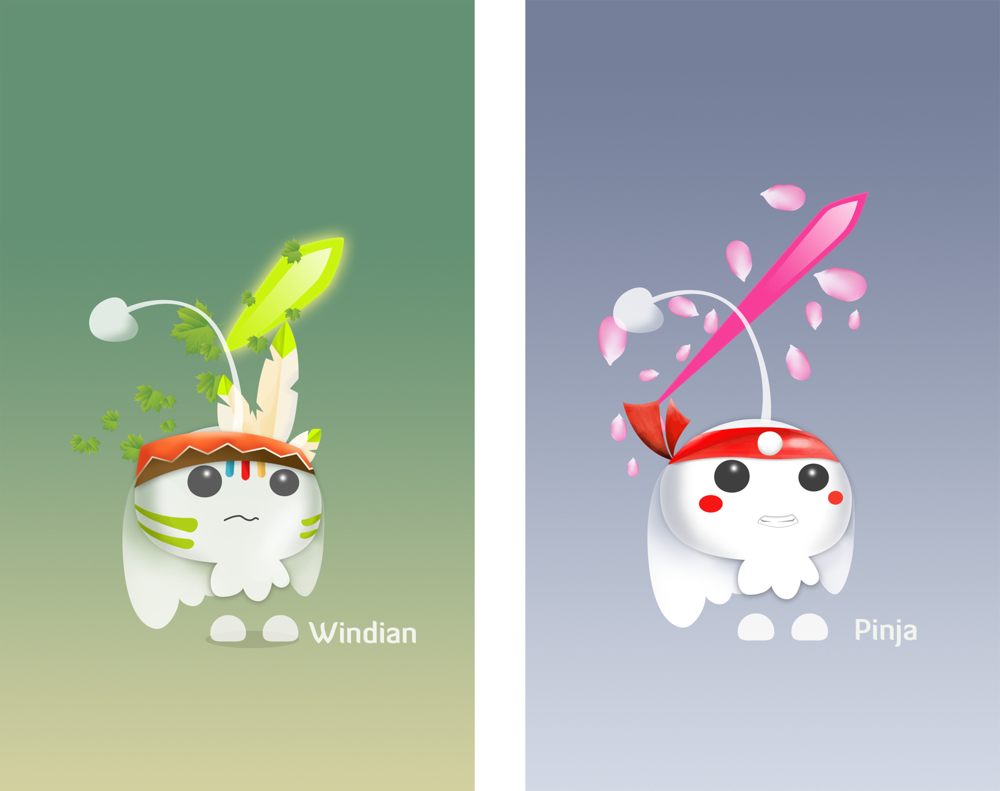
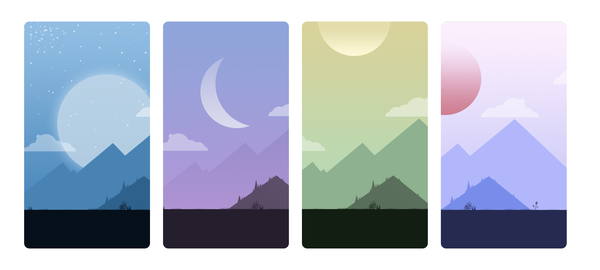
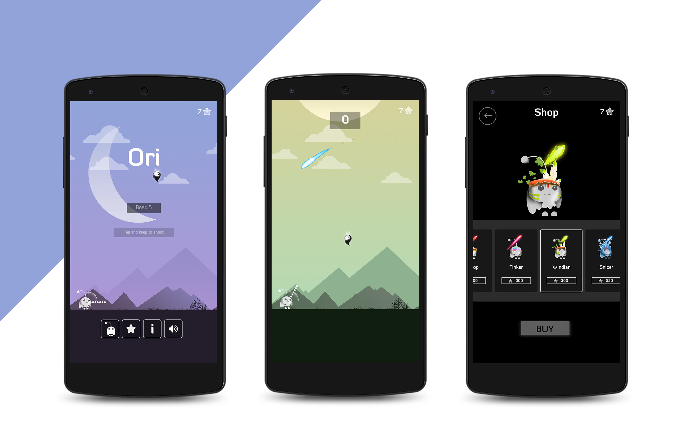

## The Backstory

Two of my friend are gamers, they are addicted game. But beyond that, they want to create games for them-self.

I really don't like play game, but I want to create something for myself in my free time.

We decided to collaborate to make a game. And that's why we made this game.

## Character Design

#### Early Concept

  

#### Final Characters & Skins

  

  

#### Background concept

  

## Game In Action

  

---

## Team

* Trong Nguyen - Game Designer & Artist

* Pham Nguyen Binh Son - Developer

* Bui Van Nam - Developer