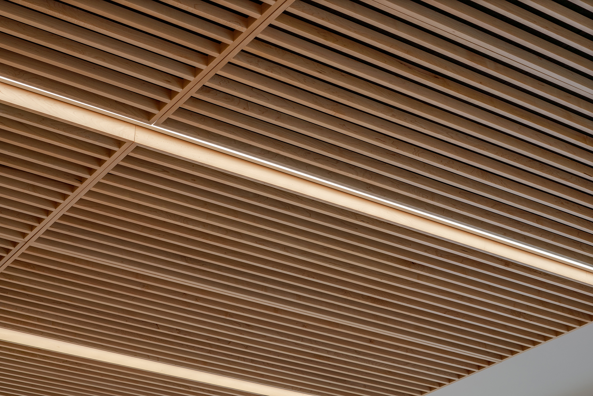

## The Backstory

  

  

  

  

">
  

- - -

## More Portfolio Galleries

[Exterior →](/exterior-photography) / [Interior →](/interiors-photography) / [Abstract →](/abstract-architecture-art) / [Construction →](/construction-photography) / [Twilight →](/twilight-photography) 