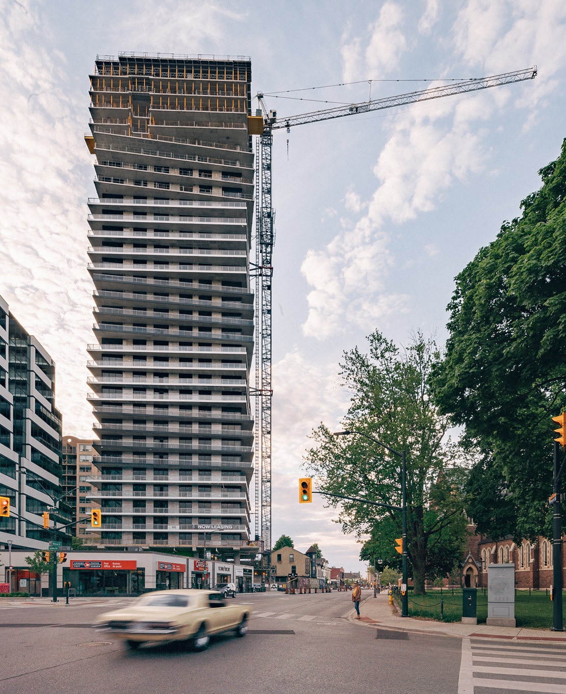

## My roles
I was part of a design team of two and responsible for the experience strategy and design of the Web and the mobile app (iOS and Android). I produced wireframes, all interfaces and interactions between April 2015 and March 2016.

  

### More Portfolio Galleries

[Twilight→](/twilight-photography) / [Interior →](/interiors-photography) / [Details →](/detail-photography) / [Exterior →](/exterior-photography) / [Abstract →](/abstract-architecture-art) 