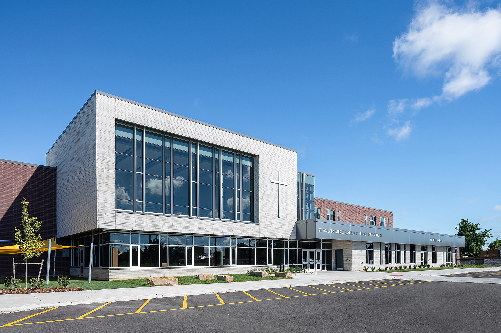
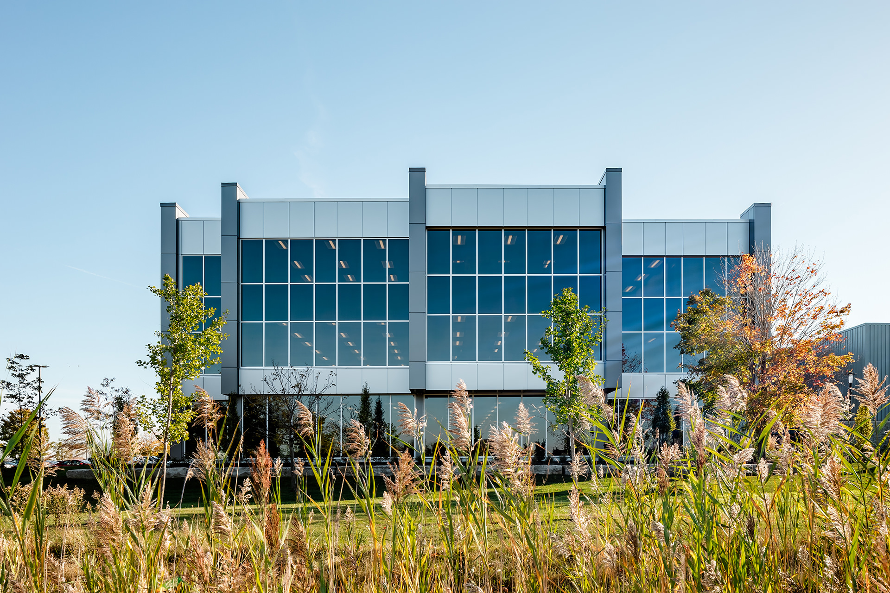
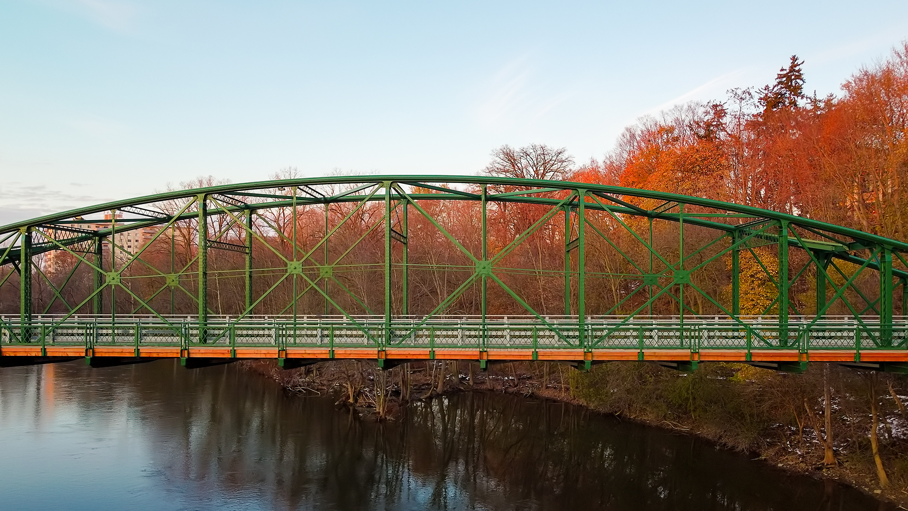

##### Process

  

  

## Define problems
At Code Engine Studio, we work with many clients, many web & app projects and many team members, we need to track time and get paid from clients.

We tried to used different app to track our time, some of them are very expensive, some are cheaper, tracking time easier but we must spend 4 hours/week to do a report on Google Sheet.

We think we can create a better app that focuses on ease of tracking time and good reports.

  

- - - -

###### More Exteriors

### Personal Project Photos 
Find some additional media from some personal projects.

  

<video autoplay loop muted playinline src="https://myvideos01.s3.ca-central-1.amazonaws.com/flying-towards-historic-bridge.mov"></video>

  

### Report

Run report based on projects, person, time span.

