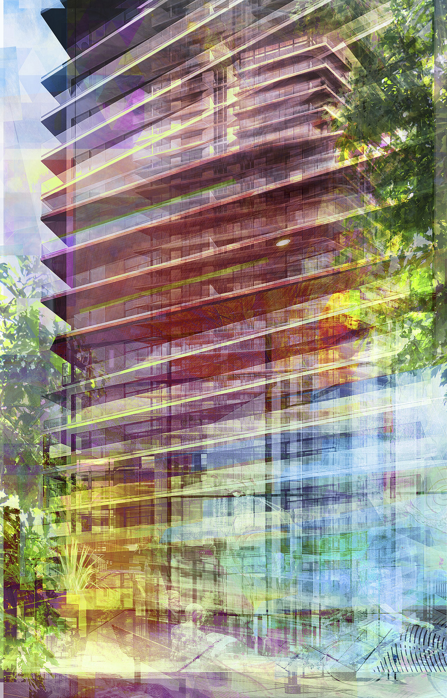

## The Backstory

Bright and visually stimulating abstract art created from architectural photographs I’ve shot. 

This art came out of my exploration to create architecture art for a client and now continue to create. If you would like a custom piece created, I do take on commissions.

  

- - -

### More Portfolio Galleries

[Exterior →](/exterior-photography) / [Interior →](/interiors-photography) / [Details →](/detail-photography) / [Construction →](/construction-photography) / [Twilight →](/twilight-photography) 