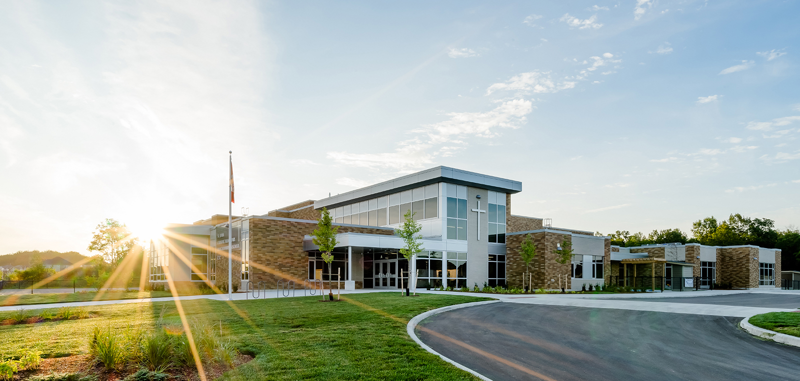
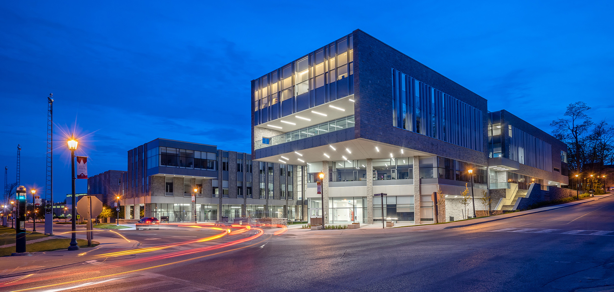
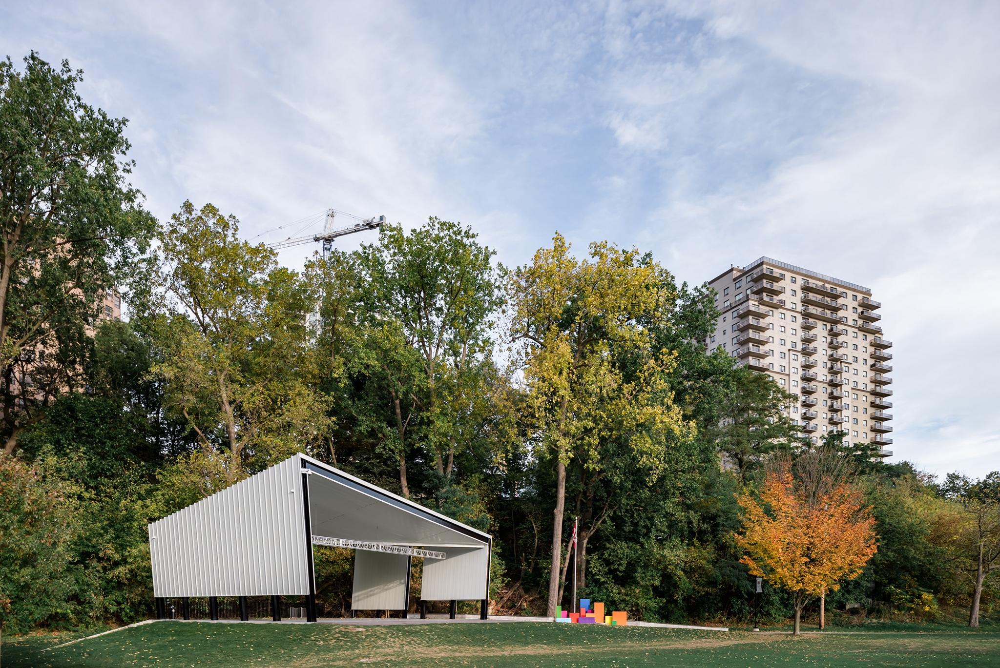
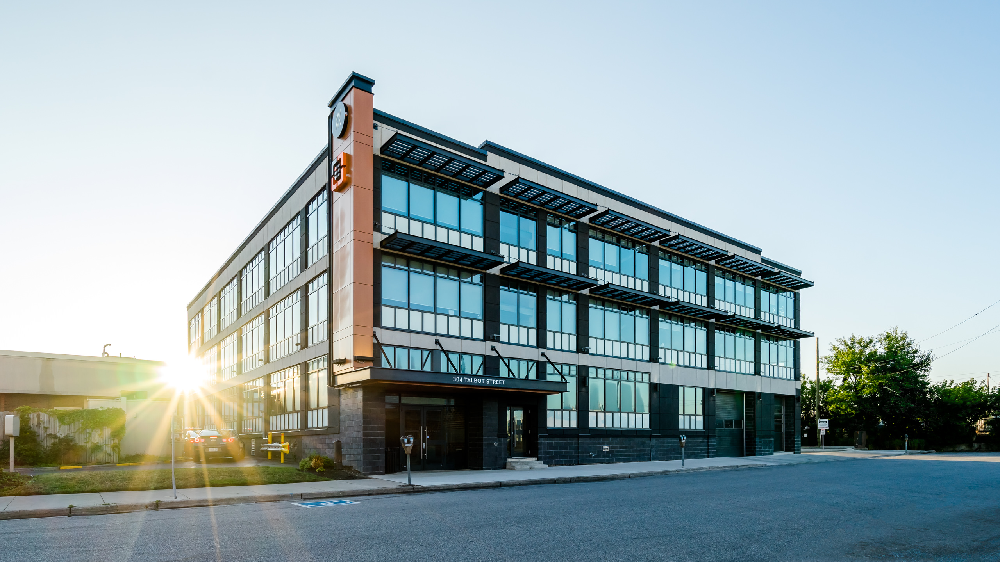
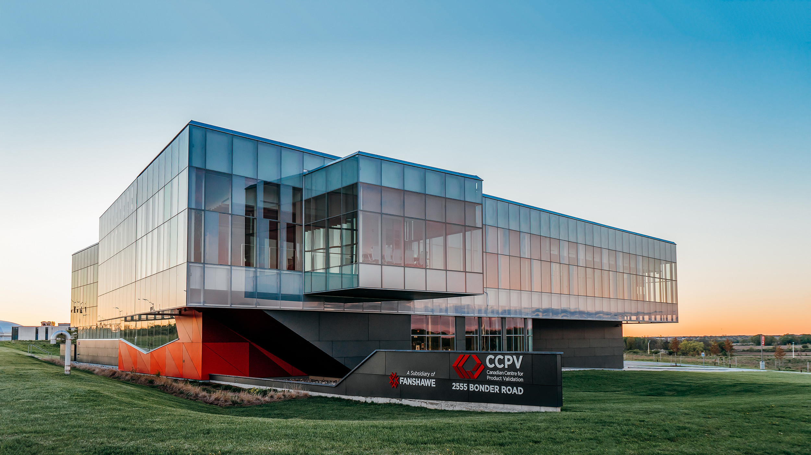
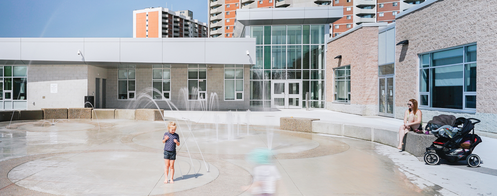
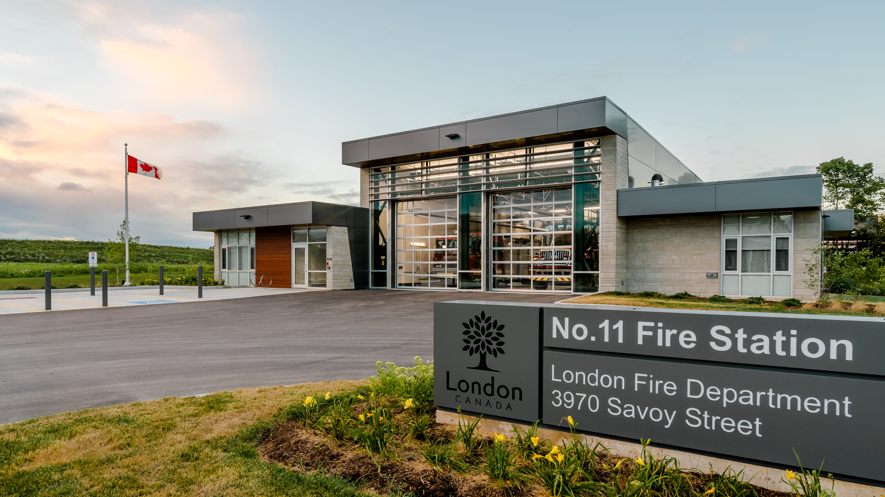

In just a couple of days (April 23rd, 2018), at the  London Convention Centre , The London and St. Thomas Association of REALTORS® will host and celebrate the 2017 Don Smith Commercial Building Awards. If you’re not familiar, this is a biannual reception and awards ceremony recognizing the top commercial, industrial, multi-family and community buildings across the LSTAR region (London and St. Thomas, I believe). 

> “This is a tremendous opportunity to recognize the outstanding talent, innovation and design by the developer, construction and architectural businesses who create these amazing buildings across the region.”— John Geha, LSTAR

The 20 nominees will be judged on how environmentally sensitive the individual buildings were; on design and innovation; and on the extent to which they met a specific developmental need within the broader community. The categories are Commercial (retail and office), Industrial, Multi-family and Institutional (community).The buildings needed to have been completed between August 1, 2015, and July 31, 2017. 

## The Nominees for the 2017 Don Smith Commercial Building Awards

* WEST 5
* **St. John Catholic Elementary French Immersion**
* Goodlife Home Office
* Sobeys Plaza Oxford and Wonderland
* **FIMS and Nursing Building, Western University**
* Masonville Place Renovations
* **Canada 150 Pavilion at Harris Park** 
* Villas of Wortley
* LSR (London Street Railway) Power Plant
* **The Cube – Talbot Street**
* London City Centre Re-Vitalization Project
* Elemex Architectural Façade Systems
* Design and Construction of Mixed-Use Building Renovation
* **Canadian Centre for Product Validation (CCPV), Fanshawe College**
* Sodecia Global Technology and Innovation Centre
* London Free Press/Post Media
* MEC London
* **South London Community Centre**
* **No. 11 Fire Station** 
* Violence Against Women, Services Elgin County, Residential and Counselling Facility

This list is fire! The buildings in bold are ones I’ve been privileged to photograph and you can also see them below: 

  
  <figcaption>St. John Catholic Elementary French Immersion</figcaption>

  
  <figcaption>FIMS and Nursing Building, Western University</figcaption>

  
  <figcaption>Canada 150 Pavilion at Harris Park</figcaption>

  
  <figcaption>The Cube – Talbot Street</figcaption>

  
  <figcaption>Canadian Centre for Product Validation (CCPV), Fanshawe College</figcaption>

  
  <figcaption>South London Community Centre</figcaption>

  
  <figcaption>No. 11 Fire Station</figcaption>

Personally, I’d love to see Cornerstone Architecture’s design for  No. 11 Fire Station  to get an award and be recognized for another amazing Fire Station. The  No. 7 Fire Station  by Cornerstone received a Don Smith Commercial Building Award in 2015. 

## More to the Awards This Year
A legacy category has been introduced to the awards this year. This award is to recognize any building that is unique and/or significant to the London and St. Thomas jurisdiction!The 6 *Legacy Award* nominees are: 

*  [London Life](/london-life-freedom-55) 
* CASO Station, St. Thomas
* University College, Western Tower
* St. Peter’s Basilica
* Middlesex County Court House
* Elgin County Court House

— More details about the awards and tickets to the reception can be found on the  [original release](http://www.lstar.ca/news/lstar-celebrates-excellence-commercial-real-estate-don-smith-commercial-building-awards) .

---