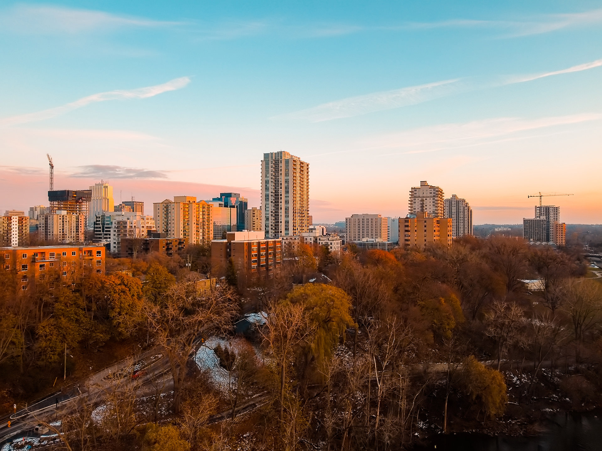
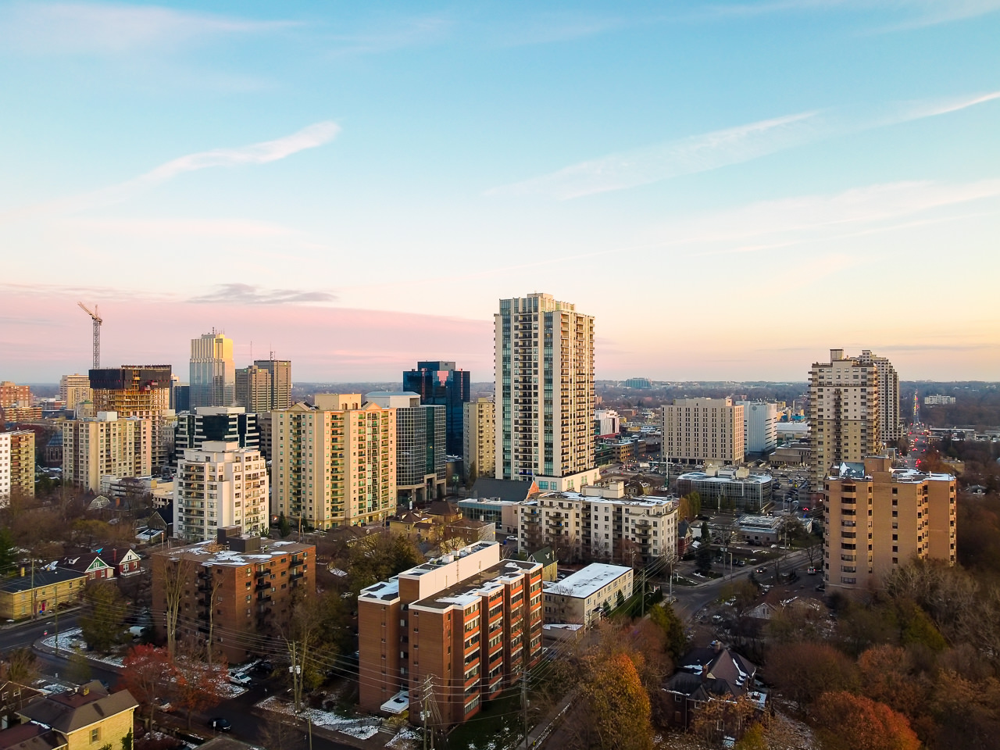
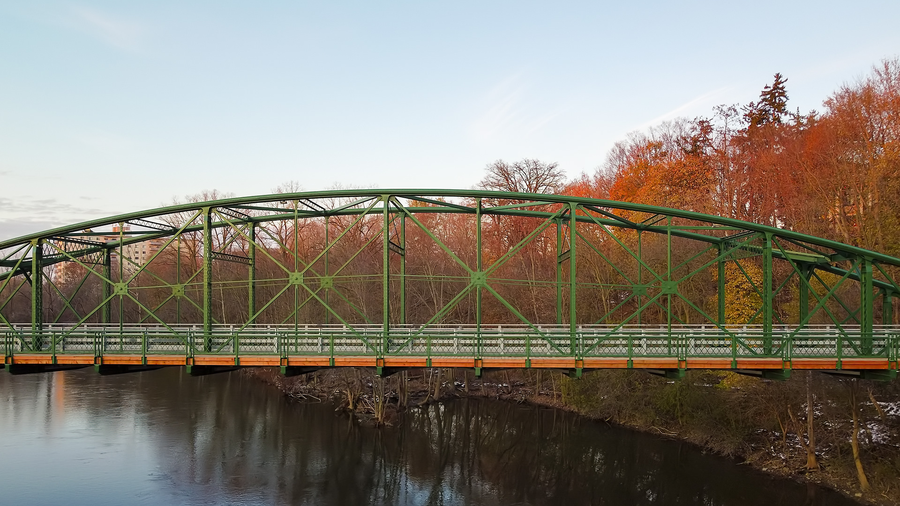

After a full day of photo editing, it was time to fly. Yes, I picked up the [DJI Mavic Mini](https://click.dji.com/ALJ_9LCOtNUkm2VXsinGaQ?pm=link). A drone that's smaller than my kitten. This blog post really isn't much for my [architectural photography](/) (at this point), but a couple of my first photos with the mini quadcopter! 

These 2 photos are of the ever-evolving skyline here in London, Ontario. 

  
  <figcaption>London Skyline from my first DJI Mavic Mini Flight</figcaption>

## Quick thoughts on Mavic mini photos

To be honest, the photos I shot with the Mavic Mini today reminded me of shooting on the iPhone or a phone camera. The images aren't super unbelievable but they aren't terrible either. Right now, the photos are shot only in jpeg and not RAW. I have no idea if there will be an update in the future related to the photos, but you can still push the jpegs a bit in post. For these first photos, I used Lightroom and a little Photoshop to edit them.

For a device this small, I'm blown away at what's possible. In both photos, you can see the growth of [One Richmond Row](/one-richmond-row-reaches-top) and how it impacts the downtown skyline.

  
  <figcaption>London, Ontario from Above as the sun sets in November 2019 - Less warmth & saturation added in post</figcaption>

## Making Time for Exploration & Creative

The battery for the Mavic Mini lasts 30 minutes. It's probably less during the cold. Today, I was flying for only about 17 minutes and my hands were pretty cold. With such a small window of time to fly, I figured I could try to make time for exploring the sky with this little thing. 

With such practice, maybe my videos will be watch-able! On my first flight, I did shoot some video; however, it makes me dizzy and I think you'd need some Gravol to watch at this point. As well, the editing takes me longer than I'd like still - it's a weekend kinda thing.

  
  <figcaption>Mavic Mini Looking at the Blackfriars Bridge - A beautiful Heritage Structure here!</figcaption>

## First Mavic Mini Flight Video

https://youtu.be/Lmxm5K1dJDs

Forward to the 27-second mark for the Mavic Mini footage to start :)