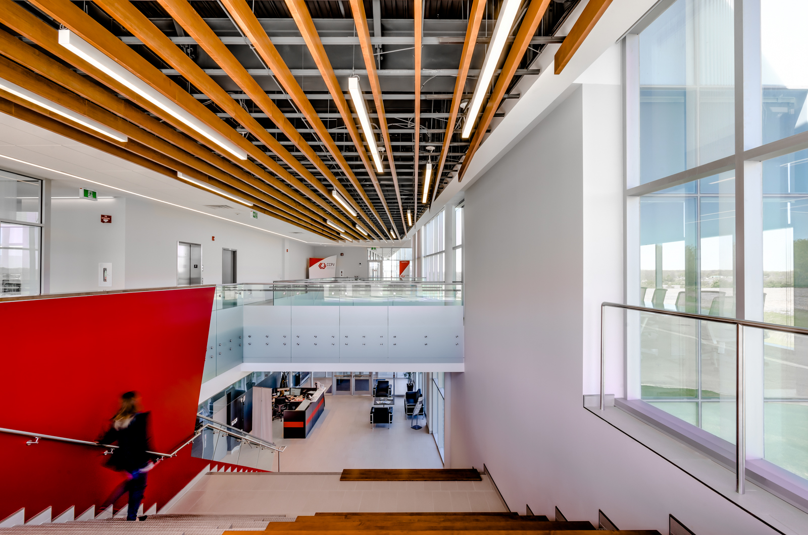
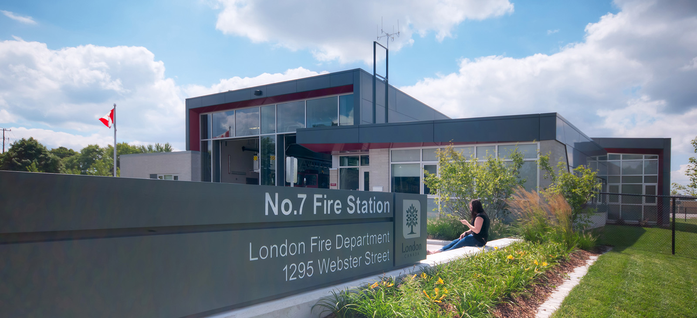
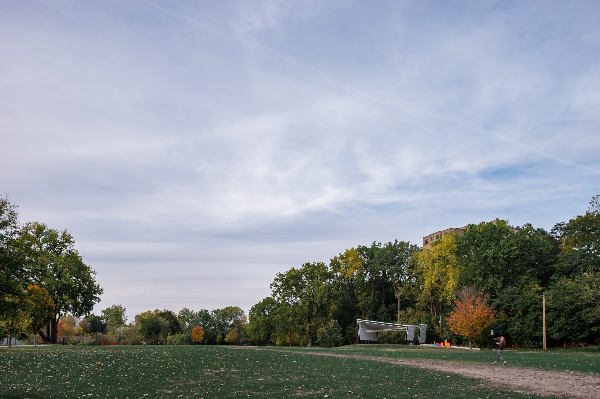

It shouldn't come as a surprise that including people in [architectural photography](/) is highly worthwhile. Think of architectural renderings and including people to interact with the proposed design. Including people in the rendering helps tell the story of the design and draws the viewer to have an experience.

The same goes for photographs.

Including people in every architectural photo can be difficult. You've got to have patience if you don't have your own model. The right amount of patience is always worthwhile. I've come to love the way being an [architectural photographer](/) forces me to slow down or return at different times to see how people are experiencing spaces and how light interacts in different ways.

When a project doesn't have a great deal of traffic or human flow at the time of the shooting, I will try teasing an employee to help, bring an assistant or models, or use the architect if in attendance. The best people are the unsuspecting public as it's the most authentic.

  
  <figcaption>Person going down the stairs for action in interior photograph at CCPV</figcaption>

## Why Include People In Architectural Photography

As a photographer, I try to include people in architectural photography because of:

- Adding human scale
- Showing how real people are experiencing and moving through the architecture
- Making the building much more alive and meaningful to the viewer
- Allowing the viewer to project themselves into spaces and create intrigue
- Improving the overall composition for increased engagement (people over index)
- Highlighting details and use

  
  <figcaption>Woman sitting in front of the fire station</figcaption>

However, it's to be said that I'm doing my best to create an authentic image which provides the viewer clarity as the building, interior, or home exists in the real world. Showcasing architecture projects without people leaves the viewer feeling isolated and potentially clinical. Our brains are getting better and better at questioning if a photo has used too much Photoshop.

## Why I don't Photoshop People into Architecture Photos
It's really simple: I'm not creating another rendering. Architects are already creating very realistic renderings or 3d images of their designs - as mentioned in my post [on sky replacement](/sky-replacement). Architectural renderings may not fully represent the built work in the real world when all is said and done. I'm on a mission to get more businesses to confidently showcase the progress and built work with photography alongside renderings.

Sure, a library of blurred (or not) people could help a someone spend less time at a site, but I opt to try and have an assistant to move through a composed frame or use the real and live people there. As well, wouldn't it be a bit weird if you and your photographer were using the same library of people images for your work?

> I don't believe in paying a photographer to create another project rendering.

I believe this investment in your business is to help you share as honest experience as possible and build trust with clients and the community. Our collaboration is about securing repeat clients and leading to more projects in the future.

Real or Photoshopped, it may not be a big deal to some. It's these fine details that can leave viewers questioning the image. Humans are visual by nature and are drawn to clarity even if they might not be able to fully explain why they like one image more than another. Even a blurry person, not Photoshopped, in a photo has unique light and shadows that are a result of the architecture.

## With and Without People
With digital photography, we can take a lot of images. Since I don't price my work based on a per photo basis, it's highly likely that I could provide my clients with images that include people or leave them out.

### What do you think?

  
  <figcaption>Imagine yourself at the park and a young child running around.</figcaption>

I would love to hear your thoughts on people in architectural photography in the comments. If you're an architect, designer, builder, or developer, I highly recommend the natural inclusion of people in architectural photography of your projects.

In an upcoming article, I'll share another way I bring spaces alive.

### Would you like to be a model?
I'm building up a list of people interested in being a model in future architecture and [interior photography](/interiors-photography) assignments. Shoot me an email if you're interested! Or, share this post with someone that might be of interest.