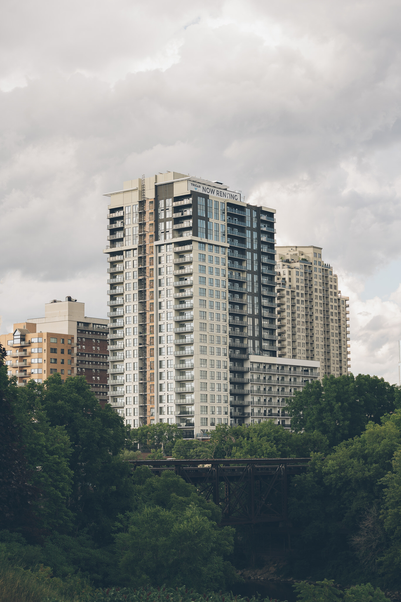
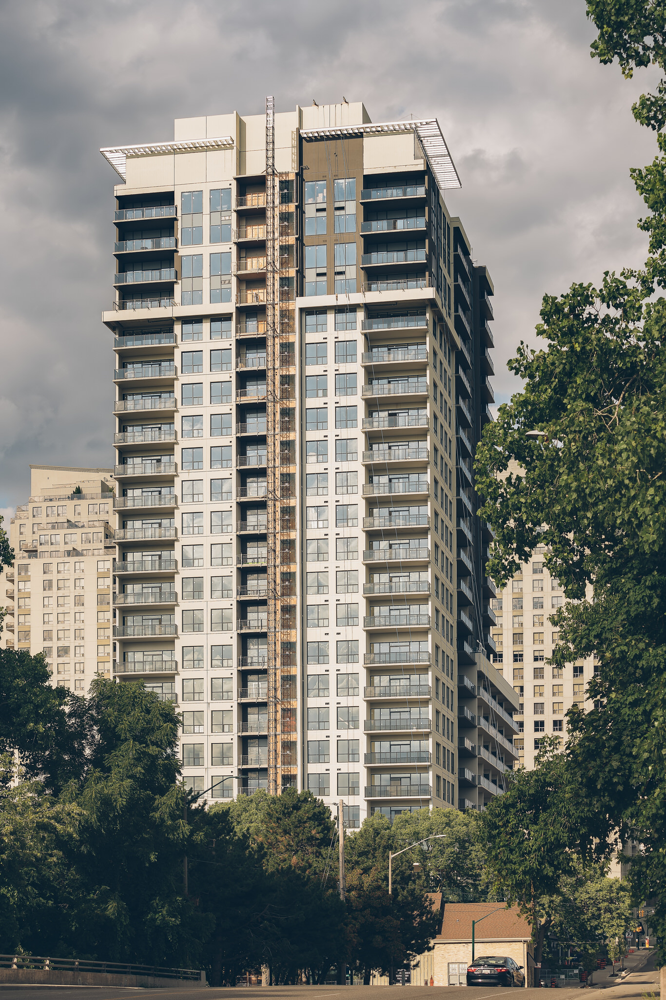
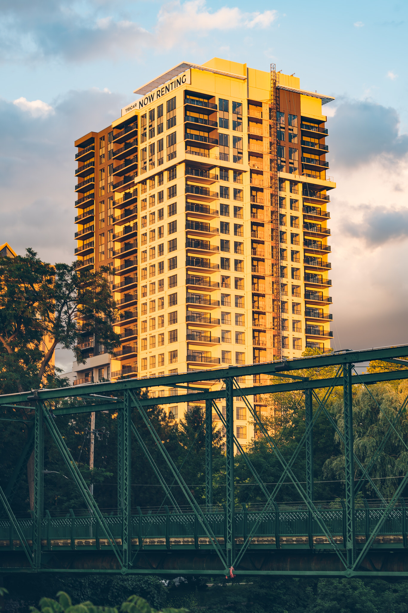
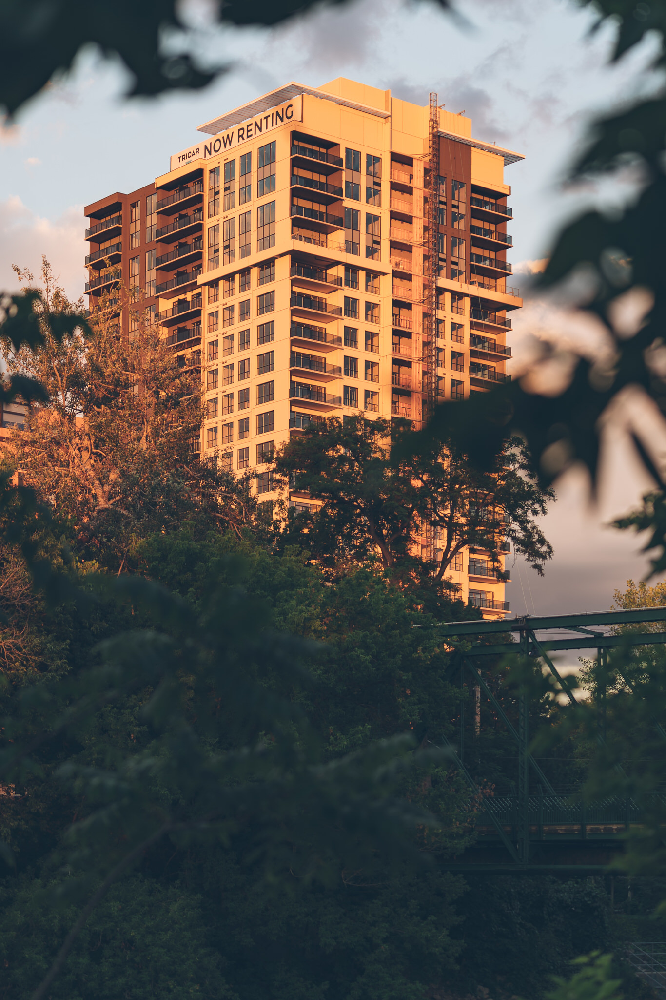
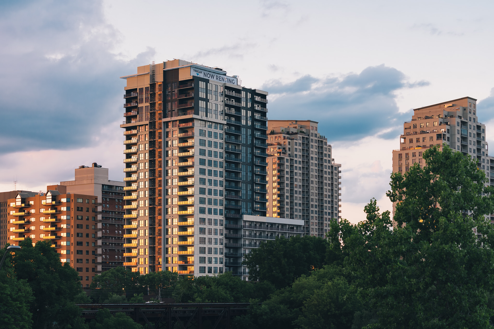

We’re into Summer here in London, Ontario and the trees are out to remind us we’re in the Forest City. That said, I took liberty to capture a few photos of Tricar's Riverwalk, a building soon to be complete on York Street. 

Because of the rich greenery, could the building have been named Forestwalk? 

  
  <figcaption>Emerging from the forest city</figcaption>

Typically, when shooting [architectural photography](/), I’m found with a wide-angle lens attached to my Sony A7RIII camera; however, on this day, I opted to strap on a 70-200mm telephoto lens to capture Riverwalk still finishing up [construction](/construction-photography). 

I loved the results and I can’t help but feel as if the building isn’t even in the downtown core as it emerges from a forest of trees.

  
  <figcaption>Looking east on York Street towards Riverwalk</figcaption>

## Riverwalk in amazing location

Don’t get me wrong, I’m not saying that I’m against the name Riverwalk. While I did submit a few of my own ideas for the name, I’m just getting an interesting feel for the building as I took the photos and reviewed them. 

Riverwalk’s location is amazing I feel these photos really help sell that.

If I was in the market for another place, I’d love to be comparing Riverwalk and One Richmond Row (and maybe even Centro). 

Being downtown London would be most excellent. We can’t get past the rad design happening with One Richmond Row, but Riverwalks location is pretty tempting too. Hey, I like to imagine living downtown someday.  

  
  <figcaption>New Tricar building glowing in sunset</figcaption>

  

  
  <figcaption>Riverwalk glowing reflection at Sunset in London, Ontario</figcaption>

I look forward to taking more photos once Riverwalk is fully completed, but I needed to get out and try and get back into the swing of things. 

I’ve felt defeat with everything happening around Covid-19 and this is me trying to rise from these ashes of defeat. 

[Learn more about Riverwalk](https://www.tricar.com/locations/riverwalk/)

- - -

Are you or somoneone you know involved in a building project that could use my photography help? I'd love to hear about it. [Drop me an email](/contact) or say hi on social media.