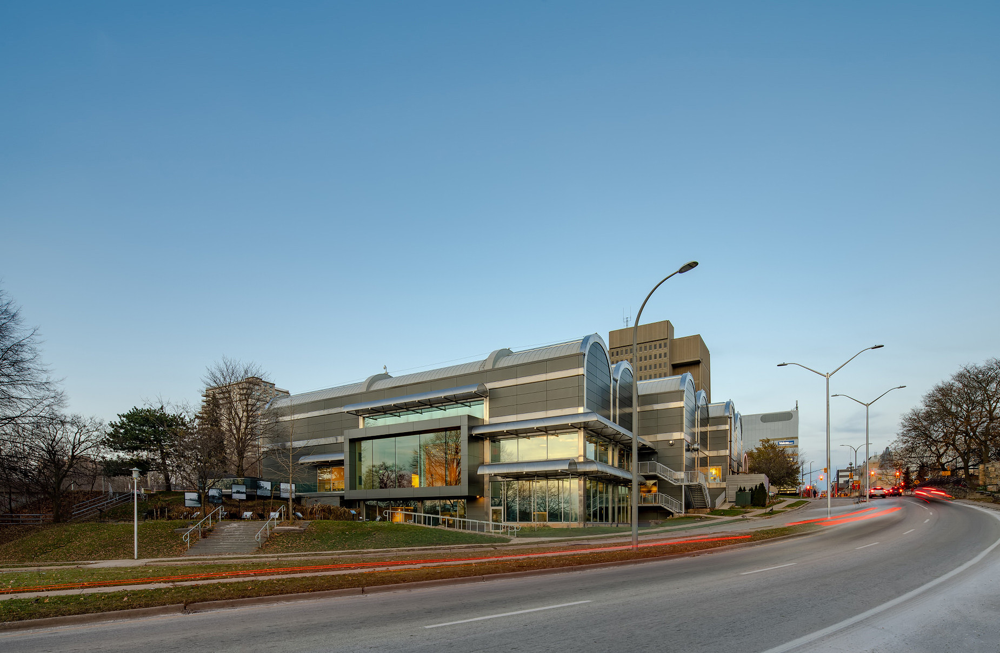
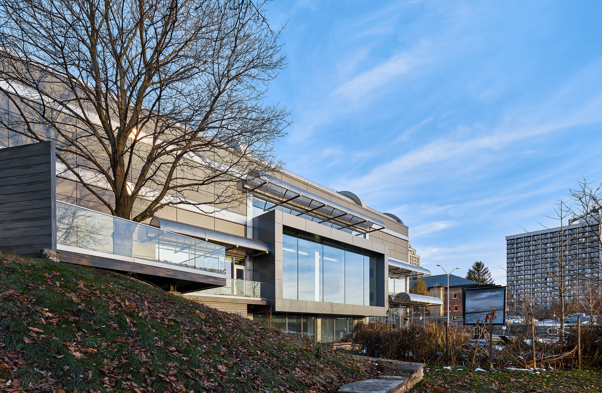
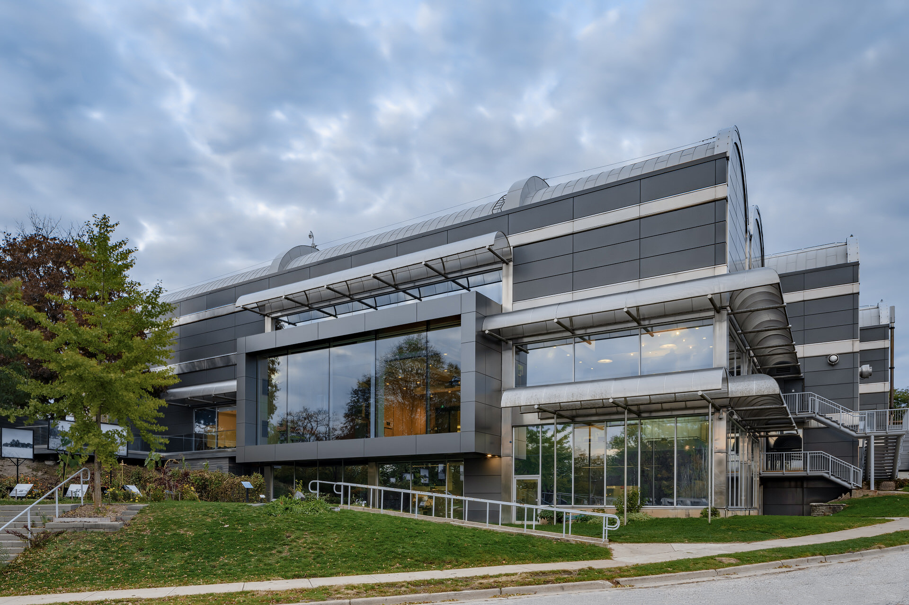
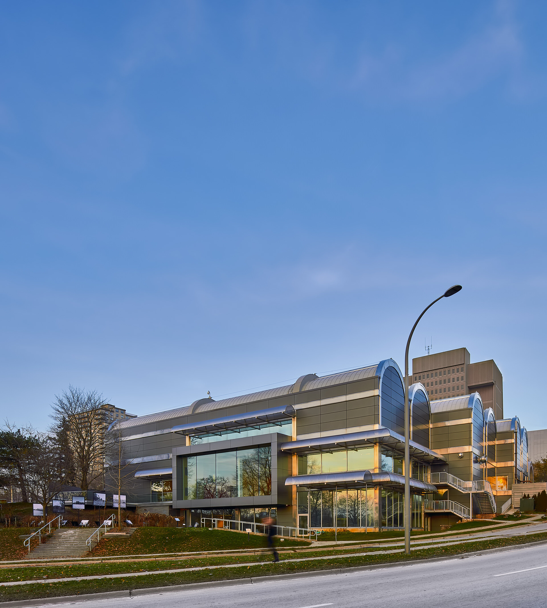
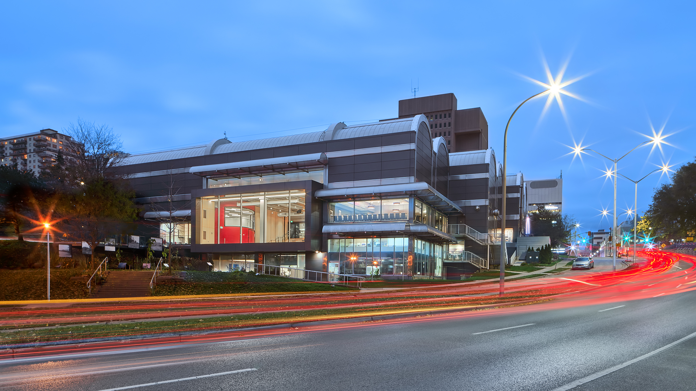

In this post, I share my [building photography](/) of the modern renovation of Museum London - Centre at the Forks. This beautiful update by [Nicholson Sheffield Architects](https://nicholsonsheffield.ca/) is part of the Forks of the Thames change here in London, Ontario. The Forks of the Thames is a big deal for the city as it will be an asset and a significant community amenity, showcasing the city’s profile and reputation for the desirability of living and locating businesses within the downtown. This said I believe there is an imminent need for beautiful architectural photography.

I originally photographed the [interior](/interiors-photography) and [exterior](/exterior-photography) of the building in late autumn of 2018. The weather was pretty rough at the time and a lot of leaves had fallen. It was one of those situations where there was nothing that could be done though. I could only plan to try and take some photos at an earlier time in 2019.

## MUSEUM LONDON LATE AUTUMN 2018

  
  <figcaption>Cars driving by Museum London in Downtown London, Ontario</figcaption>

  
  <figcaption>Museum London in late fall of 2018</figcaption>

  
  <figcaption>Scouting photo of Centre at the Forks - Museum London on overcast day autumn 2018</figcaption>

  
  <figcaption>Architectural Photo of Museum London by Scott Webb Photography</figcaption>

  
  <figcaption>Twilight photo of Museum London</figcaption>

Overall, I don't mind these photos from 2018 because they show the transformation and that the museum exists year-round. 

Despite imperfect weather, the building still looks awesome. The renovation feels so good and I think this is how it should have been from the beginning.

- - -

I did return in early Autumn 2019. View [Museum London in 2019 →](/museum-london-2019)

Also check out more photos of Museum London at the links below:

- [Interior Photography of Museum London →](/museum-london-interior)
