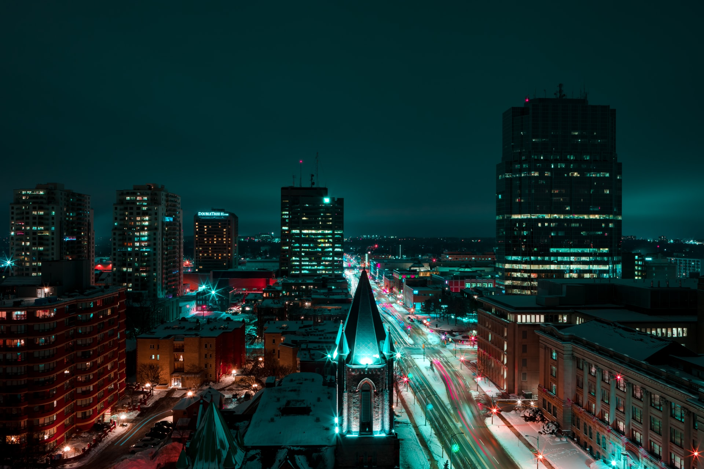

Recently, I've come across a number of articles related to London, Ontario using some cringe-worthy stock photos. When I see these, all I can think about is that the photo was probably purchased years ago through a stock photo site and it's the only representational photo of London in their photo library. I can't imagine the person feeling super excited by the image or feeling confident it will help with any engagement. 

I always want my city to be represented in a quality way and it's one reason I have been contributing more and more free London Ontario photos for download and use through Unsplash.

## Free London Ontario Photo Collection
Since much of what I photograph is [architectural photography](/), you'll find it will dominate the London Ontario Collection I've created on Unsplash as well. Most recently, I've added free photos of the architecture of One London Place and London City Hall. These are actually, quite old, free London Ontario photos dating back to around 2010, but I feel they have an evergreen look. The photos in this post are from [the collection](https://unsplash.com/collections/453347/london-ontario).

  

## Giving London Ontario Photos Away
I believe in finding ways to give back to my city and providing free visual content for use is one way that I found. I also love the idea of images of London being used by millions of people and you never know what it could lead to for our city.

People email me regularly and some questions do relate to the location of the photo if I didn't already list it. These photos have been helping bloggers, designers, and many businesses with their work and selling products too. 

In my opinion, high-quality photography is more important than ever before and images have a much greater use now! They transcend so much further beyond pretty pictures that you can like and comment on. 

I would love to create a much more extensive London Ontario collection of free photos! If this sounds awesome to you, I'd love your support. By support, I'm talking micro support for $1 per month through Patreon. If you've found use for any of my free photos, you've saved much more money :)

  

Regardless, more free images from around London will happen!

Remember, if you have found a way to use a photo of mine, I'm always interested in seeing what you've done. Please share it with me so that I can share and feature here in a future post.

[Browse and download the free photos](https://unsplash.com/collections/453347/london-ontario)

- - -
