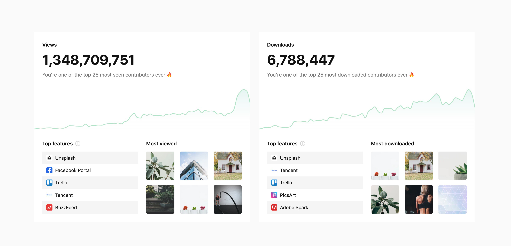
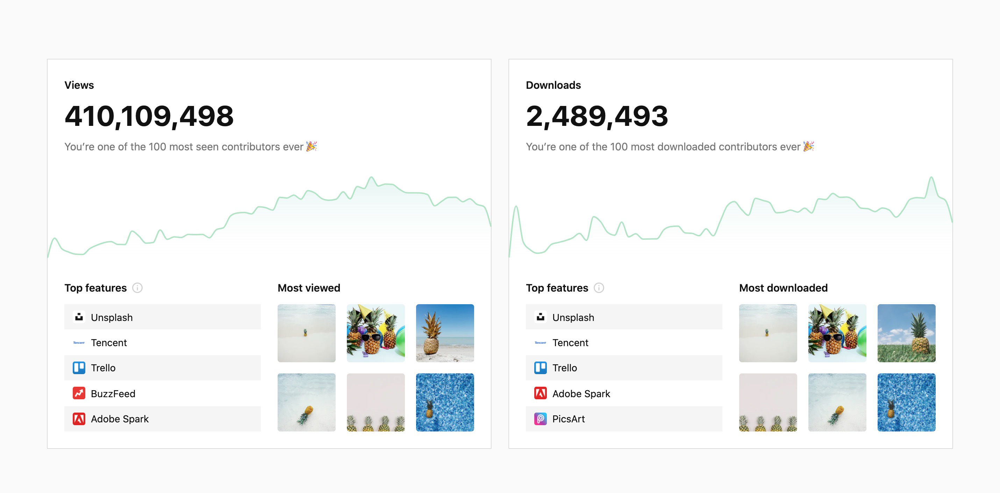

#### The Backstory
## A brief history with Unsplash

I love building side projects online, and it was one of these—an accidental ‘competitor’ to Unsplash called HAYSTAAK (now killed)—that first brought me in touch with the Unsplash team. My project was to offer photos like a “Dollar Store” but quickly turned to giving photos away. Searching if anyone was doing this, I found the young Unsplash.However, I had no idea how much of a giant I was up against, and after burning out on the day job/freelance/side project grind I spotted a ‘we’re hiring’ link on Unsplash and wondered if I could make a larger impact on the photographic and design communities by abandoning my own project to join Unsplash. 

### Team Unsplash
I knew it was a long shot, but I didn’t market myself as a social media guru and instead just shared how I worked hard to show the small number of followers on my own site how much I cared for them, emailing every single person individually and expressing my desire to genuinely want to help them find photography to use that wasn’t cheesy stock, a huge expense, or a waste of time. It was an amazing 9 months working with the, at the time, tiny Unsplash Team. Leaving Unsplash was bittersweet. As is often said, everything happens for a reason and I am fully shooting London Ontario architectural photography, self-employed and growing my side project called Pineapple Supply Co.I contribute as much as possible to the Unsplash Community. Building and being part of the community is special. You can actually find my first two Unsplash Community Dispatches on the old Crew blog still. 

- - -

##### As of Oct 20th 2020
## Unsplash photo Stats

  
  
Unsplash stats for <a href="https://unsplash.com/scottwebb" title="View profile on Unsplash">Scott Webb</a>

  
  
Unsplash stats for <a href="https://unsplash.com/pineapple" title="View profile on Unsplash">Pineapple</a>

I’ve been able to build two accounts, my own profile and a profile for pineapples, that have surpassed the 1M downloads mark.

In my eyes, Unsplash is full of opportunity for everyone — photographers, contributors, people that need beautiful photos, brands, businesses, and Unsplash. It’s never too late to start contributing and giving back. It’s amazing what’s possible when you don’t care who gets the credit and you have no expectations. 

Everyone, especially a professional photographer, has at least 9 photos they can contribute that are exceptional but not being used.

- - -