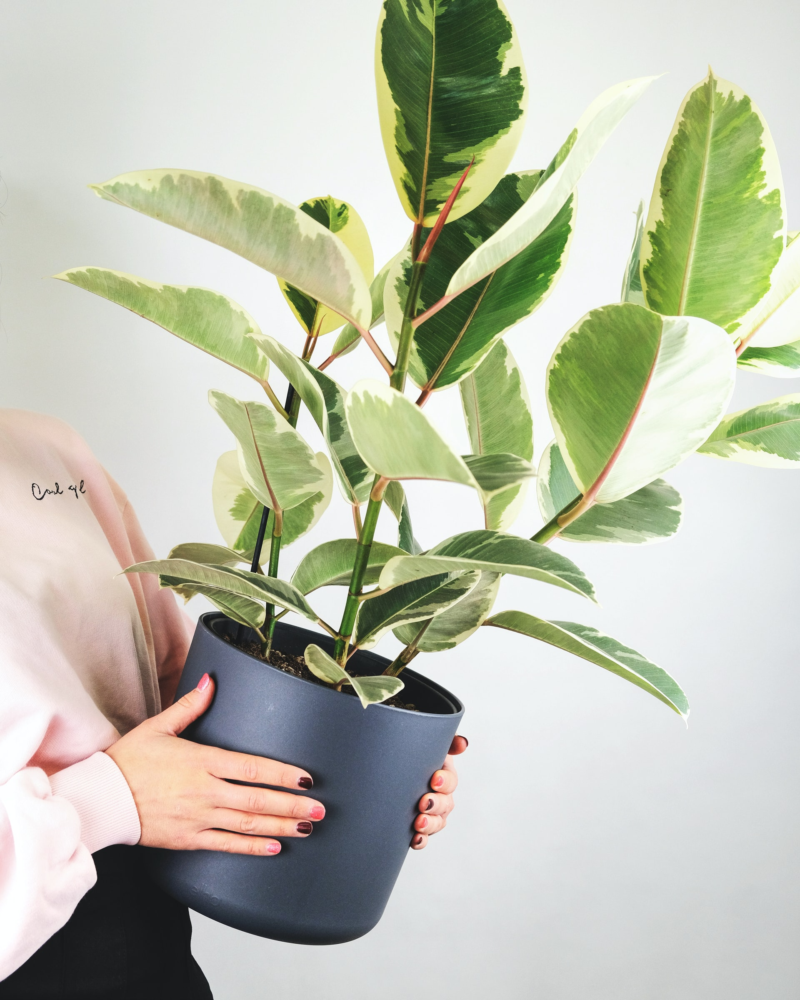
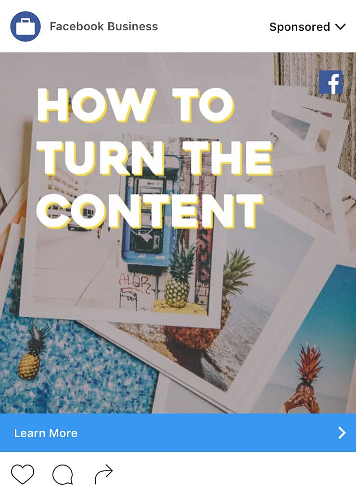
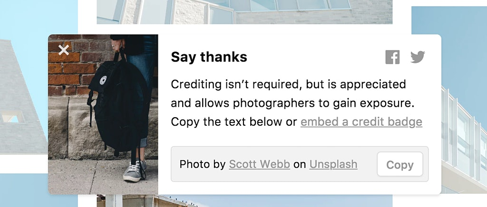

In 2017, [Unsplash](https://unsplash.com) [shared a few details](https://medium.com/unsplash/the-future-of-photography-and-unsplash-811f114aab7a) on where they see the future of photography and their company. Their focus appears to be on a photographer search and hire opportunity to potentially support their photo contributors. I was left with many thoughts and questions instead of confidence in their support for the contributors. Everyone keeps focusing on the people downloading and using the photos. Seems few people are discussing the contributors of the photos. How does Unsplash make money that could be partially distributed to creators/contributors? Does it even need to happen? So far, I've seen Unsplash to make money through partnerships and native advertising - seen when multiple contributors to Unsplash were commissioned to shoot photos with a Google laptop or something. I'm sure Unsplash made money in all that. This money would be outside of the investments they've received. 

Is that the future for creators?

Is being hired for a photography job the future of paid photography work through Unsplash? How many people are actually searching for photographers to hire through Unsplash? While the licensing of photos was devalued in the article, there were no statistics that showed more people, companies, and brands are searching for custom photographers on Unsplash. The only stat was one making their focus a bit counterintuitive as Mikael said 70% of downloads appear to be of non-commercial needs: 

> While almost everyone needs images to do their jobs today, the jobs we do with imagery are different from when photos used to be licensed by media buyers or photo agencies for commercial use. For example, almost 70 percent of the people who download images on Unsplash have never downloaded a photo from a stock photo site before. And the most common uses for Unsplash photos are presentations, blogs, or personal projects.

Does this mean 30% of downloaders on Unsplash are potentially looking into hiring for paid shoots and working with a contributor they've downloaded from in the past? Or am I completely misunderstanding this? I'm also curious if Unsplash has an average contributor earning target they would like to hit through hired work?As the way things are today, I never expect any photo I contribute to be visible other than on my profile. It's looking tougher and tougher for that exposure; however, I've not been able to make time for taking photos that I'd really share on Unsplash. If a photo makes it into the New section, this is really where your photo has a chance of being seen more than Instagram and the front page of the New York Times. 

## All we have is exposure...yet

If a photo doesn't make it onto the new page, I call this photo a "fish out of water" because it's just flopping. It becomes a photo that a few followers might see. Even with over 10K followers on Unsplash, a photo that is released will get minimal views through the following feed. I'm not sure how many Unsplash users are regularly checking their following feed. I know I'm very lazy on going to it and I would consider myself a pretty heavy user. This is why I think the following feed would be more valuable if we could follow collections too. 

Yes, the exposure you receive in the new or trending is mind-blowing compared to other platforms. To continue to see this exposure, I would advise to consistently contribute and be active within the Slack community; however, this requires you to upload more of your photography and a greater time commitment to the Unsplash community. Is such a commitment sustainable? Both of these elements are of high value and the reason I've written such a long piece around it. 

## The Unsplash Proposed Future of Photography

  
  
How green does the future look for Unsplash contributors? Photo by <a href="https://unsplash.com/photos/JFKLyHJ4mNE">Severin Candrian</a>

From what I gathered, the future of photography and earning some dollar bills will still come in the form of getting hired for work on projects. The best case for getting hired is that you've established some type of relationship with viewers or downloaders of your photos in the past. With Unsplash being a completely free platform to get high-resolution photography, people will no doubt return over and over. Does it mean the people will continually think of you? It seems Unsplash is betting on this idea. As photographers and contributors increase, space will become increasingly tough, but people are being hired for work on Instagram today through DMs. The same thing happening on Unsplash is definitely not out of the question from my own experience.Unsplash didn't give us too much information on the potential of a contributor being hired by someone to work. No sneak peak at a "hire me" button like you can find on 500px and Ello today. They could release some updates today and provide something special still. Instead of a preview, it still felt theoretical and still far off. I'm curious to know because the content creators still have to use a hack by adding email to their description and there isn't any public display of social media information.Please, don't mistake what I am writing as negativity surrounding Unsplash. I'm one of the people that have seen an ROI with Unsplash. No, I'm not the one flown all around the world. I've booked work and the most recent job is a monthly retainer that will cover much of my necessities. This monthly retainer is for a fitness brand and I love that I was found due to giving away free photos through a site like Unsplash. Another job I've booked is the one and only wedding I'm shooting in 2017. I swore off wedding photography to be a specialized architectural photographer; however, this felt special. The wedding is for another Unsplash user. How's that for creating relationships within the community. I've also started up Pineapple Supply Co. due to giving away pineapple photos via Unsplash as a side project. I create pineapple photos each month and dream to create a one-stop pineapple shop for the internet. No doubt, I've spent more than I've earned on this project, but it's grown out of traction on Unsplash.

## The photography Industry is bigger than stock

The photography industry is crazy and the future of photography can't really be summed up in relation to stock photography. There are so many different types of photography, ones that you can't use stock photos. Professional photographers will still be needed to help people, companies, and brands. It will be up to the photographers to determine how they see their work and what their photography is worth. 

#### Here is where my mind starts to run.

> In fact, as I write this, a donation from someone awesome has landed in my PayPal account.

My mind really starts to run when it comes to Unsplash's desire to connect photographers with paying clients and financially incentivize contributions. Is this going to help Unsplash make money too? For example, will they facilitate the connection between photographer and client as seen with design & developers connected with clients via CREW? I would assume there would be some way for Unsplash to earn a cut of the deal. If Unsplash proposed even a 1% cut from a deal, it could be a dent in the photographer's pay cheque. I could imagine some users bypassing the feature and leaving things how they are now. It's much like selling a license to a photo through your own website instead of an online marketplace that takes a cut. Thankfully, I've made some photo licensing deals through my own website this year and I've kept 100% of the sale (minus processing fees). If I sold these photos through a stock marketplace, I'd have only earned 20-70% of the sale while the buyer paid the same price. 

On other creative sites, it seems as if these type of buttons are direct ways to get in touch with the creative through the platform. In the case of the 500px directory, you could also be contacted by 500px for special assignments. Adding this connection to Unsplash wouldn't differentiate them, but align them with their ‘competition.’ The addition of a Hire/support/tip button by Unsplash would at least show financially supporting us contributors is of some importance to them.From the Unsplash article, I can't help but long for more analytics behind photographers being hired through the platform - successful transactions not flakey inquiries. Has there been a huge influx of requests to hire photographers into their support queue? Do we know how often photographers are hired through this kind of feature on 500px or Ello? Or even Dribbble? Has anything been piloted through some users and it went very positive? I ask these questions because I feel a "hire me" type component, along with a support or donate to the photographer should be incorporated as a profile staple. In fact, as I write this, a donation from someone awesome has landed in my PayPal account. 

## Contributing to Unsplash vs Pexels

My curious mind desires to run experiments over the different free stock photo websites in terms of support from the community, but I can’t do that at this point. A number of contributors on Unsplash have tried a hack for support from viewers by mentioning their Paypal link in the description as text or as the bio link. This should be enough of a tell to move towards a way to provide a monetization layer to the platform for creators. Over time Unsplash would be able to track everything and iterate from there. I believe Unsplash is the cream of the crop in this space right now and would like to see what could really happen for all contributors and creators.

I can't foresee a quick end to stock photography marketplaces. The perfect photo for someone's project might be on 500px, Eyeem, CreativeMarket, Getty, etc. With digital in such abundance and the difficulty of getting into the Unsplash New feed, it would be silly not to experiment with some of these photography marketplaces. I've experimented with a few places and moved some photos over to Unsplash after 6 months - Year of little action. Or I've removed a photo on Unsplash over to a stock marketplace because it wasn't selected for the new feed. You never know if your photo will be more popular on another platform and this is why I try to upload to other free photo sites too (be sure to read my article on free photo sites you need to look into if you contribute to Unsplash). I've explained or brought up a number of ways for Unsplash to make money and then share the revenue with contributors. 

> Looking at Unsplash, many contributors may not want to do photo shoots for people or companies. I think it would be valuable to earn a passive income for contributors to put back into their enjoyment of photography or travel.

A decent example was over at Vid.me (sadly Vidme is no longer with us. and maybe we could look into that and see if there is anything to relate to Unsplash Monetization efforts). Vid.me was relatively young and were the midst of integrating monetization options. They weren't trying to promote viewers to connect with video creators to make videos for them. Vid.me was building in [into their platform] reasons for creators to continue to upload video. Looking at Unsplash, many contributors may not want to do photo shoots for people or companies. I think it would be valuable to earn a passive income for contributors to put back into their enjoyment of photography or travel. I'm referring to shooting more of what they specifically want to shoot and share.This looks like a monetization strategy that enables everyone to potentially earn and contribute to Unsplash regularly. If I'm hired for more and more shoots, I have less time to shoot other photos and fewer photos (potentially) to freely contribute. Some great contributors could disappear for months out of the year due to workload. Yes, this is good in a sense for the contributor, but not the best for Unsplash or followers. The thing is, I don't know if any contributor is seeing this level of hired work. My vision for the future of photography and Unsplash is autonomy. 

In my original Unsplash Monetization post (now merged here), autonomy for contributors was what I wanted to get across with my ideas and thoughts. I'd welcome it as a nice supplement to my [architecture photography in London](/). Imagine not only a disruption in the distribution of photography but also disruption in the potential for photographers (everyone is a photographer) to earn without the gatekeepers at stock photo sites pixel-peeping your images, selling photo licensing at all, and without relying on getting photography work from a "hire me" feature. My desire would be to have complete freedom of my time to avidly explore and travel so that I could photograph more architecture and other ideas I have. From there, I’d continue adding photos upon my Unsplash profile for others to discover and use freely. This would be a dream to escape frigid Canadian winters while still photographing what makes me feel alive. This would be about a potential for creators to only work on the projects they are most passionate to work on or choose not to work for hire at all. In my mind, to make this a reality, I see all kinds of brands and businesses saving money on some really dope photography from creators on Unsplash. Where are they going to put this savings? Why not into finely tuned ads within the very website giving them the savings. We've seen Facebook, Apple, Spotify, Twitter, and every other company make use of free photos from Unsplash or a copycat site. Photos used by huge brands are viewed in numbers we don’t even know. We do know that curated photos can see exposure beyond what the cover of the NY Times sees. Imagine your photo used in a Facebook ad across Instagram. Eventually, your statistics for your photos are so extraordinary, it’s hard not to question some aspects of the relationship. 

  
  
Facebook Ad via Instagram using one of my free Unsplash photos

### After reaching +1.5 Million photo downloads and +200 Million views (in the least) related to your photos, what's next?

The contributor can show and tell how Facebook used their photo in one of their advertisements, but there was no credit given by Facebook. After this kind of experience happens a few times, you can't help, but ask again: what's next? Even if you never expect anything, an entrepreneurial mind won't sleep on the possibilities and curiosities that lay beneath the surface.

I'm not the only one thinking about financial incentive

A comment on an [article on Photoshelter](https://blog.photoshelter.com/2017/08/unsplash-still-bad-photography/), by the author Allen Murabayashi, hit the nail on the head: 

> They’ve hit a critical mass of supply and demand. Why not build a monetization layer like YouTube so that content creators have a financial reward/incentive?

As I've said before, adding a monetization layer would be newsworthy in the stock photography industry.And Les responded with something to consider, even something that I wonder if I've been dealing with: 

> I have to believe the market will eventually correct this though, as more creators realize they are giving everything and getting nothing. Without incentive to create, the talent and diversity in content will go elsewhere or just get bored of creating.

Even if a hobbyist photographer only makes a few hundred dollars in a year as a stock contributor, this is still money they can put towards their hobby in some shape or form. Even though it took 8 years to get my first Google Adsense payment, there is a financial benefit I can use to for gear, services, tutorials, or courses.  In my vision for the future of photography and Unsplash, I see more and more contributors declaring they are now a "full-time Unsplash photographer" much like you see with people declaring they are a "full-time YouTuber." If I was to consider my recent retainer with a fitness brand, I'd be close to financially covering most of my living expenses each month - for as long as the gig lasts. 

## More criticism could come

Without financial reward opportunities for creators on Unsplash, I feel there could be more criticism like we're seeing from Allen on Photoshelter. At this point, it just starts to look as if Unsplash does receive the majority benefit in such transactions with contributors. The Unsplash community is outstanding, but even getting out to meetups and photo walks has been a lot of driving and overnight expenses. There is no doubt that one of the benefits of contributing is being involved in the community and making new connections with other photographers. But remember, I also want to play the infinite game and if other platforms are able to add monetization opportunities for their creative community, I don't see why Unsplash can't too. This needs to be a priority for the team and anytime I've asked about a monetization possibility, they've already been thinking about it. Let's try something guys! I'm talking something beyond a sweatshirt that benefits one high-profile creator (the sweatshirt is beautiful btw). 

> The contributors are Unsplash's oxygen

More criticism could be directed towards Unsplash if the website doesn't make some moves in the monetization opportunities for creators. Perhaps we need to know more about something like how does Unsplash make money because it would be from that revenue for Unsplash that would potentially be distributed to contributors. I feel like there were more negative replies found within their Medium post than usual. The contributors are Unsplash's oxygen and as a contributing creator, you want to feel like there is a symbiotic relationship. Trust me, I am grateful for the "Thank the photographer" options people can use, but it wouldn't be difficult to integrate a Paypal button. There is no guarantee that you'll ever be given proper credit by people that download your photo and it should be understood there is no guarantee a contributing photographer will be receiving any financial benefit either. Expect nothing and be delighted if someone is generous enough to support your work monetarily. 

## And Finally, Let's get real with stock photo contributor earnings

  

I'll try and get as transparent as possible with my experience over the past year as a stock photo contributor. 

First, we need to mention that in the Unsplash article, only Shutterstock contributor earnings were referenced. Shutterstock isn't the only player in the game and I don't believe a photographer must be exclusive to their company. There are a plethora of stock photography marketplaces around the web like Creative Market, 500px, EyeEm, Getty, your own website(s), and more. My point is a contributor can have multiple revenue streams coming in and boost their earnings. I decided to quickly try and calculate my earnings related to stock photography or the photo licensing model.  

If I look at the last 364 days (most if not all activity in the last 210 days), I must be a crazy anomaly in the media licensing arena. 

**In 2016, a stock photo contributor on Shutterstock averaged $511.** While I don't even contribute to Shutterstock, I've earned over 10X compared to the 2016 stock photo contributor and 2017 figures are supposed to trend down according to Unsplash. I would not consider myself to have an extensive stock photo library either. Many contributors have been building their library for years upon years and it's just what they do for a living. These are the photographers I believe shouldn't even worry about free stock photo sites anyway.  

There is an abundance of opportunity for photographers to earn money via stock photo contributions and other revenue streams. Though, it can be frustrating trying to build up those revenue streams as I've experienced.What's interesting to note, in my specific case, is that my paid photo licensing far outweighs the earnings I've seen come in from uploading free photos to Unsplash. I know, I also wanted a super thrilling reversal and crazy 'moment of truth' for making money with photography on Unsplash. Unsplash becomes another potential revenue stream, though very limited in opportunity still. So far my bank account has seen $1200 on account of giving away photos for free usage on Unsplash. This comes from the Unsplash Book payment to contributors and a deposit for the wedding I'll shoot for another Unsplash contributor in Toronto. If working with the fitness brand lasts at least until the end of 2017, my earnings due to giving away 10 of my fitness photos could catch up to my paid photo licensing. This all comes from a guy that's trying to figure out the business side of photography, what photography is worth, and rarely emailing his subscriber list.

When it comes to my paid photo licensing, I added in donations that come from competitors of Unsplash (Pexels and Pixabay). The generosity I've seen through donations/support/buy me a coffee type buttons have been pretty amazing and it's allowed me to invest right back into my photography business. Over the year, I quickly added up around $250 (after all Paypal fees). If you're someone that supported me, I am truly grateful. These donations also helped lessen the imposter syndrome and motivate me to shoot more/give more. I think everyone would rather receive a PayPal notification over a tweet. Below is the pop up after you download on Unsplash. Here's an opportunity to add monetization opportunities for the contributor - add tip contributor button beside that Facebook button. It could also be a spot for Unsplash to start displaying an ad that wouldn't seem intrusive to their minimalist site design. So where do the other earnings from being involved in charging for some of my digital photos come from?These figures are coming from my memory of just adding up all the different rev streams. Keep in mind, the figures are earnings (USD) and not revenue: 

- $115 from EyeEm

- $95 from 500px

- $1000 from Creative Market

- $3000 from my own websites

Adding this up and converting to CAD, it could be around $5500. Obviously, you can see the big benefit of licensing images directly through my own websites. Depending on a niche, you may be the only source for the images needed and if sold, you earn 100% from the sale (minus misc fees) instead of only receiving 20%, 50%, 70% depending on the marketplace. Had I uploaded these specific photos sold to a site like 500px and hoped for a sale, the photo buyer probably would have never found them. Instead, they came to the direct source and purchasing a few photo licenses was easily cheaper than hiring me to go out and shoot the architecture again. Will this happen again in the near future or in 2018? We'll have to find out. 

I never expect these types of earnings from media licensing, especially because I am pretty loose with my architecture clients on allowing them to share the high-res images with their client or the building owner. This is pretty rare as most photographers want to license the photos over and over if possible. Instead, I want my architectural photography clients to transfer that value into their offering to their client or building owner to increase the likelihood of repeat business and referrals. I've been maddeningly transparent about work and earnings I've received from Unsplash so far and what's to come. Compared to the earnings I've seen as a stock photo contributor, licensing digital photos on multiple marketplaces can still net you an income stream that is more valuable than giving away my photos - at the moment. Keep in mind, a single photography job booked through an Unsplash connection would definitely be greater than the low Shutterstock average. 

With +12 million views a month, I still don't believe I deserve anything for giving away my photos for free. The reason I am passionate about the monetization topic is that it's obvious there are connections and relationships being left in limbo. I don't want the platform to go the way of Vidme. I believe Unspalsh has a real opportunity to monetize the demonetized.  What a flip to the story it could be within the photography industry. 

Perhaps the value of digital photos is more valuable than ever before if the right monetization model is integrated.  Adding the ability for people to inquire about working with a contributor just isn't that exciting, new, or consistent. There definitely could be influencer opportunities like on Instagram if brands are open to photos being free. This could be a 4th opportunity for making money on Unsplash, but I believe it deals more on the side of the contributor's hustle. 

## I Care How Unsplash Makes Money

I don't want this article to be seen as negative and expecting to now earn money from my photography contributed to Unsplash. I'm writing this because I care so much and see a great opportunity to monetize free photos and put dollar bills into the pockets of many more contributors than a hire button. 

Bring on 3 monetization opportunities: Hire/Collaborate, Tip/donate/support creator with Paypal or Stripe, and ad revenue sharing. 

Name the tip or donate button something fun so it doesn't have a feeling of begging for donations. My profiles continue to be updated with new photos because I'm bullish on Unsplash shaping some aspects of the future of photography. A new potential income stream for content creators could emerge. 

I hope my thoughts and information could be of some help to other photo contributors and Unsplash. Also, feel free to check out my collection of unexpected things happening from contributing on [my Unsplash Highlights Page](/unsplash). Other platforms are doing everything they can to support content creators. When will Unsplash? Will they?

*Updated July 31, 2018*