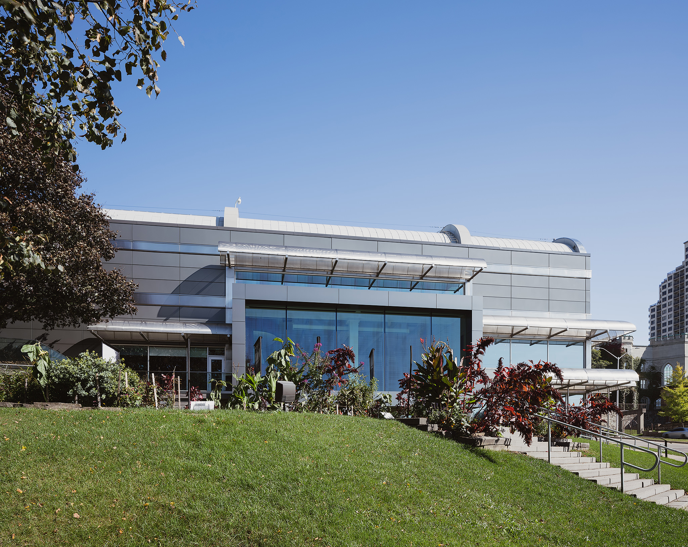
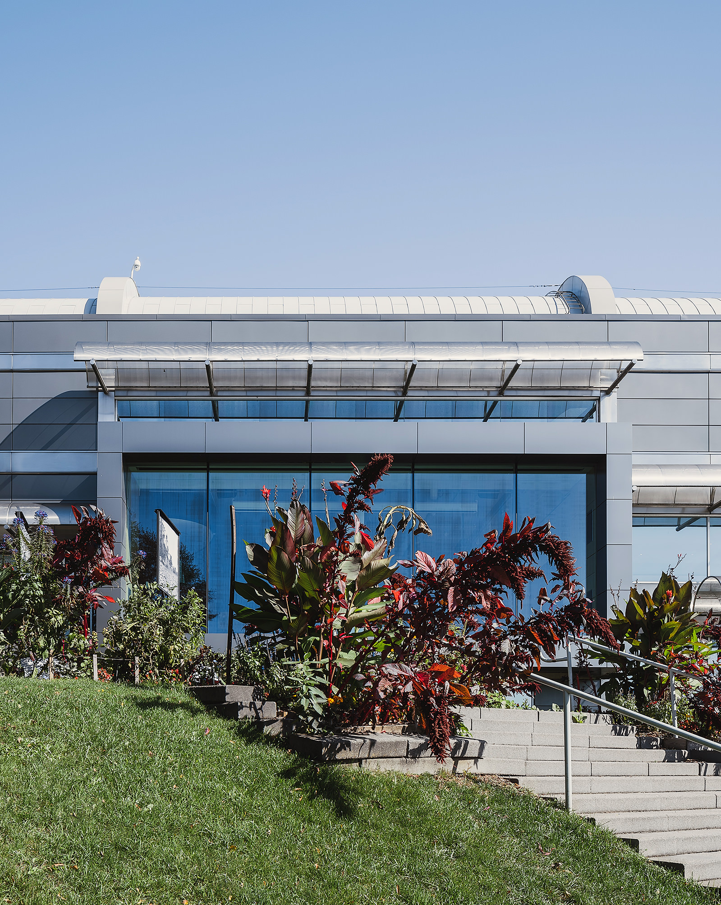
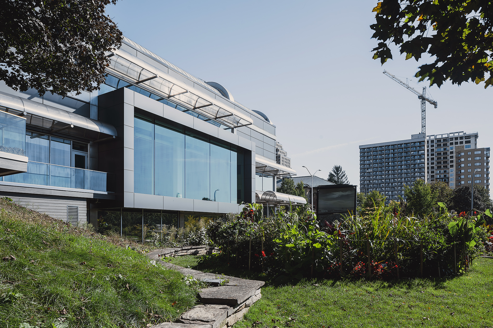
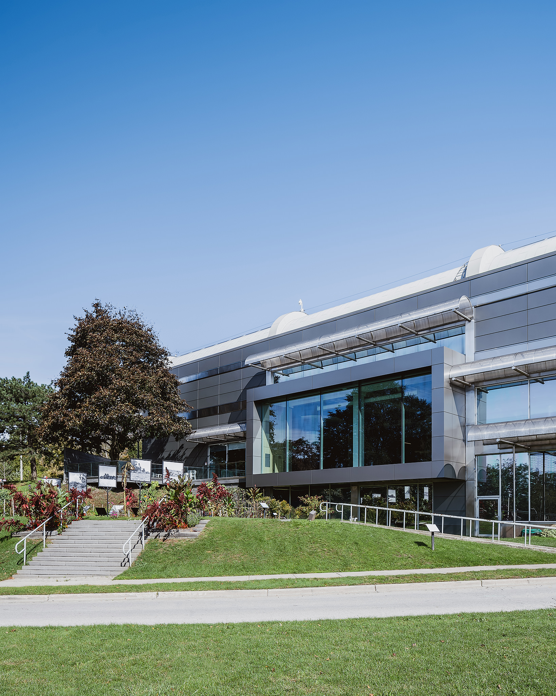
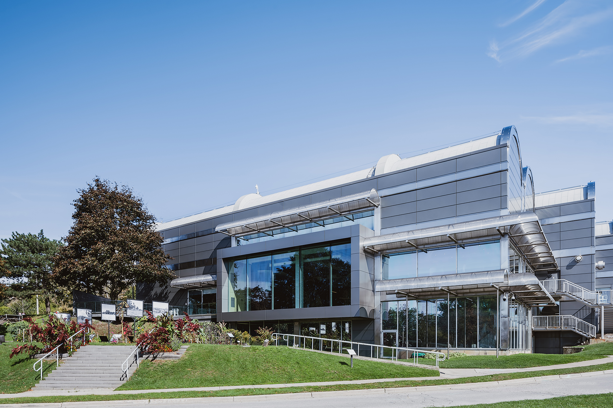

While I was happy with the original photos I took of [Museum London at the end of 2018](/museum-london-ontario), I was unhappy with the terrible weather we had at the time. I had the intention to return later in 2019 and grab some additional photos to later share with Nicolson Sheffield Architects as a gift.

Shown below, you'll see Museum London went through a few more changes from autumn 2018 to 2019. 

Looking closely, the two trees beside the handrails of the stairs have been removed. The landscaping looks most excellent too!

## Museum London end of summer or early autumn 2019

  
  <figcaption>A look at the renovated, modern Museum London</figcaption>

  
  <figcaption>Looking directly at Museum London from the street by Scott Webb Photography</figcaption>

  
  <figcaption>Looking south at the Museum London Revitilization</figcaption>

  
  <figcaption>Architectural Photo of Museum London by Scott Webb Photography</figcaption>

  
  <figcaption>Twilight photo of Museum London</figcaption>

For these photos, the weather was much more co-operative and the landscaping was still looking spectacular. It's amazing how quickly autumn changed the previous year, but the changes that occurred from 2018 - 2019 were very nice too. I am certain the removal of those trees really helped with the view out to the Thames River from those huge windows!

- architect: [Nicholson Sheffield Architects Inc.](https://nicholsonsheffield.ca/)
- construction: [Aveiro Constructors Limited](http://aveiroconstructors.com/)

- - -

Also check out more photos of Museum London at the links below:

- [Mueseum London in 2018 →](/museum-london-ontario)
- [Interior Photography of Museum London](/museum-london-interior)