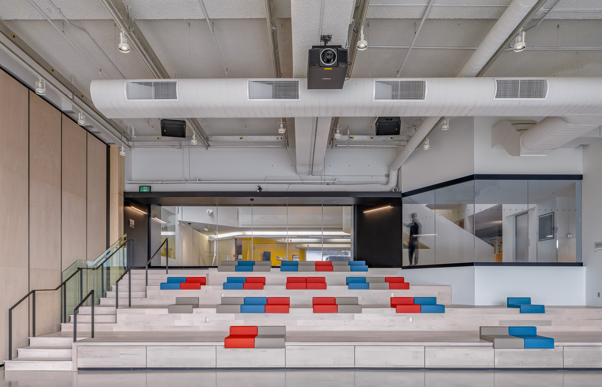
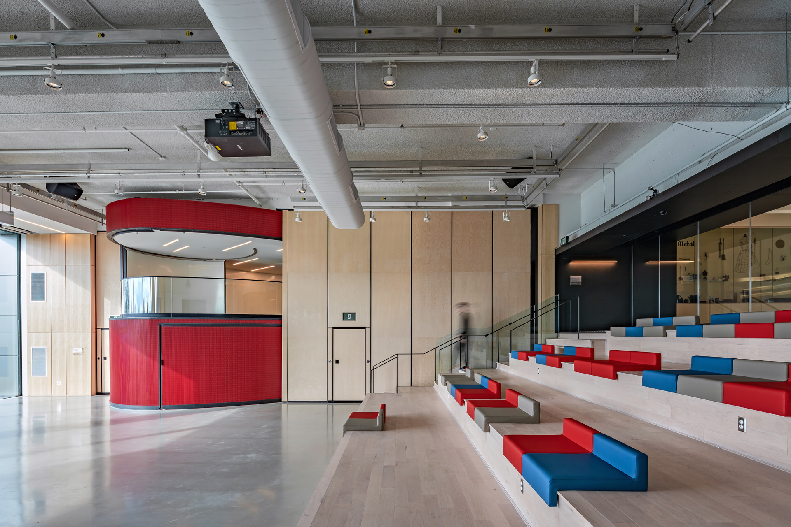
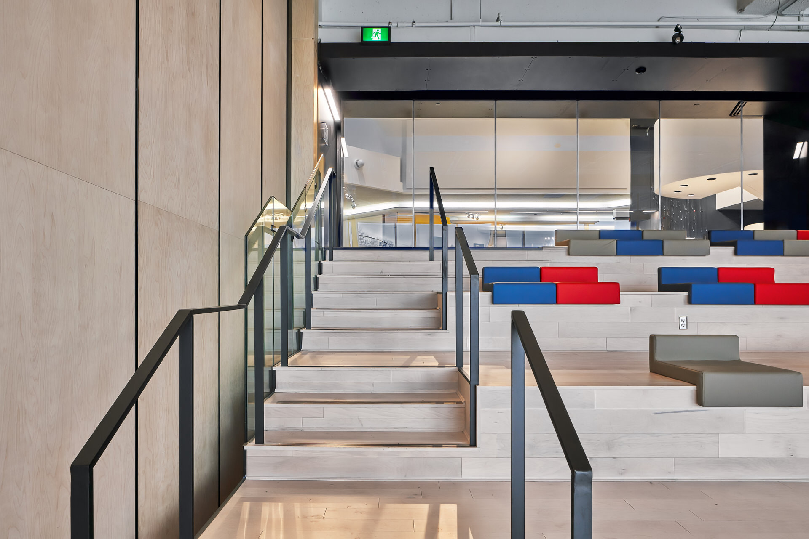
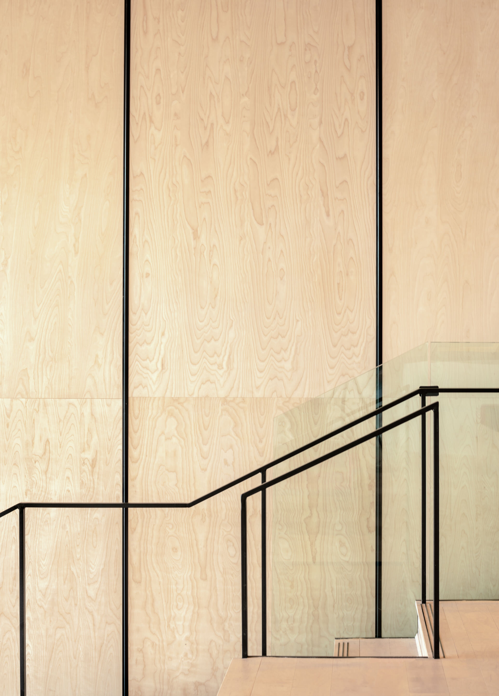
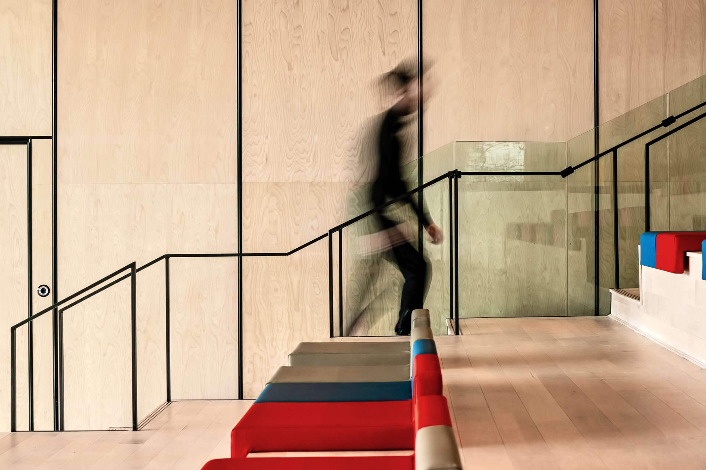
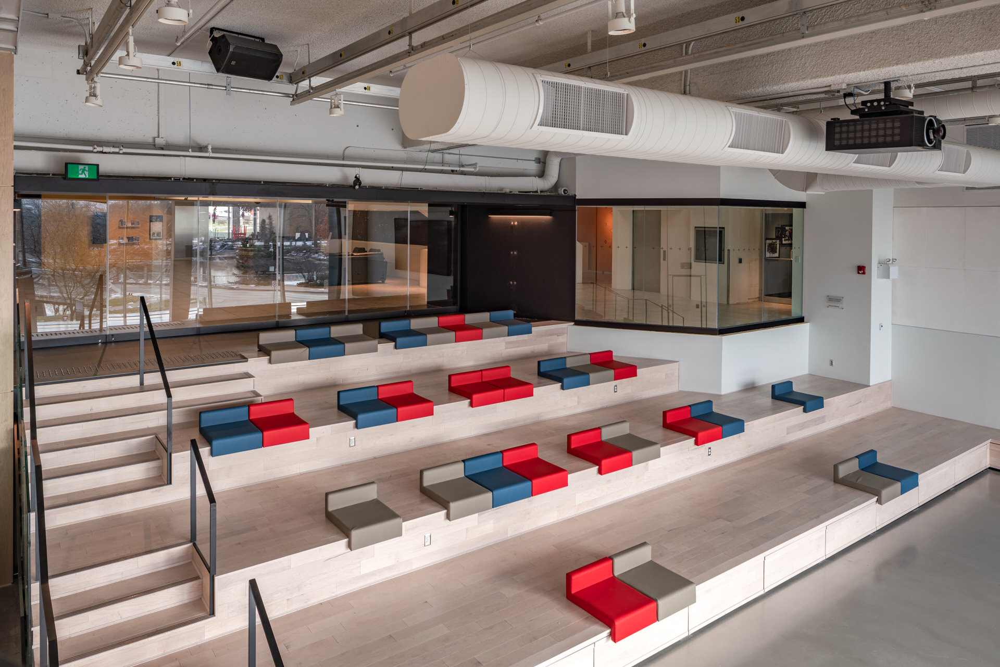
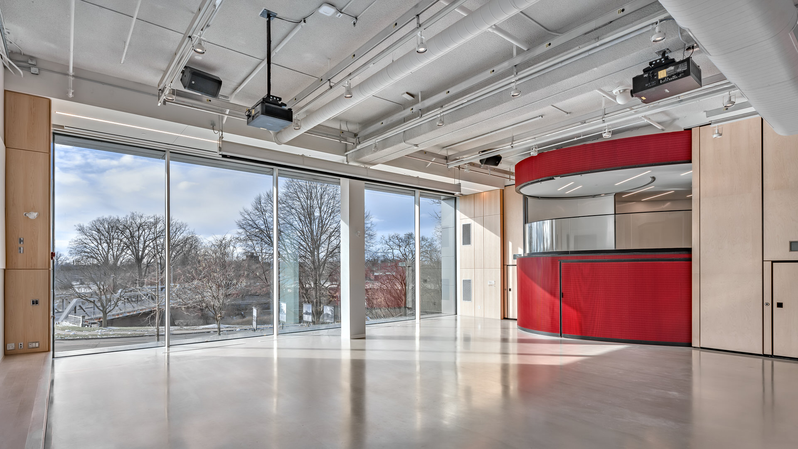

I've shared a couple of posts with [exterior photography](/exterior-photography) of Museum London ([2018](/museum-london-ontatio) & [2019](/museum-london-2019)). Since there have been quite a few photos, I broke it up like this and now it's time to share some of the [interior photography](/interiors-photography).

  
  <figcaption>Looking at bench seating inside Museum London, photo by photographer Scott Webb</figcaption>

  
  <figcaption>Renovated interior space of Musuem London, Centre at the Forks in London Ontario Canada</figcaption>

  
  <figcaption>Looking up the stairs inside the renovated Muesum London space</figcaption>

On this interior shoot, I had a Fanshawe College photography student with me named Dominec. 

It was great to have some assistance and be able to discuss aspects of business and the shoot at hand.

  
  <figcaption>Architectural detail of the stairs and wall feature</figcaption>

  
  <figcaption>Person going up the stairs - Muesum London Interior</figcaption>

  
  <figcaption>View from Pod inside Museum London</figcaption>

  
  <figcaption>View of the 2 story windows built into the new Museum London architecture</figcaption>

The Centre at the Forks renovation to Museum London sure has created an amazing space. I know the museum has already experienced a lot of great events.

- architect: [Nicholson Sheffield Architects Inc.](https://nicholsonsheffield.ca/)
- construction: [Aveiro Constructors Limited](http://aveiroconstructors.com/)

- - -

Also check out more photos of Museum London at the links below:

- [Mueseum London in 2018 →](/museum-london-ontario)
- [Museum London in 2019 →](/museum-london-2019)