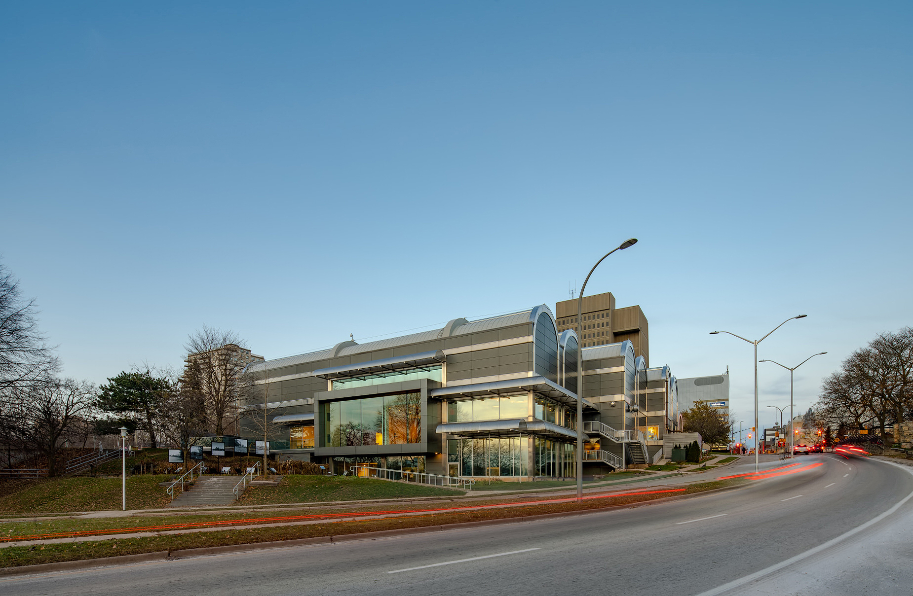

In this post (there are a lot of photos), I share my building photography of the modern renovation of Museum London - Centre at the Forks. This beautiful update by Nicholson Sheffield Architects is part of the Forks of the Thames change here in London, Ontario. The Forks of the Thames is a big deal for the city as it will be an asset and a significant community amenity, showcasing the city’s profile and reputation for the desirability of living and locating businesses within the downtown. This said I believe there is an imminent need for beautiful architectural photography.

I originally photographed the interior and exterior of the building in late autumn of 2018. The weather was pretty rough at the time and a lot of leaves had fallen. It was one of those situations where there was nothing that could be done though. I could only plan to try and take some photos at an earlier time in 2019.

MUSEUM LONDON LATE AUTUMN 2018

  

