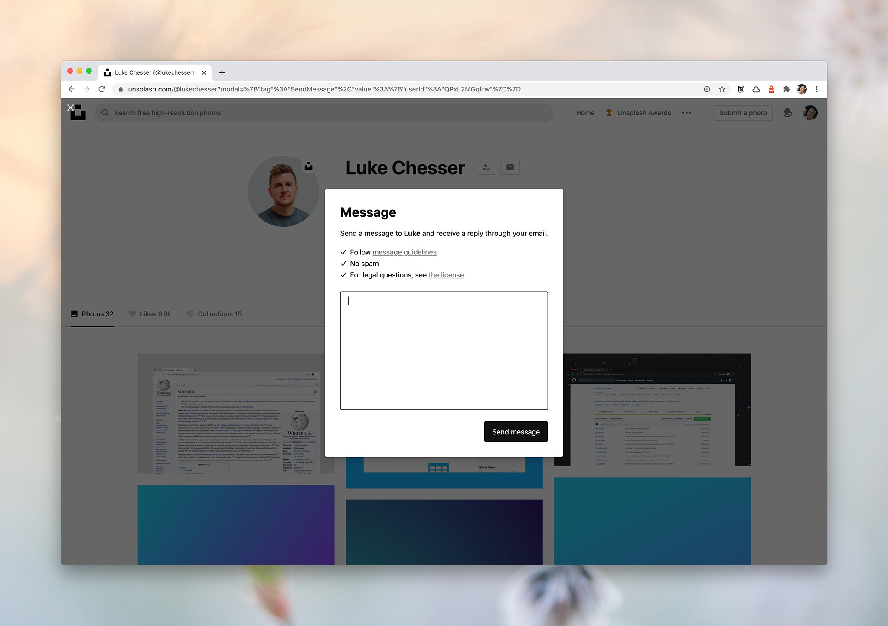
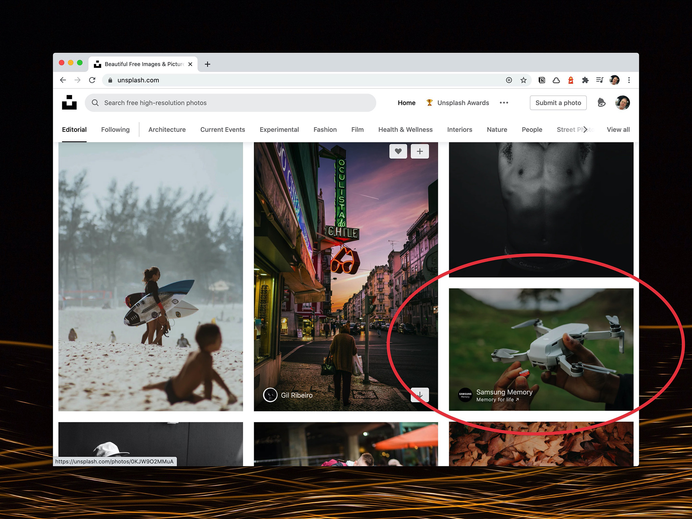

It should come as  no surprise that contributors on [Unsplash](https://unsplash.com) start to question how to make money, eventually. When you see the kind of statistics your photos receive ([you can view mine here](/unsplash)), the mind can’t help but wonder if you can leverage the platform to do more of what you love to do. 

There are a multitude of ways to make money on Unsplash going from donations to selling your images to those that contact you, selling higher resolution images than you uploaded, bring part of an Unsplash advertising campaign and earning your own gigs.

I’ll go over each of these possibilities and more in this post, but first a little background.

> Have you ever make any money on Unsplash?  

The number one question I get from other photographers is around the opportunity to make money. It’s asked in a few different ways:

- Have you ever made any money?
- How do you make any money on Unsplash?
- Do you receive donations? How much?

There is a strong desire to receive something in return for your contributions. At first, the exposure is so sublime that money isn’t a real thought or at least it wasn’t in earlier Unsplash days. Like me, most people contributed photos without expectations. 

There’s a shift that occurs once your photo views or downloads hit mind-blowing numbers - different for everyone. I wish I had examples to share, but I’ve seen many contributors joke about how they could retire if they even received $1 per download. Alas, no one receives any money when a download occurs. The only way people have to say thanks is by sharing a tweet or sharing to Facebook and give you some more exposure (something I see less and less of today).

In a previous post on [Unsplash monetization](/unsplash-monetization-contributors), I brought up  a few ways [Unsplash](/unsplash) could help contributors to earn; however, it’s been a few years and we still don’t have these options. So, we have to get a little creative and hack our way to a few bucks. 

Let’s go over a few ways to make money on Unsplash! 

## 6 Ways to make money on Unsplash

### Donations
Wait, I thought Unsplash doesn’t have a donation button? Well, you’re correct. It doesn’t mean you can’t receive donations though.  There is actually a proposed hack directly from [Unsplash’s Annie Spratt](https://unsplash.com/blog/unsplash-hacks-for-photographers/). What you do is place your PayPal link (PayPal.me) into your website link spot within your profile.  You could otherwise place in a link to buy you a coffee. Test it out, feel free to shoot me over a coffee. [Check out Buy Me a Coffee](https://www.buymeacoffee.com/scottywebb) 

> Whilst Unsplash does not currently support donations, if you have a website of your own, you could yourself set up a page that accepts donations and add that link to your Unsplash profile. You could even add in the bio section that people can use the link below to support your work.  

I did change my profile link to a donation link for short period. I don’t recall receiving any donations or support while it was there. It may require a lot of patience.

### Make use of Patreon
This idea doesn’t differ from how to get donations, really. Making a Patreon account will give people that love your photography a place to support you as patrons. If you’re not familiar, definitely [check Patreon out](https://www.patreon.com/). 

In using Patreon, you’re probably going to set up some other value for supporters aka patrons. You can also interact with the patrons and build a community. That’s not something you can do from simple donations.

Make sure to note that people can support you via Patreon in your written bio. 

### Enable the message feature
Did you know? There is a message feature that you can enable and allow anyone to shoot you an email directly from your Unsplash profile. It used to be blue and say “message,” but it’s been streamlined and is now an envelope icon. Hey, it works the same.  But I know you’re wondering how is this going to help me see some money?

> In 2020, I made $405(USD) this way.

The point of the message feature allows anyone to connect and eventually someone is going to ask to use the photo or ask for something related to a photo. You’ll have an opportunity to sell your image.  This is possible even while you’re probably thinking about your photo being free. 

  
  <figcaption>Using the Unsplash message feature</figcaption>

Here’s where it’s good. In my experience, some people or companies want to use the image as it is presented. To use the photo commercially and completely unedited is outside of the guidelines of the Unsplash License. This leaves a door open for you to sell your own license and make some money with no middleman.  In 2020,  I made $405(USD) this way. 

Without the message feature turned on, you’re definitely missing out on potential opportunities. Yes, you will get some spam but it’s pretty rare. 

You’ll want to keep on top of the messages that come in from Unsplash because of this kind of opportunity.

### Sell high-resolution images
All of these recommendations are feeling so backwards at first aren’t they?Recommending you sell your high-resolution images is just that. Unsplash already gets your high-res photos. But do they really?

Many photographers seem to look at Unsplash in black and white. You have to upload all your images or none. And, you upload your high-res files for those images. However, do you really need to upload that 41MP image? Or every image? There is a minimum size to the images you can contribute and you can choose (yes you have the choice) to upload a lower resolution file and keep your ultra high-res file for yourself. Kind of like how photographers keep their raw files. 

If someone is in love with a photo and wants to use it for something that requires a larger file, they can contact you to see if you have it. When that happens, you’ll be the only one with the highest resolution available and have an opportunity to sell it to them. 

Another opportunity is to sell your high-res images on your own website. I know Joshua Earle does this with [Huper](https://explorehuper.com).

Lastly, you could upload your highest resolution images to stock photo agencies along side Unsplash. You’ll be able to direct any inquiries to that if you don’t want to try selling the images on your own. 

> If someone is in love with a photo and wants to use it for something that requires a larger file, they can contact you to see if you have it.

I admit this way of going about contributing photos to Unsplash feels not so great, but this is how some contributors have to start working the system in order to hopefully see some kind of income. If Unsplash were to introduce some kind of monetization, I assume things would change.

### Become involved in an advertising campaign
You should notice by now that there is native advertising happening on Unsplash. You see those sponsored images within the Editorial feed and such. This has been a money maker for some photographers, myself included. I know of 2 scenarios:

1. The advertising company selects from a handful of photographers based on the photos on their profile. These selected photographers enter into contract with the brand and shoot some exclusive images for the campaign and they are compensated, of course.
2. The advertising company selects a handful of photos already on Unsplash that will represent their campaign well. The campaign may run 2 or 3 months and the photographer is compensated for each month the ad with their photo runs.

I experienced scenario 2. My photo was selected by Progressive Insurance and ran for 3 months.  At the end of the 3 months, I was paid $375(USD) by Unsplash. 

  
  <figcaption>Unsplash native advertising within editorial Feed</figcaption>

These scenarios for making money are what I believe Mikael, cofounder of Unsplash, was referring to in his article about [The future of photography and Unsplash](https://unsplash.com/blog/the-future-of-photography-and-unsplash/). 

> At the end of the 3 months, I was paid $375(USD) by Unsplash.

  
  <figcaption>Scott Webb Unsplash Photo that was used in Progressive Insurance Ad. Earned $375(USD).</figcaption>

### Gigs
The other type of scenario I believe Mikael was referring to in his article was around the idea of photographers getting gig work from their Unsplash photos receiving exposure.

This way to make Money on Unsplash is pretty rare but I’d never rule it out. I feel that opportunities may exist more depending on where you live, but who knows for sure. It really depends on the type of work. 

For me, I’ve been fortunate enough to earn some past work from Unsplash. A few years ago, I got to shoot a wedding for another Unsplash contributor. It was a paid gig and not something for more exposure. On another occasion, I was contacted by a fitness brand to shoot monthly photos for their product. It was very exciting as it would have paid my rent every month for who knows how long, but I was extremely busy with [architectural photography](/) at the time. I tried to recommend another photographer on Unsplash but I don’t know if it ever happened.  This scenario is why I’m hesitant on the idea of the future of photography with Unsplash being in getting hired paid work. While great, a lot of the photography I upload on Unsplash is peripheral. Meaning, I upload things outside of just the [photography of architecture](/). 

Today, your location shouldn’t matter too much. A brand can send you their product quickly and you then do your thing and shoot. That’s pretty much how the advertising campaigns are working on Unsplash, right. 

So, it’s a possible scenario to make money by uploading free photos to Unsplash. With Unsplash growing quickly, I start to wonder if the chances of work like this will be come less and less. I’m reminded of 500px and their “hire me” option. I never heard if that worked for any photographers.

Unsplash doesn’t have a running list of photographers like Pexels does with their leaderboards. You can gain awareness of being an amazing photographer through their yearly Unsplash awards though.

- - -

## Any other ways to make money on Unsplash?
That’s pretty much all I’ve got in terms of making money on Unsplash for now. Just be aware that photographers are making money from “giving away their photos.”  It’s not an all or nothing game either.

Be strategic about your contributions and think about these ideas if you do want to potentially start seeing some money. 

What do you think? Have you been fortunate enough to make any money? Do you know any other ways to make money on Unsplash? Directly or indirectly? 
