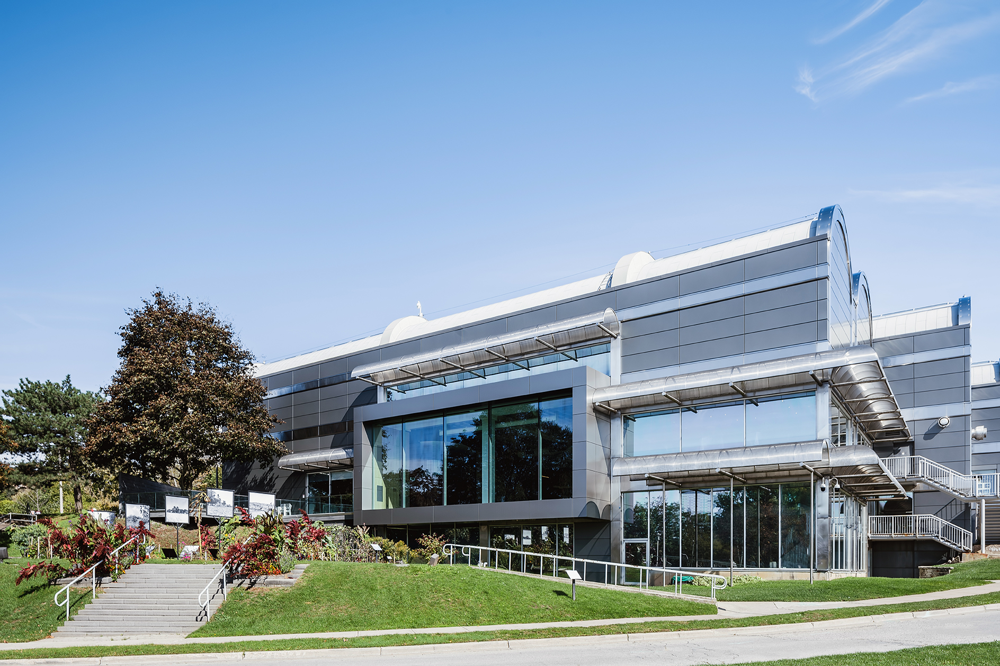
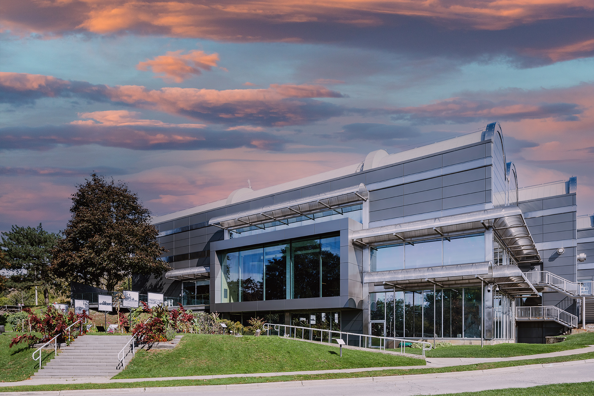
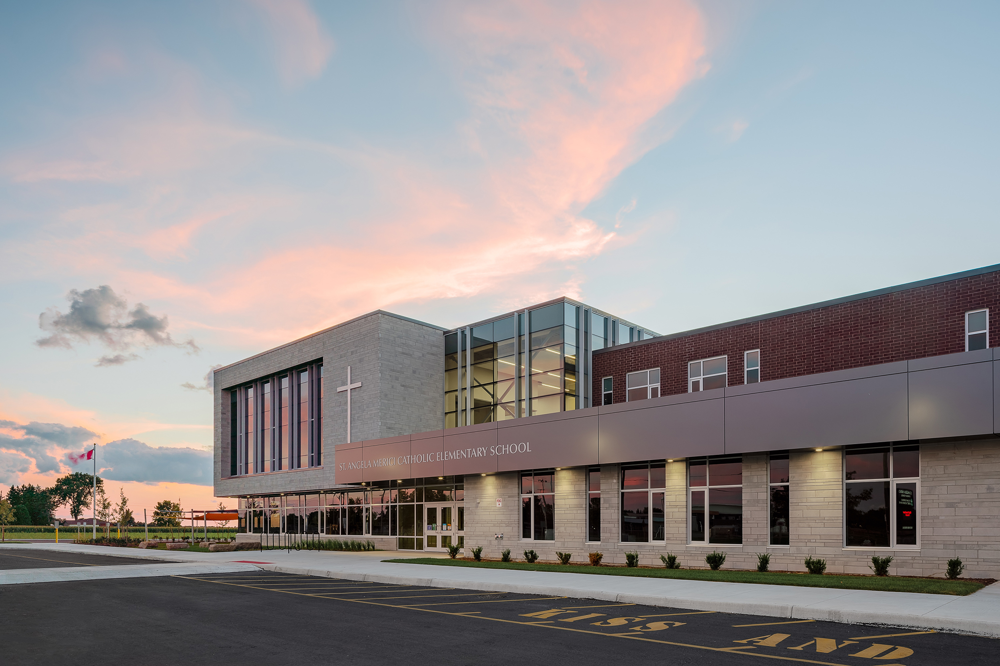

I’ve got this old architecture book called “Experiencing Architecture” by Steen Eiler Rasmussen and every time I got out to photograph architecture, I am reminded of it. I want people to have the ability to authentically experience the architecture through the photographic medium. 

This is where I take a stand and decide where I draw the line in my own images. There is much to discuss around the truth about architectural photography and there is an amazing [2018 article](https://www.azuremagazine.com/article/architectural-photography-fake-news/)) asking if architecture photography has become fake news by Nicholas Hune-Brown. I’ll reference a few quotes from it at times. For this post, I’ll only be addressing one of the factors that I find problematic: **Sky Replacement**.

I take, what might be, a controversial stand around sky replacement in my work. But first, what is a sky replacement?

## What is a sky replacement?
If you don’t know, a sky replacement is when a photographer or retoucher decides to completely replace the actual sky with one that might be more eye catching or sensational. There are image libraries full of just images of skies so you can have endless options to select from for your image. 

> If the world is consuming architecture online, through a series of increasingly unbelievable images, why build anything at all? 
> –Nicholas Hune-Brown.

Just released in Adobe Photoshop 2021 is a sky replacement feature! Photoshop makes this so easy a monkey can do it now. I’m sure you’ve seen architectural images where this level of photo editing has occurred. Maybe you didn’t notice or maybe you always felt something was a little bit off. Why? Doing this can drastically improve an image and bring in that ‘wow’ factor everyone seems to be after. 

Where do you call it a day though? 

There’s a difference between touching up a photograph and completely altering it. Check out the video looping below on where I'm coming from.

<video autoplay loop muted playinline src="https://video.twimg.com/ext_tw_video/1324682725438218241/pu/vid/1084x720/w3v8_iYXZ21uZNkg.mp4"></video>
<figcaption>From blue sky to dramatic sunset with the click of a button</figcaption>

## Rendering or Photograph?
It’s become more difficult than ever to try and tell the difference between a photograph and an architectural rendering and the other way.  One of the aspects of a realistic rendering comes in the form of the sky used. Many times, the rendering is also making use of a sky selected out of a library of sky images. 

## Would you hire a photographer to create another rendering?
I refuse to have a client hire me, as a photographer, to go out and shoot architecture and then create another rendering from it. It goes against my desire to create authentic architectural photography for my client. I know my client can already replace a sky from their renderings.  My job is to now capture the built result as it is interacting with people and the environment as best I can. 

>  Strong architecture doesn’t require a lot of editing. The building and space should speak for itself.
> –Ma Yansong

  
  <figcaption>Photograph of Museum London and actual sky with hint of clouds</figcaption>

From my point of view, the moment I change the sky, I’m changing colours and the way light is interacting with the architecture. Of course, most people will only experience architecture through photography on the web and they’ll probably never know anything the wiser. But, to my senses, everything about an image becomes questionable with a full sky replacement. 

  
  <figcaption>Sky replacement to be more dramatic...now a rendering?</figcaption>

## The old fashioned sky replacement
With the new sky replacement feature in Adobe Photoshop 2021, it’s going to be even more tempting to see what another sky might do for an image. It’s easy. But, doing so would go against my own words and claim that I look to create authentic images of architecture and the built project. 

My approach leans to the old fashioned sky replacement: Return to the site and shoot some more. I love going back to a building to shoot multiple times when possible: morning, evening and catching daylight in between. The sky and the light on a building changes a lot and I don’t have to try and pull off a deep fake.  

  
  <figcaption>Beautiful and natural architectural photo at sunset</figcaption>

Some photographers will refer to this kind of approach as getting it right in the camera. You'll notice all the amazing reflections showing up and how the building is interacting with this legit scene created. As well, the colour casting is perhaps imperfect but that's true to the experience. For this image, this was my 3rd trip out to Chatham to catch the light and I had my fingers crossed for such an experience. The added trip was well worth it.

### Does this approach cost more?
The way I structure an architectural photography project, I don’t charge by the day or by the hour. I don’t believe my client should be on the hook if a project requires more of my attention or involvement. I have no problem visiting a site multiple days or waiting out for specific weather. 

> In our own work I think we’re fairly disciplined about it and try to show some of those imperfections, but the truth is that there could probably be more imperfections and that would be a more honest representation.
> –Omar Gandhi

If I go out to a location, I’ll shoot something regardless as architecture does still exist on days with an overcast sky. Will that image be the hero shot? Maybe not, but it can still be useful in a clients image library at some point in the future, even if it is a talking point with a prospect or helping to explain a detail. 

## An honest representation
It’s my hope that architects, developers, and anyone involved in the building project value such authenticity in trying to help communicate and experience architecture.  Or as architect Omar Gandhi refers to showing more imperfections and an overall more honest representation in photographs. I believe replacing a sky shifts that representation too much. 

As a photographer I’m still able to showcase a building. I don’t want myself or the architect being called out for fake imagery when submitting to architecture contests and awards. Those are such places that photographs of the built project are required.

Like I said earlier, this stance may be controversial and maybe not. I’d love to hear your thoughts and feelings on the subject. 

Is a full sky replacement altering the image too far? Does it start to become another rendering? Does it matter?

If you’ve got an architectural project you’re involved in, I’d love to hear about it. [Give me a shout here](/contact) or on social media.

---