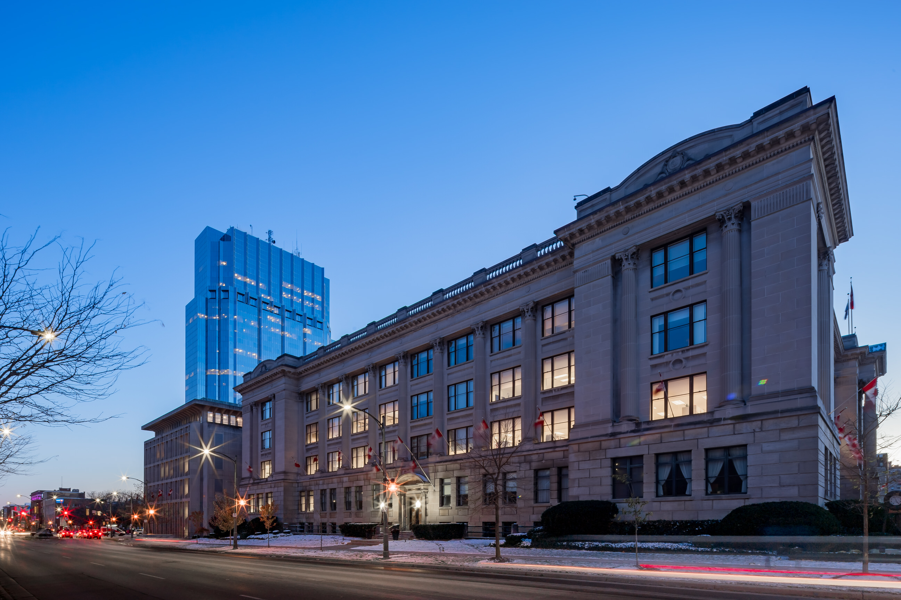
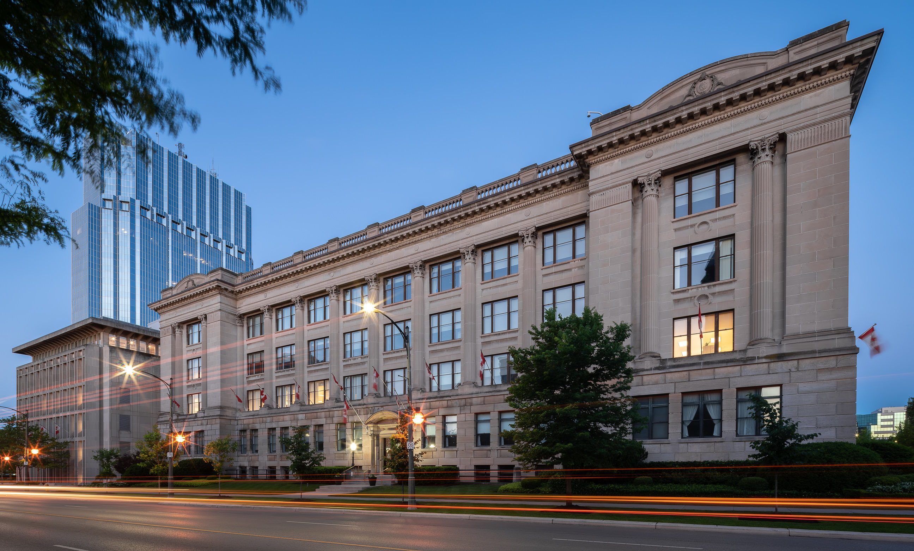
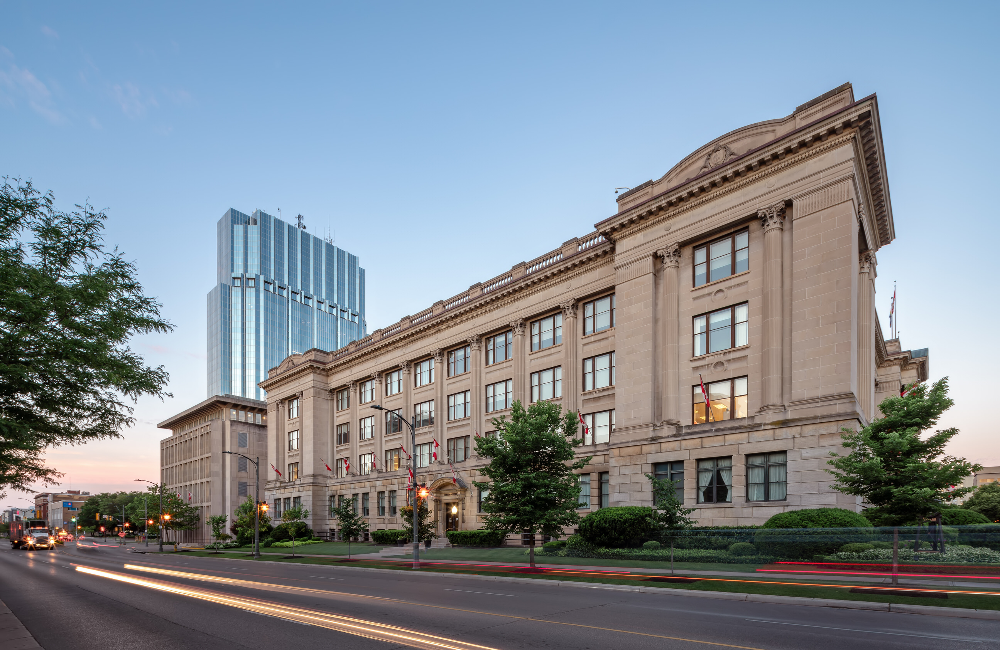
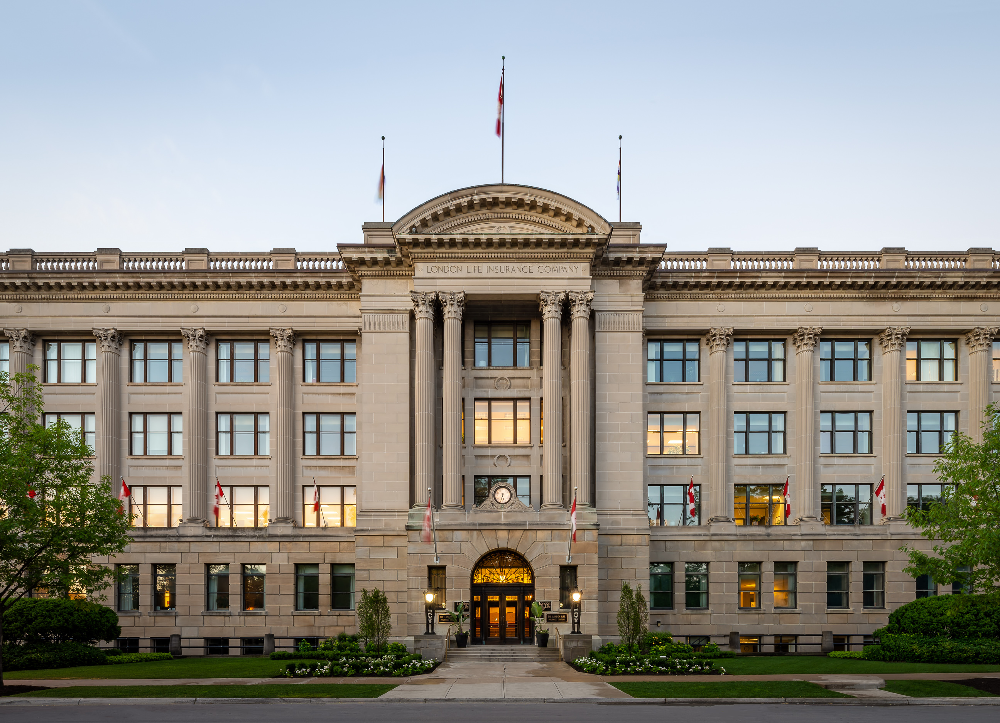
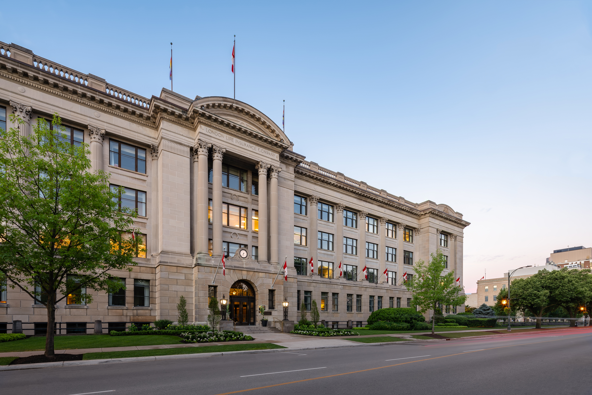
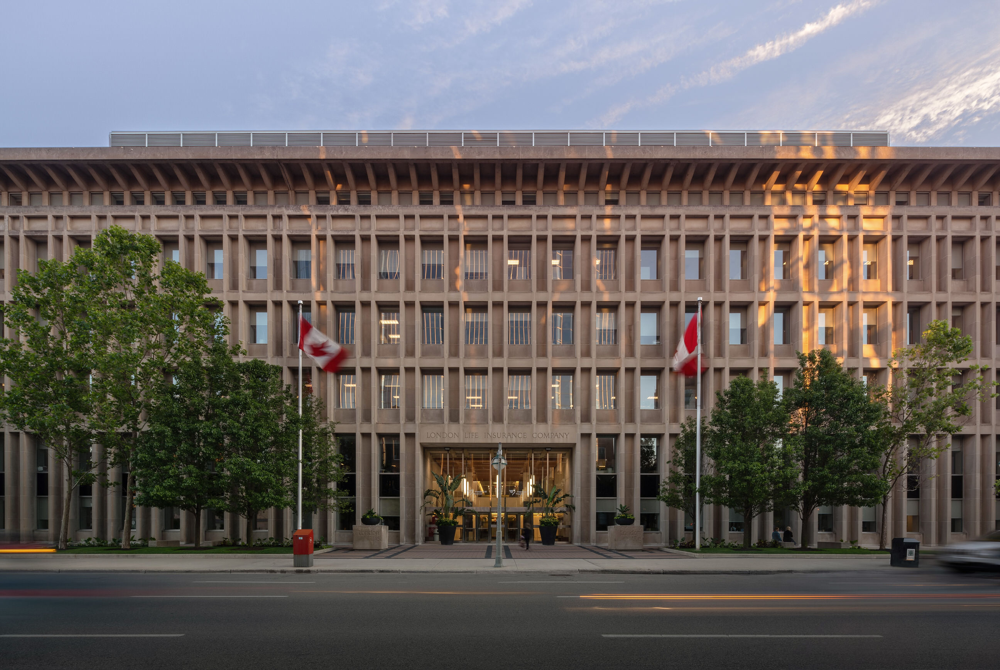
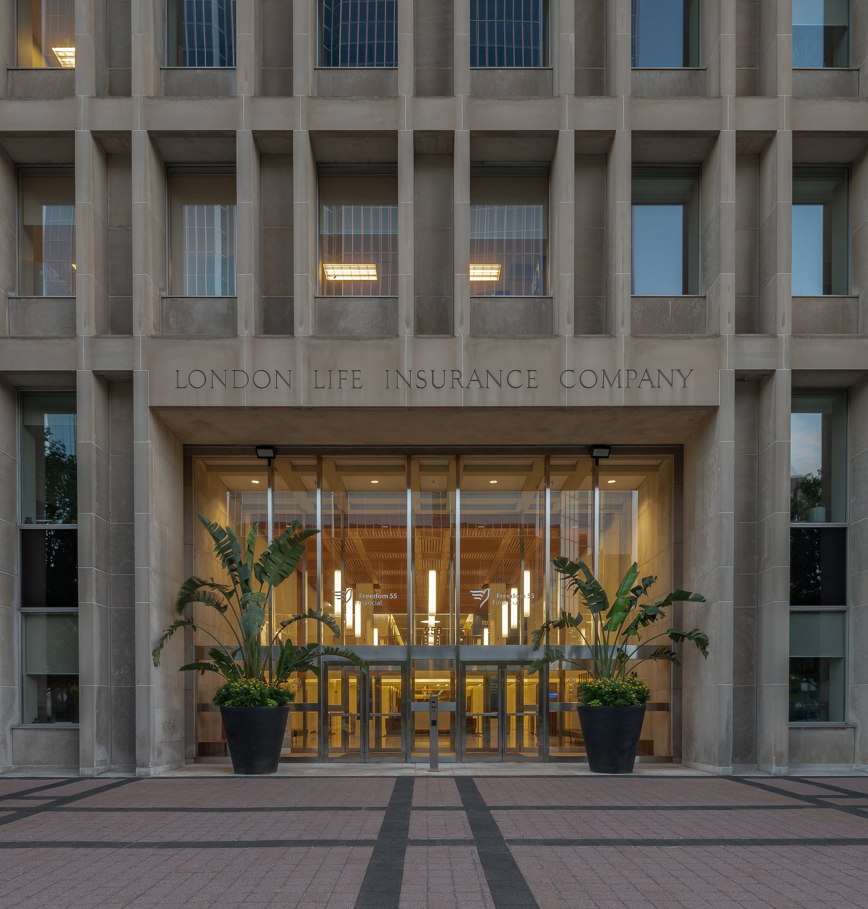
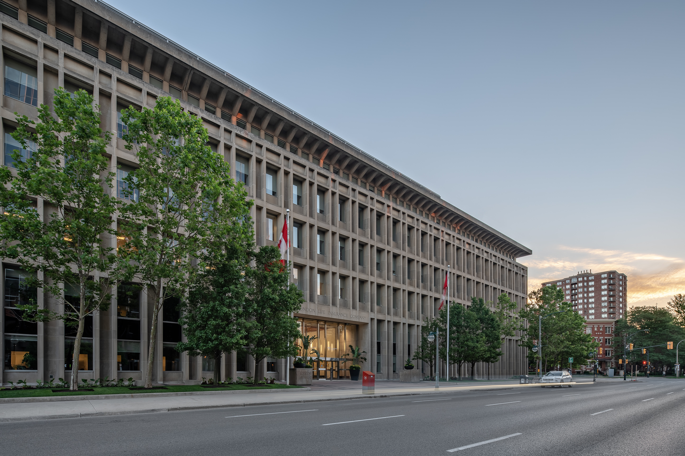

If you followed the  [Don Smith Commercial Building Awards](/2017-don-smith-commercial-building-award-nominees) , London Life was a nominee for the Legacy Award.  The building is a beauty and iconic in downtown London. With the need to capture London life and Freedom 55, I got to explore with intention and try to create images that showcase its  [prominence downtown](/construction-photos-one-richmond-row-october) . 

**Spoiler alert**: London Life won the Legacy Award for the Private Sector. This means the building was most unique and significant to London. I hope these photos help to show that. 

## London Life in Fall 2017

  
  <figcaption>London Life building in late fall, 2017</figcaption>

Let’s start by sharing a photo of London Life from late fall 2017. This was a really great photo for what I had to work with at the time. I remember my hands were so numb and about to fall off too. It is worth it even though my client and I wanted an image without the snow. Last autumn was brutal most of the time. That said, it’s always great to  [book architectural projects for photography](/contact)  as early as you can. Hey, no worries! I’d get new images when the weather would co-operate with me. And that’s just what I’ve done. 

## London Life on the first day of Summer 2018

  
  <figcaption>London Life building in summer, 2018</figcaption>

Totally unplanned, I went out for sunrise on the 21st of June to meet up with the lovely London Life. Okay. That’s a lie. I actually went out the day or so before to try and photograph the building. Unfortunately, the weather was overcast and raining. So, I planned for the next day. I did plan after all.  Sometimes gloomy days can help with your architectural photography.

Going on the first day of summer becomes an easy day to remember when I look at the photos now.  The weather on this day was looking pretty good. My wish was to see a few more clouds and get some additional colours like I saw with photographing the  Western Fair Raceway and Casino .

Anyway, I started off with looking for an image of London Life like the one from last fall. It’s important to know this photo was taken at blue hour in the morning as the sun was rising. The other, from fall, was in the evening. I went in the morning, this time because I needed the quietness. I needed people to still be sleeping. I needed no cars parked along the side of the road. And, I was fortunate only one car was parked which you’ll see in the Freedom 55 image. I wanted a comparison image because the original was highly liked even with the snow. Getting a new shot without the snow would be worth it. This isn’t an exact comparison, but close. Once I shot more photos around the corner, on Dufferin St, I went back here and tried to get a better comparison. It wasn’t needed, but my curiosity was too strong and I gave in. 

  
  <figcaption>London Life building after sunrise on first day of summer, 2018</figcaption>

The 2nd image is shot at 5:41 am and 18 minutes after the other. Now, if only the streetlights were still on. The sun was pretty much up at this time. I think there were 5 minutes left until the technical time stated by weather networks. Other than the streetlights, you can see the photo is really close to the photo from the fall. Seeing the classic green London Life grass sure is nicer. Let’s go around the corner to Dufferin Street for some more  [building photography](/) . 

## London Life Building along Dufferin Street, London

There was a setback for me in photographing the London Life building along Dufferin Street. I actually went to this area first because there was supposed to some blue glowing light above the entrance to the building. I saw it on that rainy, overcast morning and the time was later too. Well, there was no blue light above the entrance. 

After wiping my tears, I went on with the photos you’ve seen already and came back to Dufferin after. It was still early enough to get the lights on within London Life offices. But, my main aim was to shoot an architectural photo that I haven’t seen before: directly from across the street. 

### Straight across the street from London Life Insurance Company

  
  <figcaption>London Life building entrance straight on photo along Dufferin St.</figcaption>

This photo felt much like the straight on shot of the  London Public Library  entrance. Going to edit, I felt like I was slightly off centre when taking the photo. I was already crammed up against the street sign though.I’ve looked at this image for so long, I can’t tell what’s balanced or straight anymore, ha. What do you think?The key here is to take a photo of London Life that seems to be missing. 

As a building that’s the recipient of a Don Smith Commercial Building Legacy Award and few great images found, it is apparent there needs to be some higher  [quality images of London](/free-london-ontario-photos)  Life. 

### London Life Insurance Company Looking down Dufferin

  
  <figcaption>London Life Insurance Company Looking down Dufferin</figcaption>

This street is usually full of parked cars. It was very quiet for me. A little too quiet for my desire to have more activity in the photo via people and vehicles. I also wish the top flags were blowing around. What I don’t mind is the water on the sidewalk. You might think it’s distracting but I think it’s a part of the whole. 

London Life is known for its perfectly manicured green grass. The grass was just watered and you see this around the building. Pretty epic entrance, though!I could have spent so much more time with getting additional images, but I needed to capture Freedom 55 too. I know that I’ll be back to try and catch the blue lighting ON. Off I went to Queen Street to see what was happening as the sun came up. 

## Freedom 55 Entrance in Photos

Again, the goal for me is to create an image that is fresh, modern, and new.  I doubted I was about to create a photo that hasn’t been done before.Google search doesn’t bring up everything, but a search did reveal sub-par building photography of this side of the London Life building. I happily couldn’t find a photo like I’ll share first: 

### Directly Across the street of the Freedom 55 Entrance

  
  <figcaption>Directly Across the street of the Freedom 55 Entrance</figcaption>

The sun was up and just starting to come through on the building. I spent a while here with this photo as it was the last I was taking. I stayed until someone wanted to park in the spot directly in front of me, ha. So, I have a few out-take frames with those  photobombing LTC Buses but no goose this time! I love all the life going on even at this time of day. 

There is all the road activity, but also people. A woman is on her way into the building, there’s a couple of ladies are sitting on the right, and the flags were blowing around. There was a jogger, but not in this shot and he was too blurred out anyway. [People within my architectural photography](/people-in-architectural-photography) is important to me and you can  learn more about it here. I also got a photo of the entrance area from a closer distance and made a crop version of it too. 

### Freedom 55 Entrance at London Life Insurance Company

  
  <figcaption>Freedom 55 Entrance at London Life Insurance Company</figcaption>

This shot of the entrance could be cropped in a number of ways. The lights inside the building, above the engraved name, kind of bother me and I did decide to do one crop:This crop helps me get rid of the distracting lights above. Another crop could be to leave the bottom portion and that would create some strong leading lines. 

Cropping of my photos is so enjoyable with the extra megapixels of the [Sony A7RIII](http://geni.us/lAEvh). When anyone says they don’t need 42mp, I just think they haven’t experienced it yet? Or they must do a type of photography that’s rarely cropped. I’m not sure what type that would be though. 

### Angled Photo of Building

  
  <figcaption>Anled photo of Freedom 55, London Life Insurance Company looking east along Queen Street</figcaption>

Just look at the scale of the building! I love photographing a building like this downtown, but I’d love to explore more when I have time. Getting up high from within One London Place or a rooftop for more [exterior photography](/exterior-photography) would be great to explore here. 

### Which side do you like most?

Of the 3 sides show, which of them do you like most? 

**I’d love to know what you think!**

---

This was originally posted in June of 2018. Since, London Life is now known as Canada Life. 

I'll have to get out soon and do a new post with new photos that include the Canada Life signage.