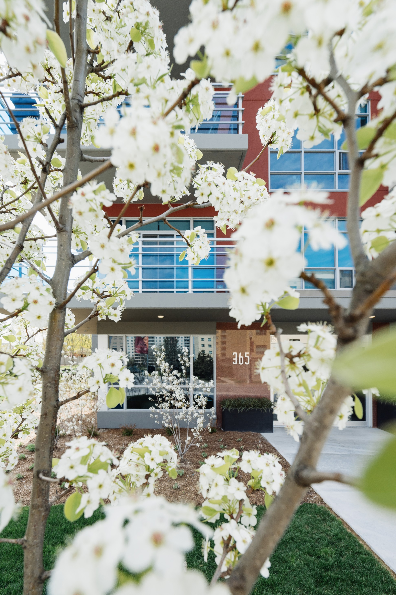

**Let’s go back 13 or 14 years. After returning home to London, Ontario from my final year of architecture school at Ryerson University in Toronto, I found myself in a very pessimistic mood. Supporting myself without a job in Toronto wasn’t possible and I couldn’t stay in a big city that made me feel inspired and creative. At this time, I was just getting into shooting some digital photography too.**I found myself hating London and living for Friday’s so that I could get out of my own head - if you know what I mean. All day and all week I wanted to explore my creative expression but London made me feel empty. But, why am I telling you this? 

If I were you, I’d probably want to connect with someone that is in love with London and inspired within the city. In participation with the #VantagePoint project, I want to share my change to an optimistic vantage point for London, Ontario. I want to share with you how I decided to stop waiting for creativity to come to me in London and I’ll do that with the aid of some of my favourite photos.**Wait up. You’re probably asking what the #VantagePoint project is.**

The #VantagePoint project is by a startup company called  [light.co](https://light.co/)  and they sell these really awesome  [compact cameras](https://light.co/camera) , which is unfortunately sold out (for now). I remember contacting them for myself and for Unsplash a couple of years ago but no luck in getting to play with a camera early on. Now, as part of their marketing campaign, they shared the #VantagePoint project with me, which is basically me sharing a photo of my favourite location and the story.Light.co is basically giving me a great writing prompt that allows me to share favorite photos from around London, Ontario too. This isn’t a sponsored post or anything like that. I felt to take up their connection with me because I instantly thought it was a perfect opportunity for me to discuss the idea that we can find amazing vantage points anywhere and strengthen our creative muscles with a positive and optimistic outlook.

## 3 London, Ontario Photographs
When not feeling the most creative, it’s even more troubling if you feel your location has nothing to offer you. This is an opportunity to challenge yourself and change your state to form a pessimistic vantage point to one that is optimistic. And I truly believe that optimism wins. Optimism says that we believe good things will happen if we take action instead of waiting around. In London, there is a lot of amazing things going on right now in terms of growth and architecture being developed. I would hate to start shooting photography right now though. Instead, I started years ago to chase photography and always trying to get better.  The photos from  [within London](/)  are not necessarily my most technically perfect. The photos might not even be recognizable as London, Ontario, but I know they came about from me intentionally creating within a city I once felt had nothing to offer - something that is just not true. Not true, no matter where you are today either.

Let’s jump into these 3 London Ontario Vantage Points of mine!

### White Oaks Mall Bananas

  
  <figcaption>Photo of Bananas shot in White Oaks Mall, London, Ontario</figcaption>

For the first photo, I wanted to share a bunch of bananas! I know, you maybe expect only  [architectural images](http://static1.squarespace.com/static/5f0f13293d6fca197b218405/5f0f6658dd44dc53a07a2632/5f0f668fdd44dc53a07a2cfd/1594844815649/personal?format=original) ? I’ve got to keep you on your toes!The story behind this photo is that I found an opportunity to shoot it while walking through  [White Oaks Mall](http://www.whiteoaksmall.ca/)  in South London. There was a huge bunch of bananas on the counter at the juice shop and I saw a great image with my iPhone. Not only could this photo satisfy the creative in me, right within the city I thought had nothing interesting for me, but I put this  [photo on Unsplash](https://unsplash.com/@scottwebb?photo=Ar0QYv-qtw4)  for other people to use creatively too. 

Since sharing this photo, it’s been viewed almost 4.7 million times and downloaded by almost 27,000 people on Unsplash alone.

### One London Place

  
  <figcaption>Looking up at One London Place, London, Ontario</figcaption>

I’m actually on a mission to show our city that there is more to it architecturally than just One London Place. It’s a bit odd that I’m sharing this photo as one of my 3, isn’t it? Well, sharing it with you is all part of staying optimistic  about it as a source for us all to get creative when photographing this building. It just makes people want to capture it. I am not particularly fond of the filter I tossed on this image either, but as I shared on Instagram recently, this photo (shared to  [Unsplash](https://unsplash.com/collections/453347/london-ontario?photo=Y7NSySVgPlI)  and  [Pexels](https://www.pexels.com/photo/building-modern-glass-tall-27406/)  for free) has been downloaded about 50K times and I love that a there is a vantage point of  [London, Ontario architecture](/)  all over the web now. Many people have found a use for this image in some way! I’m glad I didn’t stay in bed that day.

### 365 Mosaik Condos

  
  <figcaption>Photo of Mosaik Condo entrace through Spring Flowering Tree</figcaption>

This is a photo (Spring) at the  [Mosaik condos](http://mosaiklondon.com/)  here in London. I love this photo because of the vantage point. Shooting through parts of the landscape and foliage at locations can really become something exquisite. This photograph came from being in flow and not being afraid to play. While this photo isn’t one uploaded to Unsplash, it’s a photo I’ve been able to creatively use in an abstract art project that I can’t wait to show you more of soon. The  [abstract architecture art project](/abstract-architecture-art)  was also a perfect case for intentionally pushing myself creatively with architecture here in London.
This was difficult!

It’s really hard to pick just a few photos to share with you. 

Especially photographs that have a bit of story surrounding my distaste for London, Ontario that’s really grown into something special. 

I hope this is a lesson for anyone that might feel in a funk or stuck creatively in their city. 

There can be a lot of lost hope as you watch and compare yourself to other [London Ontario photographers](/about) (creatives) in big cities these days. Who knows if I’ll be in London forever, but while I’m here I want to help showcase great places and spaces architects and designers have been creating. Spaces that will shape our city for a long time and attract amazing new people too.

---

This originally posted in 2017, but reposted with a couple of metric updates.