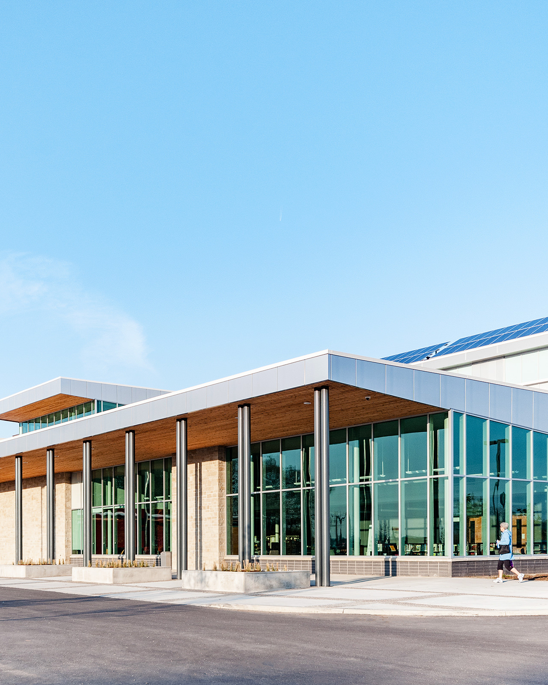
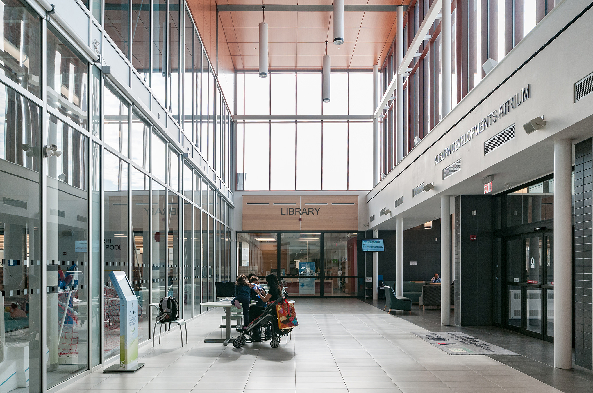
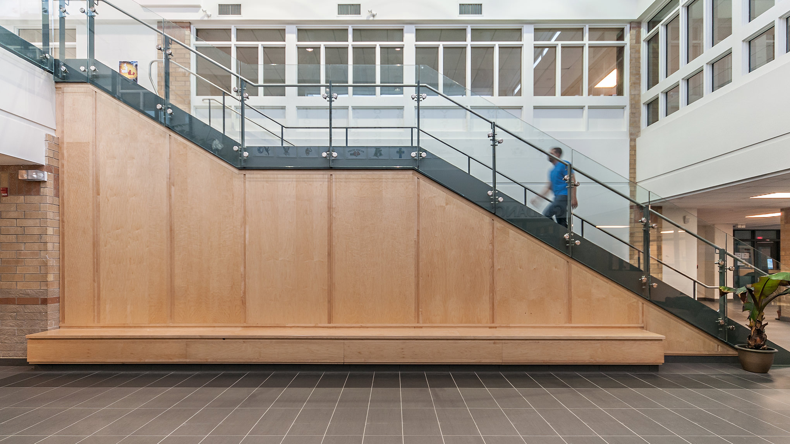

**Architectural photography seems to be changing just a bit…**

  
  <figcaption>Daylight architectural photography shot for Cornerstone Architecture Inc</figcaption>

The below quote related to architectural photography is from architect,  [Bob Borson of Life of an Architect](http://www.lifeofanarchitect.com/aqua-verde-architectural-proofs/)  back in 2015. He goes on to say:

> **The images seem to be trending towards more natural looking and realistic photos – which includes reflections and environmental imperfections. I’m not sure exactly why this is happening but I’m a fan of seeing images that more closely portray real-life conditions. I think seeing the occasional photo with people in it is a good thing.**
> 

In culture, art, and architectural photography the trends ebb and flow. Bob’s thought got me thinking more about change and adaptation on the part of an [architectural photographer](/) and clients. As we’ve entered 2017, has the photography changed? Do we see the trend Bob described as established now? Are there any other signs of architectural photography changing?

Most architectural photography describes the architectural details and displays the building in an isolated way. It’s often stripped of people to be as clean as possible and archives a period of time. I want to move beyond ‘most architectural photography.’

## People and Trust in Architectural Photography

  
  <figcaption>Architectural interior Photo of Stoney Creek YMCA in London Ontario by photographer, Scott Webb</figcaption>

> I think seeing the occasional photo with people in it is a good thing. 

We’ve gone beyond the occasional photo with people. There’s an increase in the inclusion of [people within architectural photography](/people-in-architectural-photography) and it makes sense as  people over-index . Sometimes it is not possible to ensure people are within a frame; however, it is ideally desired.

The more natural looking and realistic images build trust with viewers. Spaces do have shadows and we all know that. The lack of shadow feels off. The human brain has a fine and delicate relationship with the world. We have an ingrained suspicion of the fake, the compromised, style without substance, a lack of integrity, and use of too much Photoshop. These elements produce a clinical, computer-generated image that people mistrust.

> **Truth wins.**

I look to, and admire this more [natural portrayal of architecture](/sky-replacement). The way a building interacts with light, shadow, and people is an honest experience. I want to avoid any misguided experience created by some slick software.

The overarching change revolves around creating the most authentic and engaging experience.

More changes are in the works.

## Greater Change aka Disruption
As technology advances, noise increases, and attention spans decrease, there is greater change on the horizon for  [architectural photography](/)  and the ability for firms leverage the imagery as visual content: Deeper experiences and ultra-realistic opportunities to present architecture projects that reach more people.

We’re no longer trying to make one hero image that’s used for an award submission or magazine cover. We’re trying to tell a whole story in a believable and engaging way. This means the way people experience the architecture is top of mind. Photography is the way people experience architecture, but their media preference is shifting. Fast.

Internet speeds are quicker and quicker. Today, we’re using a giant delivery charged up by satellites, server farms, gigawatts of power and the potential to go viral and splash our work across millions of screens in places across the world.

We have to acknowledge the changes, not only in distribution but also taste, style and media preference.

> 80% of online visitors will watch a video compared to 20% who will read entire content.

If you weren’t aware, media preference is trending to video due to those faster internet speeds. Photos are not capturing attention as they did in the past. We still require images, but even the type of imagery we create is changing.

The slow to adapt perish.

This is nothing new to the photography industry. It’s change that is constant.

It happened with post processing. It happened as film went to digital. It happened as early cameras to more capable cameras.

Remember Kodak? Nope.

It’s now happening with photography in general. Innovation is creating disruption and I am going to move with it so that my clients are not left behind.
Yeah, this disruption in photography carries over to our clients in every way.

> By 2017, video content will represent 74% of all internet traffic. [Source](http://www.kpcb.com/internet-trends)

The more I’ve been thinking, only providing photos is a disservice.
Providing only a handful of high-quality photos, of the built project, limits future business success. This would be a long-term problem. I want to build towards long-term ROI. Even though I’m a [photographer](/about), I’m always thinking about this for my clients.

Adapting is important to stay relevant in the market.

Right now, there is the opportunity to stand out and set the precedence within the industry. I’m not talking about adding a few people in photos. This is a huge shift in [how architecture firms show their work, build their brand, and market like never before](/how-to-get-value-from-architectural-photography).

I’m looking forward to the challenge.

  
  <figcaption>Interior architecture photography by Scott Webb for Cornerstone Architecture inc</figcaption>

Let’s use these advances in technology to cut through the noise and maximize engagement with the visual content to gain greater attention for the firm and its brand. Attention for a firms brand that can far surpass that of the magazine publication. The high-quality digital photography we’re used to will only be a starting point, from my point of view.

My plan is to not sell clients on the simple investment of architectural photography but help clients with experiential transformation of visual content creation on a macro level.

It’s time to move forward with creative content creation for architectural media and provide a stronger way for viewers to experience all elements of a building’s situation, a view of the whole environment, the perception of people in that place and the world around it. Let’s tell the narrative of your design solutions, in the real world, on a heightened level.

Now, it’s my job to display how having a more wide reaching approach to [creative visual content creation provides immense business value](/how-to-get-value-from-architectural-photography) and that having me produce it makes jobs easier and more enjoyable.

## Not so fancy Architecture Photography
Wrapping this up, I am trying to light a fire under some butt’s related to how architectural photography is changing. It’s not only about the final, fancy, high-res photos of the finished project. It’s all about a combination of new media! A more authentic look to architecture photos.

We need to move in a direction that creates creative visual content that promotes your work as it’s built brick by brick, engages more people, and brings greater attention to your brand.
 [Contact me on ways I want to help your architectural firm](/contact) 
   

---
Please keep connected as I bring examples of what I’m talking about in this article. I believe this change is vital for photographers and for studios.

This is precisely a reason why I am starting my own vlog too.