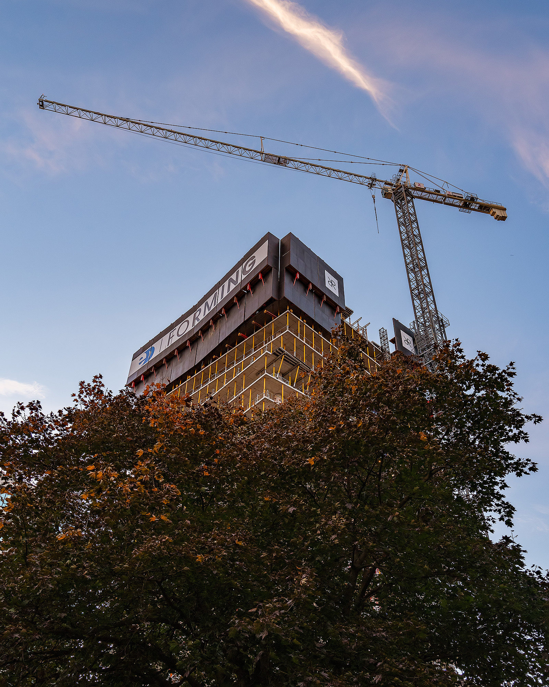

After creating a few  [abstract architecture art pieces](/abstract-architecture-art) around the upcoming One Richmond Row (515 Richmond Street), I couldn’t wait to see it in real life. With the building at around 18 or 19 floors right now, I think the anticipation is really growing for the Old Oak tower in Downtown London! I also felt this to be a great time to start taking some construction photos and document a big change happening in the core. 
Okay, Okay, I should admit that my original intent on this outing was to wander the downtown, without my tripod and tilt-shift lenses for once.

  
  <figcaption>People walking along Richmond Street with Construction of One Richmond Row in the Background</figcaption>

In 2019, the anxiety I’ve dealt with has been the worst ever and I was actually feeling some relief on this late autumn afternoon. I only took my camera (Sony A7RIII) and one lens (Sony 16-35mm f4). After about an hour or so, my  [photos are all focused around the construction](/construction-photography) . Not only was I trying to document things, but I was challenging myself creatively. After all, I was out to photograph at a time the light wasn’t technically optimal. The side of the tower I could mainly photograph was in complete shade come sundown. 
But wait till you see the glow from the sunset!

  
  <figcaption>Construction Photo of One Richmond Row in Downtown London as of October 2019 by Scott Webb Photography</figcaption>

Sun bursting through the construction of One Richmond Row // 515 Richmond Street, London

## Twisting One Richmond Row Under Construction

  
  <figcaption>Pathway leading to Twisting High rise Building being constructed in Downtown Ldnont</figcaption>

### Images from around Richmond Street and Dufferin Ave.

I took quite a few images around Dufferin Ave & Richmond St. The light was changing quite quickly as the sun was going down. Normally, I'd be using my trusty tripod for sharper images, but I am quite happy with how the handheld photos turned out. 

Next time, I'll be armed with the tripod and tilt-shift lens with the objective to capture only a couple of images that consist of the compositions I explored. 

  
  <figcaption>People crossing Richmond Street at Dufferin Ave with Construction of One Richmond Row in the Background</figcaption>

  
  <figcaption>Looking towards 515 Richmond Street Building as it is under construction and there is activity on the street</figcaption>

  
  <figcaption>Looking across the intersection to the tower being developed by Old Oak as the light is fleeting</figcaption>

## Looking Up at Construction

I also took a number of photos looking up at the progress of the construction. I especially liked trying to include a softer element like the tree:

  
  <figcaption>Looking up at the In-progress construction as if emerging from the treetops along with the crane at sunset</figcaption>

  
  <figcaption>Tower being built in Downtown London Ontario</figcaption>

I look forward to seeing One Richmond Row future develop and grow higher. 

Eventually, I'll have a full gallery with other photos to browse. 

---

- [Check out more construction photography](/construction-photogrpahy)
- [Learn more about One Richmond Row](https://oldoakproperties.com/apartments/one-richmond-row/)
