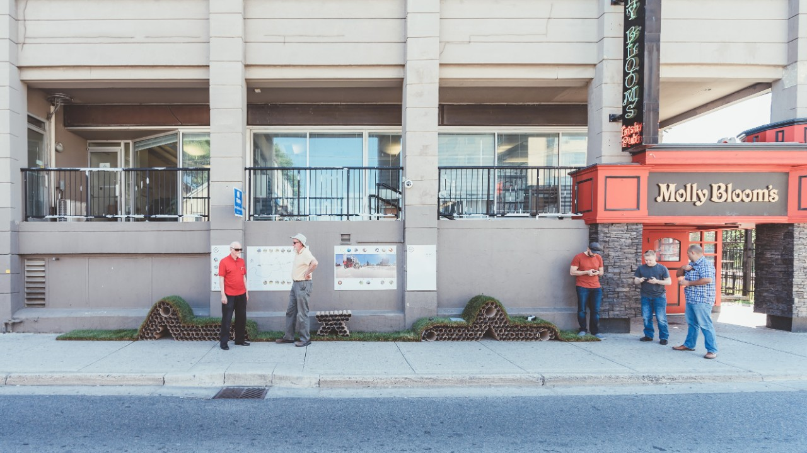
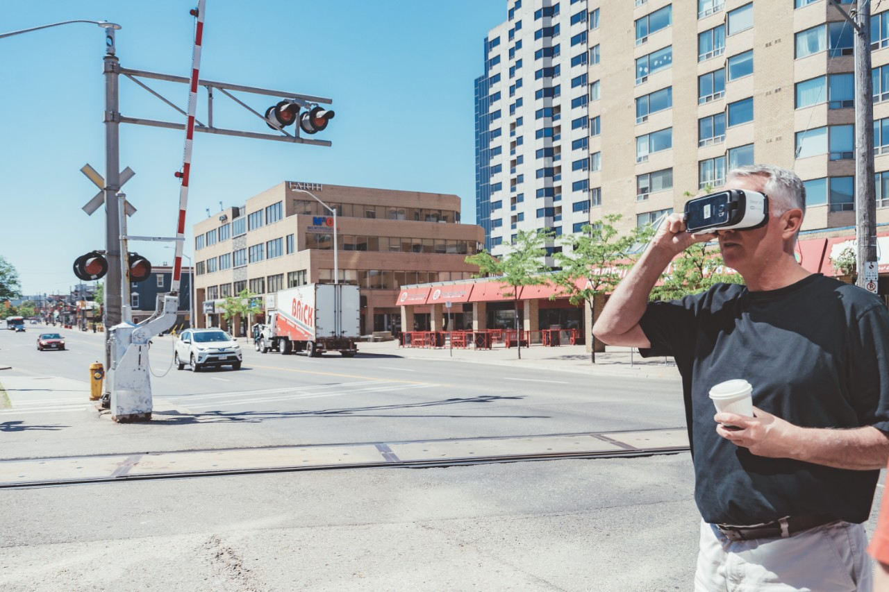
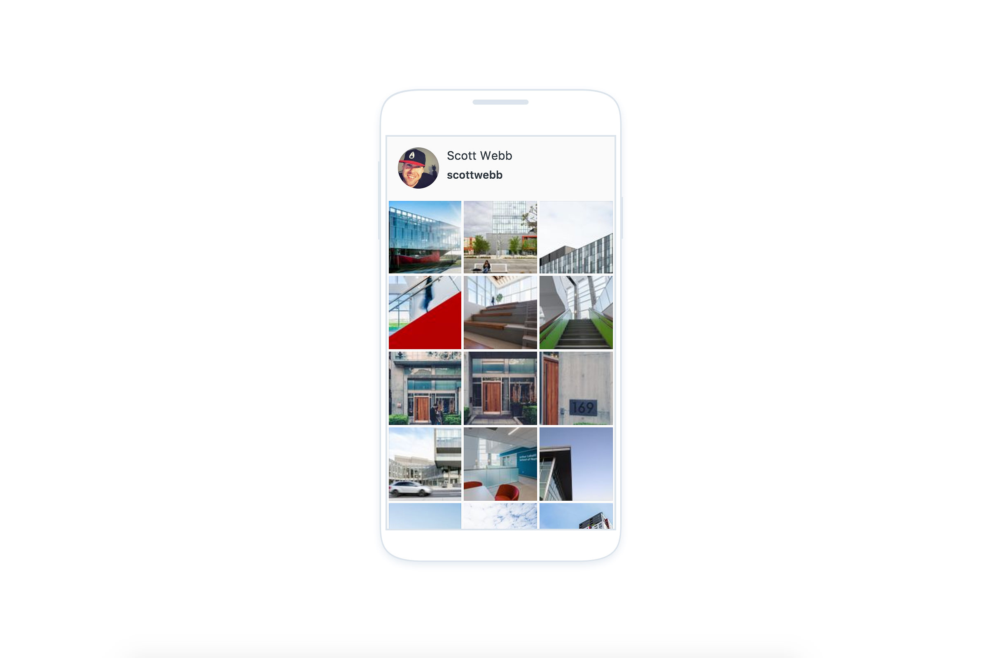
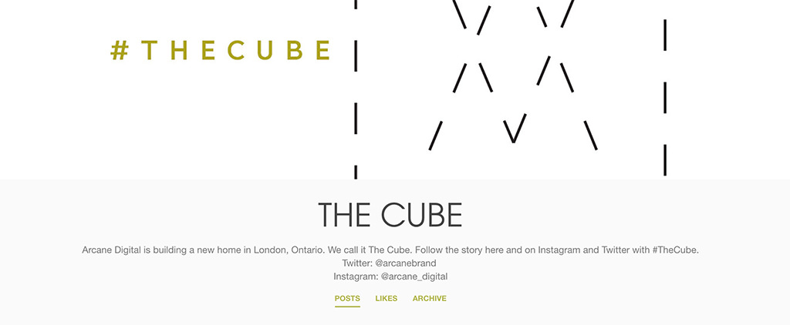
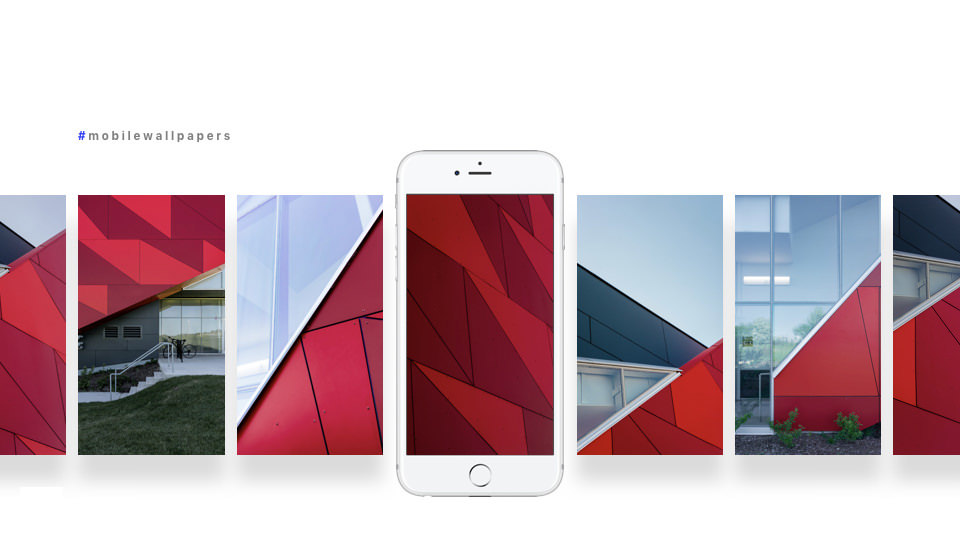

 [Architectural photography is an investment](/) and I want architects to get the greatest value out of it for their business. **A photo today has a worth far greater than 1000 words.** The visuals you put out for your architecture projects are more important than ever. Architecture photos delivered to architects should be used in multiple ways to their benefit. Clients of mine are finding greater value as their photos can be used for their portfolio, social media, and submitting to win awards. 

I spent some time trying to think of how architects could find greater value in the architectural photography provided by architectural photographers like me. Yes, the images will last years in terms of use in a website portfolio but there is so much more value to squeeze and benefit from right now. Much of what I came up with deals with gaining attention for the architecture firm, becoming more engaging, and building anticipation related to projects. 

## Here are a few ideas for architects to get greater business value with an investment in architecture photography:

### Start a blog on your website or Medium

  
  <figcaption>Cornerstone Architecture Inc. involved in a City of London Community Event</figcaption>

Many architecture firm and company websites I’ve visited don’t make use of a blog or space to consistently share articles, news, and content within their industry. Without a section like this on the website, it’s usually very quiet and can leave visitors a bit confused about your identity. Starting a blog and creating content can help connect you to become the leader within your industry or specialization. 

Also, transparency is something highly valued today. This is an opportunity to create buzz for your business locally and all over the internet. Give people a reason to come back to your site and engage with you. It may take potential clients a number of visits before feeling you’re the one for a project.  Update us on what’s going on within your studio. You’ll be able to use the [architectural photography](/) you’ve got done for projects in new ways, giving them greater value overall. 

  
  <figcaption>Cornerstone Architecture Inc. idea Rail to Trail</figcaption>

As an example, I recently helped out  [Cornerstone Architecture](http://cornerstonearchitecture.ca/)  by shooting some images and video of their installation for 100in1 Day. They were showing what it could be like in London if we converted the train tracks to a pedestrian type of trail. They did a lot of work on this for the event, including the ability to see the idea manifest through VR. It was great to get people talking about the idea. I’d love to see it live on digitally and the discussion continued through a blog article.

**Think it’s too much work to start a blog?** One easy way to get started is to utilize  [Medium.com](https://medium.com/) . No need to contact that webmaster of yours. Sign up, create a publication for your firm, and start adding content. Now, add a link to your publication on your website. The cool thing about a publication is how you could set up other employees to be able to submit articles to your publication.  Granted, you can do this for other platforms too.

Everyone could start contributing something and help things from looking like it’s been long forgotten. Images look great on Medium too! Still not sure, check out a post why Bob Borson thinks  [architects should be blogging](https://www.lifeofanarchitect.com/why-architects-should-blog/) .

### Start making use of social media

  
  <figcaption>Share architectural photography on social media - Instagram shown here ...</figcaption>

**As Gary Vaynerchuk would say, we’re all media companies now.** I know the [publicity from awards](/2017-don-smith-commercial-building-award-nominees) and such are very important, but the internet is a huge strategy and you can use your architectural photography to share through multiple social media platforms. The main platforms would be Facebook and Instagram.

 As visuals are more important than ever, you can reuse the photography to benefit you and pull more value out of them. Making use of social media is about gaining attention and increase your reach. I believe this is a far greater opportunity for your business than being covered in a magazine today. 

The eyeballs are on these platforms and one piece of content could land a project or collaboration you’ve always wanted.I’ve seen large architecture firms making use of social media, but here [in London, Ontario](/) there seems to be hesitation. 

> A photo today has a worth far greater than 1000 words

Get in front of more people, build up your projects and document your work with transparency. This is another amazing way to be more transparent as a studio and grow a deeper connection with your audience.

### Create Landing Pages For Projects In Progress

  
  <figcaption>Create Landing pages for specific projects like this one for The Cube</figcaption>

Most often I will hear about a [new development in London](/one-richmond-row-reaches-top), but I never hear anything about it again. I might hear about the completion, yet that’s even rare. I believe architects could create buzz for architecture projects-in-progress through specialized landing pages. These pages could be on your own website, a subdomain, or offsite completely. However the page is set up, its simple and quick these days. Moreover, it can be done without extra costs other than time to update.  

Each page is highly focused on the development of the project and not just an ‘in-progress’ snippet in the portfolio section of your website. Remember, you should give people a reason to return and gain familiarity with your business. Where I saw this executed was through a landing page or project website for  [Arcane’s Cube building](https://thearcanecube.tumblr.com/) . 

The page was the work of Arcane from my understanding and looks like it was a cool way to build anticipation for their new home. It fell flat at the end but helped to share progress and details about the building. In doing this, you could  [work with an architectural photographer](/contact)  to [shoot construction and progress](/construction-photography) content for you. Today, the story is golden and a landing page for each project would be a great value add. Your transparency creates trust and helps you in growing connection with the client, potential clients, and the local community. These pages also become very strong in search engines, making it easier to find you. Check out the page for  [The Cube](https://thearcanecube.tumblr.com/)  for  [Arcane](http://arcane.ws/) .

Imagine how this concept could be utilized freely and without much work for you. Share the story, build anticipation, be transparent, and have more ways to get discovered. People may be more inclined to sign up for your newsletter for the reminder of new updates to the progress. Once the project is complete, drop a photo and link over to your portfolio to see more of the successful completion. 

### Offer Architectural Photos as Desktop and Mobile Wallpapers

  
  <figcaption>Showing architectural photography used as mobile wallpapers for community download</figcaption>

I believe in a sharing economy and it’s one of the benefits to using me as your [architectural photographer](/). I want you to get the most business value from your investment and create greater potential engagement with clients and website visitors. I feel you could create some buzz for architecture projects by giving away one or more photos of the building. This might be something every other photographer freaks out over due to licensing, but I see more value for you. I see this as an opportunity to create more engagement with you directly and get your work to spread.

People fall in love with buildings and do use images as wallpapers. Giving visitors the option in great quality is something different. Hey, why not hold an Instagram poll for followers to help you pick the project photo to be offered as a wallpaper. 

Engagement on Engagement for your studio and greater value from your architectural photography. 

## The many reasons for professional architecture photography

An Architecture studio already has many ways photography can be used to benefit them. The typical hero images are important, but so are images that can be utilized in more digital ways to promote the creative work. I’ve always wanted to be able to provide specific values related to the **ROI from architectural photography**, but with so many opportunities for business use, it is very hard. 

The ideas here may not translate to a dollar value right away, but I believe you instantly pull out greater value while gaining more attention and exposure all over the internet. One piece of content can change things or lead to an  amazing project . There is so much opportunity in these ideas combined with amazing architectural photography. 

**Do you have any ideas where architects could get greater value and continue to work with pro architectural photographers on a regular basis?**If you do, leave a comment or  [send me your thoughts privately](/contact) .

If you’d like to discuss some of these ideas in greater detail, I’d  [love to hear from you and see if I can help](/contact) .