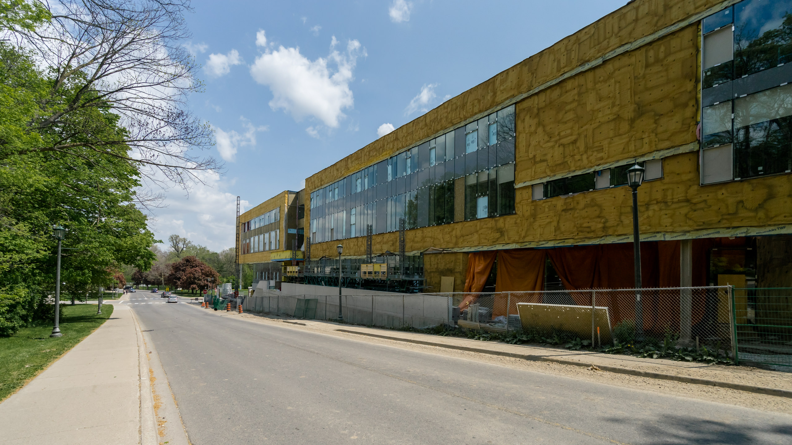
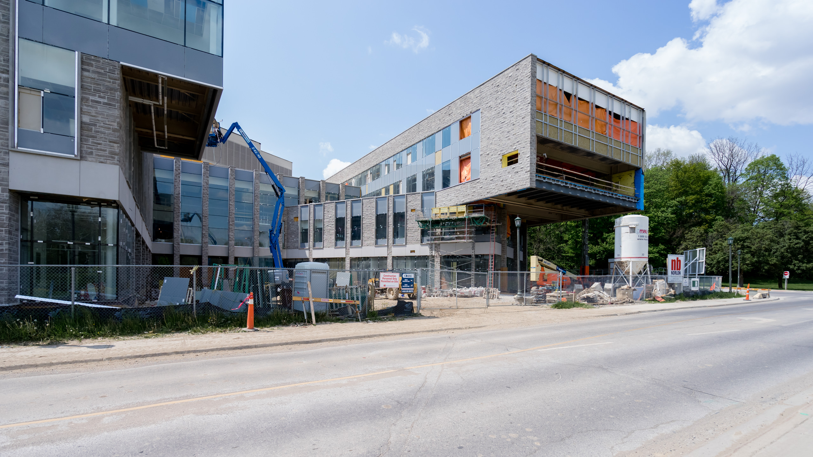
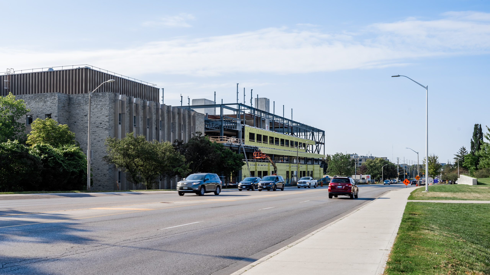
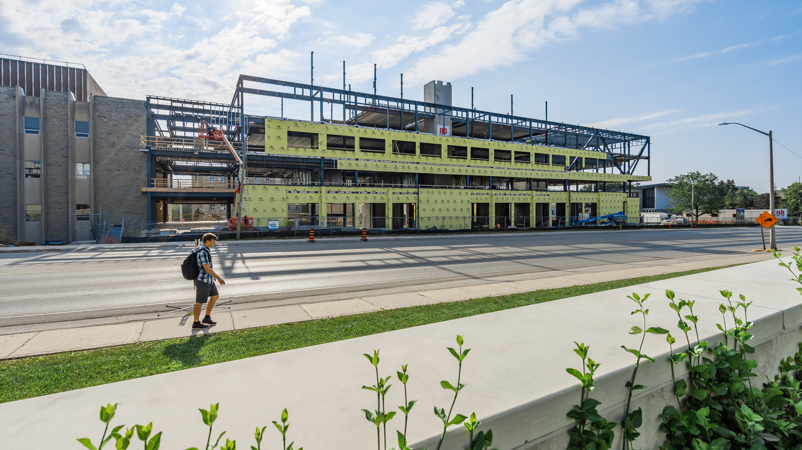
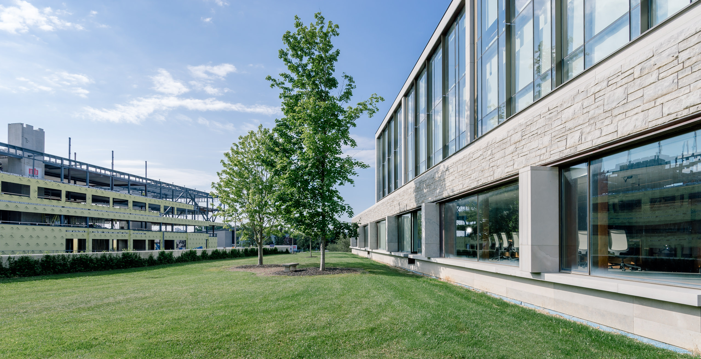
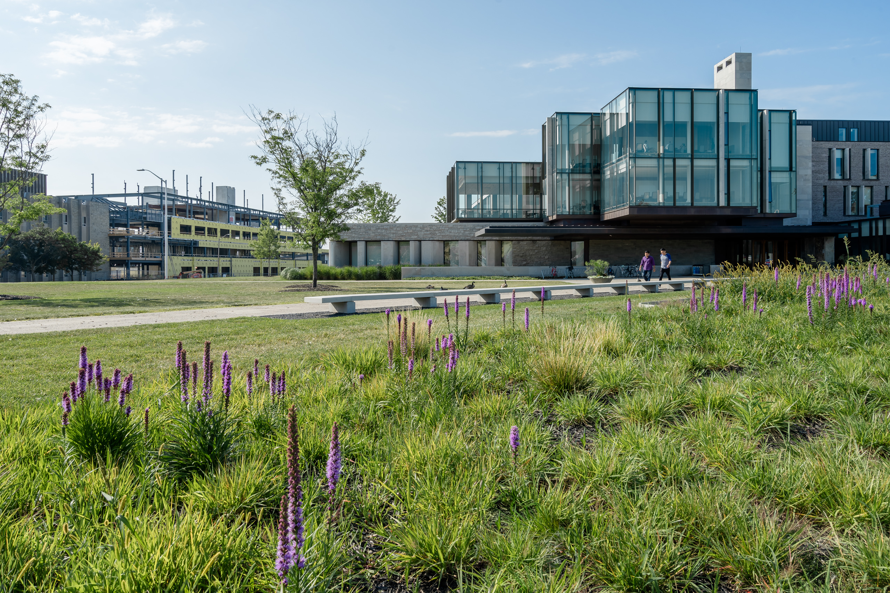

There is no denying that  [visual content is more important than ever before](/architectural-photography-changing) . The photos taken of complete projects are so versatile due to the digital nature of our society. As important as  [architectural photography](/)  is for completed projects, I’d like clients to consider really extracting the most value out of their architectural projects for themselves and for clients. This might sound like my other post about  [ideas for using your architectural photos in a greater capacity](/ideas-architects-find-greater-value-architectural-photography) , but this is post is going to refer to the actual architectural project itself.

There are many stages that go on prior to project completion and use to your advantage. Just as architectural photography is versatile in how many places you can make use of it for your firm, the visual content that can be created with the entire development of a project is too. In today’s digital society, we are all a media company first. With so much content trying to get our attention and digital being the way people get to know us, we need to find ways to stay top of mind and provide ways for our audience to engage. 

High-quality photography is a must because people completely ignore low-quality images now. I think if you decide to document more of an architectural project from start to finish, you’ll find unbelievable benefits.  

## What about Construction Photography?
The reason I’m bringing this is up is that I’ve been thinking about construction photography for a while now. I love seeing the progress of a new build and there are many opportunities for interesting photos.I was walking around Western University back in May 2016 and come across the construction of the  FIMS and Nursing Building. 

  
  <figcaption>Construction of the FIMS & Nursing Building at Western University, London</figcaption>

  
  <figcaption>Construction of the FIMS & Nursing Building at Western University, London</figcaption>

This was the inception moment of shooting  [construction photography](/construction-photography) , but I sat on the images as I couldn’t figure out how I could add another product as I wanted to focus on high-value for completed projects first.

  
  <figcaption>Construction of Engineering Building</figcaption>

  
  <figcaption>Construction photo of Amit Chakma Engineering building at Western University</figcaption>

As time has passed and I’ve been very busy with projects, I have been thinking about how I could provide other products to help extract the most value out of the architecture projects. I’ve got ideas on how construction photography could play out for clients, but I’m wondering how important it is to the architects, developers, owners, etc. There is a lot of value within it from my point of view. I also get a little frustrated when I rarely see project updates. I’ve found a couple of projects that have had some image updates and a monthly pdf update; however the images are such low quality they seem pointless to review.

  
  <figcaption>Western University Engineering Building Construction and Ivey Business School</figcaption>

## Is Construction Photography Worth It?
I believe even construction photography is important and high-quality is still a requirement. These are images representing yourselves online and other ways you’d use them. As well, the photography is to help accurately portray the quality of work being done. I’ll try and get out more thoughts on what kind of value I see for hiring a professional [architectural photographer](/)  to also shoot your construction photography. I also see a great opportunity to get more value for your money. I’ll have more details on this coming soon. 

Recently I was over in the university area because I wanted to start executing on shooting some construction photography. With originally named ThreeC+, now the new Amit Chakma Engineering Building, in-progress I decided for it to be one of the subjects I use to make the visions I have in my mind a reality.

  
  <figcaption>Ivey Business School and Amit Chakma Engineering Building Under Construction in Distance</figcaption>

 I would have liked to start from the beginning, but this should still give me an idea of the visual content I could create through construction photography. I’ll be limited to  [exterior photos](/exterior-photography)  as I won’t have any access interior  [in-progress](/construction-photography)  imagery. 

What I realized while shooting these photos was how I could compare these photos to the finished building later.  For instance, the last 2 images include the  Richard Ivey School of Business  in them to compare once the project is completely finished. I started to see how aesthetic these [vantage points](/london-ontario-vantage-points) will be. 

### What do you think?

**What do you think? How important would construction photography be at your firm? Absolutely critical? Or just a nice-to-have? Or somewhere in between?**

---