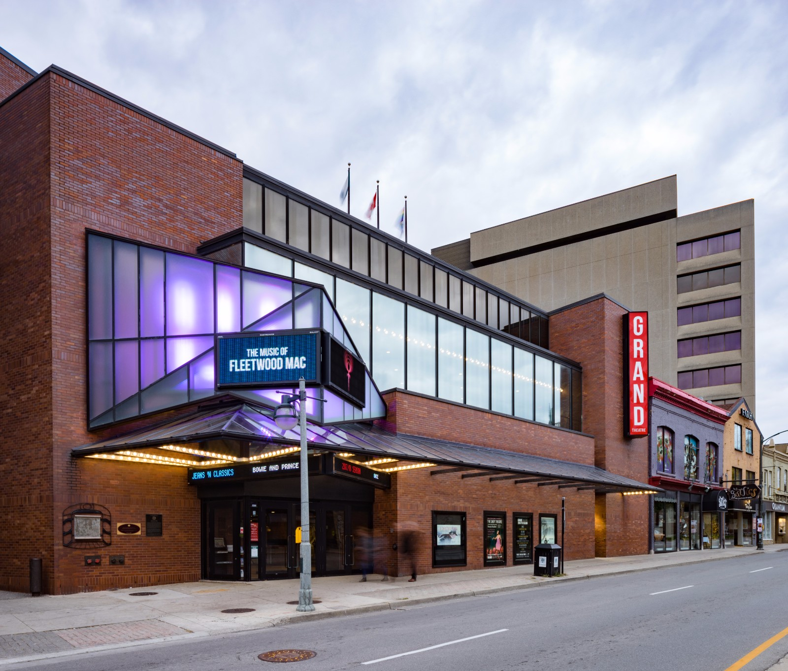
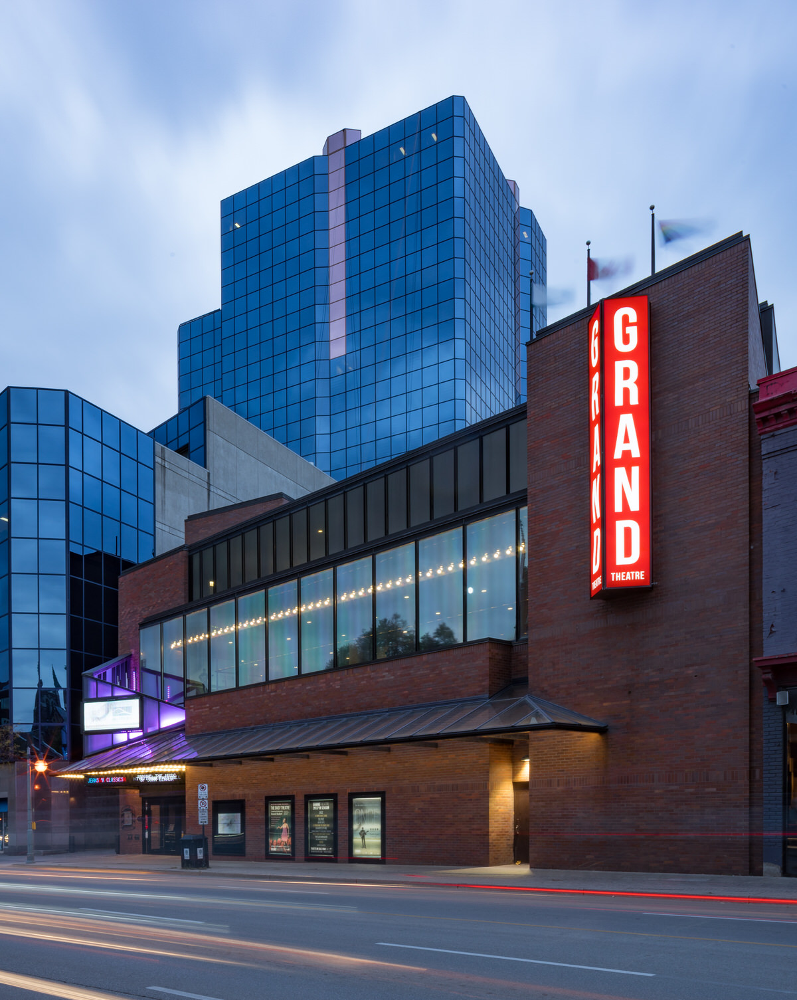
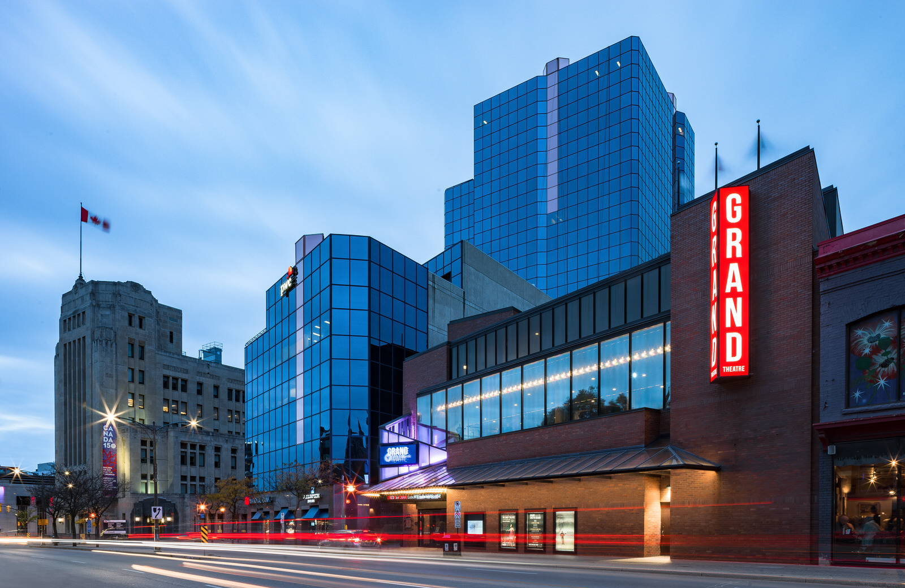
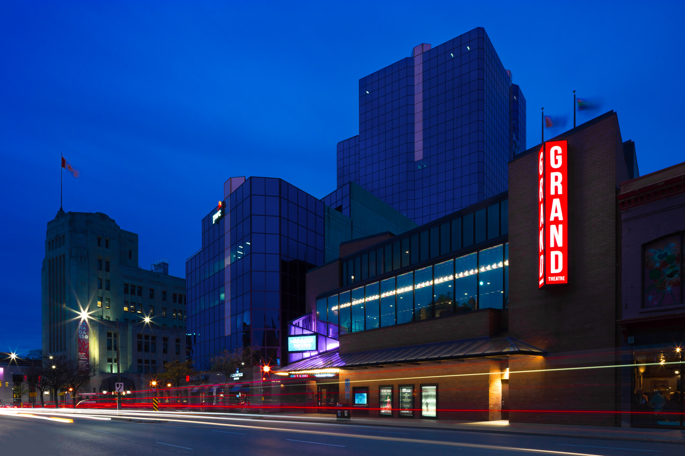
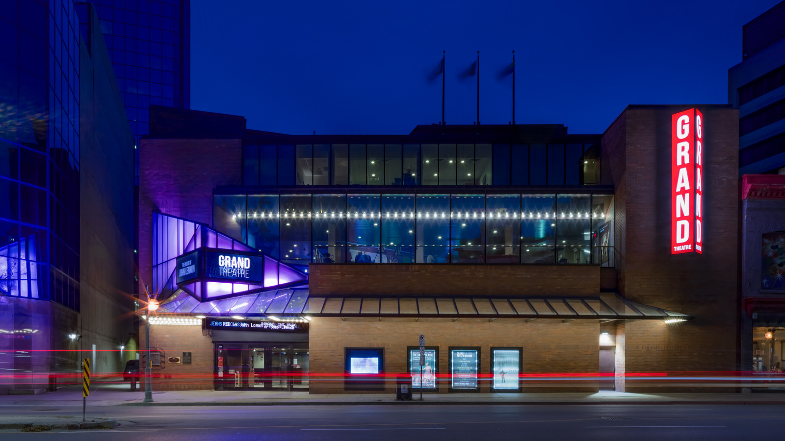

Gloomy days suck, but I want to share how to improve your [architecture photography](/) by using such days. It’s been gloomy, overcast, or raining for a while now in London, Ontario and I simply can’t stop grinding or continue to let these days get me down. Moreover, I want to use my [journal](/blog) to share a glimpse into my world as an  [architectural photographer](/)  and give insight to people pursuing this genre of photography too. 

First, let me share why rainy, gloomy days suck.

  
  <figcaption>Using gloomy days to scout for better future architecture photos</figcaption>

## Why Gloomy Days Suck for Architecture Photography

* You typically get a blown out sky
* Flat flat flat images
* Could make for a very ominous feeling
* These days can be really dark
* Little to no interaction of light and the architecture

  
  <figcaption>The Grand Theatre in Downtown, London</figcaption>

As much as these days suck for shooting exterior and  [interior photography](/interiors-photography) , they are a reality and this is how people will experience the architecture. As photographers, we have the opportunity to try and show how the project can still shine through. There will be times when I have no other option but to do a shoot on an overcast day or evening. I hate when those shoots happen, but deadlines are real. It’s why I recommend clients to plan well in advance and potentially allow for a few visits. And, this is where we get into being able to improve your architecture photography. It’s important to note that I’m more referring to photography for clients to use and not just random creative exploration for yourself.  And no, I’m not about to teach you how to do a [sky replacement](/sky-replacement). I’m not about that life. I feel in doing that, the client could have continued to use a rendering instead of real-world images.   

## Improving Your Architecture Photography when the weather isn’t perfect

  
  <figcaption>Scouting architecture on gloomy day</figcaption>

Because of the number of consecutive gloomy days here recently, I started to get frustrated. I’ve got a lot of buildings to photograph and deadlines to try and hit for clients. How could I still make progress, but not waste my time?. These days are perfect for doing the post-processing work. I hope what I realized can help to improve your architectural photography. I hope this isn’t information you see on every other photography blog. 

What I realized is, as with most things, relationship building is how to improve your architecture photography. Gloomy days or even just a couple of hours on these types of days can be used to build relationships. To put it another way, while the time to shoot isn’t ideal, you can scout your assignment. It’s no different from other forms of photography and building the relationship with the couple for wedding photography. 

With most wedding photography a meeting is set up for photographer and clients to meet. As well, engagement photography is typical for the couple because it helps build the connection with everyone and the photography on the wedding day will be much more comfortable. The more comfortable everyone is the better the photography turns out.

  
  <figcaption>Twilight Image after a gloomy day still works!</figcaption>

 In architecture photography terms, you are building the relationship by going out and meeting your subject, looking around to find  [interesting vantage points](/london-ontario-vantage-points) , and getting more comfortable with the project. You don’t have to take any photos, but capturing a few could turn out interesting and you can review some of the challenges of the location.

Sometimes you have to return to a location a few times to really get to know it. At the time, I did exactly what I’m describing with The Grand Theatre and a few other downtown locations. I’ve seen the location many times as I am downtown; however, I never really got to know the architecture or photographed it. I decided to use a couple of hours to scout it out so that on an ideal day I can return and bang out the shots I desire and catch something I missed on the first visit.  

Taking a few photos, I learned what lens I’ll most likely want to shoot with too. So, instead of scrolling my twitter feed again, I took advantage of yet another gloomy day to scout out shoot locations and grab some test shots too. You never know, the client may end up selecting one of your test shots. With digital, there is no harm in sharing more photos of the project. The photos added throughout this entry are from yesterdays first meeting with The Grand Theatre.

## How This Will Improve the Photography

  
  <figcaption>Revisiting The Grand Theatre after original gloomy day scouting trip</figcaption>

When I revisit The Grand Theatre location, I have an idea of where I want to shoot from. That means I could shoot from where I shot the photos you see or opt to move slightly for a better perspective. I have already learned that I’ll want to bracket images due to the rotating signage. 

Going out and scouting a location isn’t always possible. But, it’s a great exercise to become more familiar with your assignment compared to using Google Street view or trying to find images online. In fact,  [The Grand Theatre](http://grandtheatre.com/)  is yet another place here in London that I struggled to find images showcasing its exterior. 

There are many images of the interior seating and exterior images were sparse (and low quality). As well, from these photos, I’m inspired to go back and shoot more. Good things come from being inspired!And on a side note, it started to pour rain right after I took these. 

---

**Gear used for all photos:** [Sony A7ii camera](http://geni.us/sonya7ii) ,  [Metabones V adapter](http://geni.us/6jSj1d) ,  [Canon 24mm Tilt-Shift Lens](http://geni.us/AsrQ1VO) 
