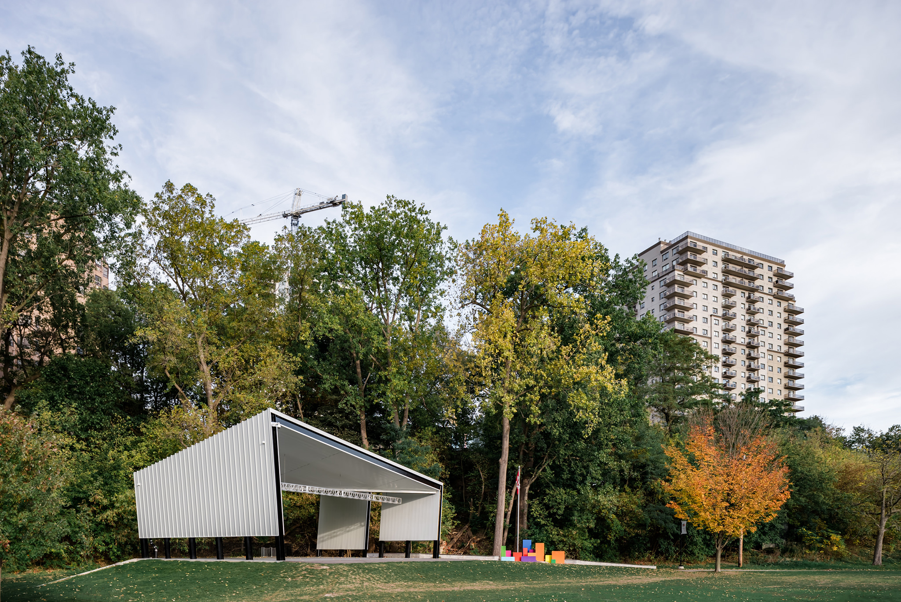
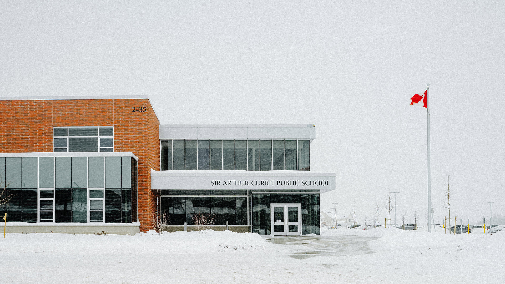
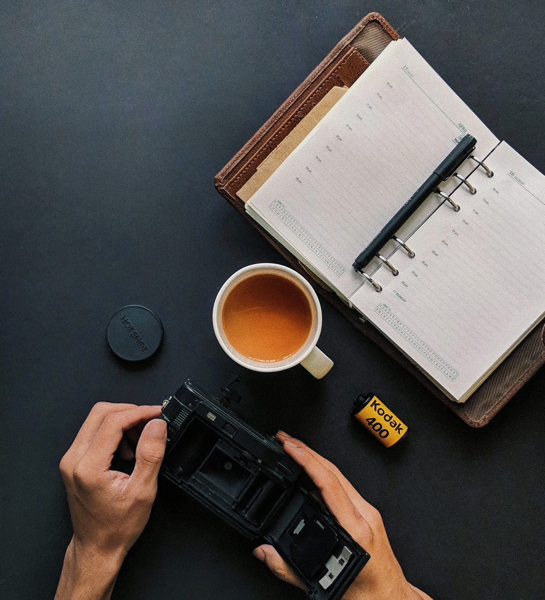

Wouldn’t it be desired to ensure great photos of your architectural work or for the project you were involved in? A successful project, in my eyes, includes  [professional architecture photography](/) . In this post, I’m trying to make the case for you to know the best time to schedule photography for your architectural projects in advance, if possible. 

## Best time to schedule photography
Remember, these project photos are going to be useful for many areas of business for years to come. So, the best time to schedule photography for your built project (or close to finished) is as soon as possible. This doesn’t mean we’ll go out and take the photos before it’s 100% finished. You’re simply scheduling everything in advance so that you are ensured photographer availability, a better price, and hopefully staying ahead of terrible unpredictable weather conditions.Let’s get into it in more detail. 

## How is Architectural Photography Usually Scheduled?
Typically, most requests for photography come once there is an important short-term need. I totally get this and hustle hard to get out for the  typical process of scouting, capturing, and then editing . If I can’t do a shoot within the desired timeframe, I simply don’t take on the project. This doesn’t include projects that are extremely large and we run into issues along the way. Issues like weather, especially.But, yes, most requests are reactionary to an immediate need that comes up. Needs like: 

* Aa submission deadline for awards
* Proposal deadlines
* Annual reports and documents
* Website imagery and portfolio updates
* Branding refresh about to launch

These requests can even happen for projects completed years back. Photos of older projects may have never happened or the current images look dated and in need of a modern, consistent, update.  

## Autumn is a super busy season

  
  <figcaption>Autumn architectural photo in Harris Park, London</figcaption>

While these requests for photography are not a big deal to me, I know that it can be a stressor for everyone else. My past clients can trust I’ll hit their deadline. I’ll do everything I can and that includes trying to control the weather. I’m not very successful on that weather control thing yet, though. Hey, that leads me to the major struggle with having a really short time to shoot a project or shoot at a specific time of the year.

Architectural photographers can tend to have a very busy autumn season and this is when the weather gets unpredictable for us here in London and Southwestern Ontario. You can feel two issues that arise: potential lack of availability and unpredictable/undesired weather or seasonal conditions. 

## Risk 1 - Weather and its cooperation or lack thereof
Weather makes things tough with short turnarounds and it gets especially tough late in the year. Last year, being super busy in the fall, I was praying for great weather. The opposite happened. I swear it was the worst. I hardly remember any weather that was amazing other than the autumn day I shot  images of The Canada 150 Pavilion in Harris Park .  

  
  <figcaption>Architecture photo of school taken during snow storm in London Ontario</figcaption>

Weather and seasonal conditions are tough to get around. And it’s explained before fully delving into a project late in the fall season. All those beautiful leaves and colours can disappear from a few days of strong wind and rain. Sometimes it’s 100% better to postpone any photography until the next year in spring or summer. 

See the example of a late in the year condition:  Essentially, starting a waitlist for the next season. Your needs for the project photos will really come into play. Sometimes,  [interior photos](/interiors-photography)  can be shot at this time and exterior photos at another date.Even the interior photos were impacted at Sir Arthur Currie due to the snowy conditions. Deciding to shoot in late spring the following year, we were able to get some  [amazing images of the exterior](/exterior-photography) . I’ve not even shared these photos yet, but here’s an example:  You can also see examples of this issue happening with  photos of The Covent Garden Market .

The earlier you plan for the photos to be shot, the better prepared we can all be. This is all especially a big deal after Summer comes to an end.As the weather gets more and more unpredictable, you’ll also want to  [look into hiring a local architectural photographer](/contact)  instead of bringing one in from a bigger city. Being local, the photographer won’t or shouldn’t have additional fees if the weather goes bad on a shoot day. No additional hotel or travel costs. 

## Risk 2 - Photographer (Un)Availability
As we get late in the year, many projects are being completed and require photographs. I wish I could shoot everything in London, but I know I can’t. Last year, I was at my max and if another request had come in, I’d have had to turn them away or see if they were okay with going on a waitlist. And, with greater demand, you will end up finding higher prices during this period of time too. Some cities like London may not have a long list of [architecture photographers](/) to choose from. 

You could be left to go with a photographer you don’t fully trust or spend more of your time trying to find someone. I know your time is extremely valuable and going on a last minute hunt is no fun. If you had your mindset and usually send a quick message for work to the photographer, it could be a super inconvenience to find out if they are suddenly unavailable at that time. If in a rush, you probably won’t have much time to go searching for someone else. Man, this gives me anxiety already. And, why I’ll try and figure out a way for this to not happen. 

## Book Well in Advance

  
  <figcaption>Planning to book with an architectural photographer</figcaption>

Booking shoots well in advance will also help the  [photographer](/about)  to plan out a schedule and have a much better idea of how much work can be taken on. You never know when something unique could come up and cause delay. Like what? Like a rooster  outside of The Factory London Ontario. 

If you know photography will be a need soon, connect. Since a photographer can only shoot and edit so much work, the earlier you book sessions, you could be booking them solid and making things a bit more difficult for others to get their projects shot.I hate saying that but it’s the truth in the end. I recommend getting in touch with me as I have some ideas for you if you have the need for  photography for multiple projects .

## Better Pricing, Multiple Use, Benefit For Years Later
Schedule photography for your projects in advance and you’ll find a better price, availability, and a better opportunity to plan everything out.I know it’s difficult with everyone so busy. The short-term need does become a long-term benefit for your business too. You’ll be receiving a good number of project photos and benefit from them for many years. These photos I create are done so with flexibility in mind. 

I want you to be able to use the photos for any business need: marketing, advertising, social media, portfolio imagery, in proposals, for inter-office discussion, and future reference with new projects. With the multiple ways photography can benefit the business, it should be of importance to schedule and plan photo sessions out. I want you to  benefit from extracting as much value as possible .While I don’t mean you have to plan out a specific date, plan out a time-frame and as the date gets closer, we can zero in on any specifics.In doing this, you might even find a photographer with unique offerings. 

## Photography of built projects will be needed eventually
To wrap this up, the best time to schedule photography for projects you’ve been involved in is as soon as possible. Eventually, you’re going to need images of the project. I’ve seen it many times now. Getting photos done years later may not showcase your work in the best way due to all the time passed and use of the spaces. This is especially true for interior spaces. 
There will be immediate uses for these photos and benefits will come up time and time again over the years. 

**The photos will pay for them self over and over again.** Photography of your projects does have real ROI. Scheduling photography as soon as you can the better everything turns out. Scheduling photography could even build loyalty and word of mouth.But, I’ll expand on that later.

If you know that projects of yours are finishing up this fall,  [I’d love to hear about them and see if I can help out](/contact)!

---