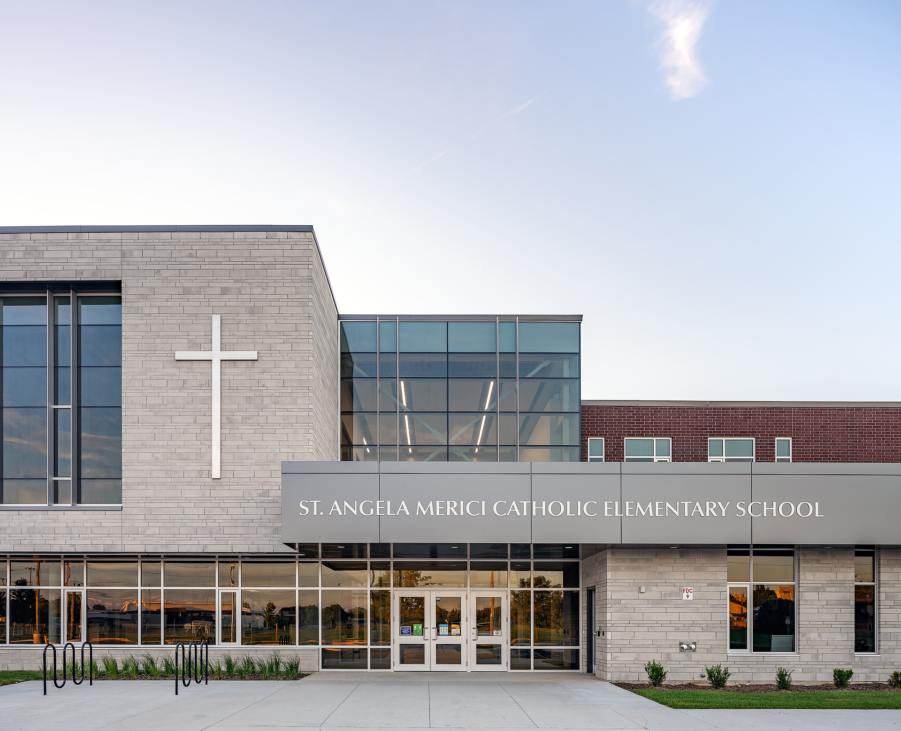

 

I thought I would start off my articles with some thoughts on “What is Architectural Photography in a Business Sense.” This is a little different from most articles I’ve seen where a photographer tells you how to shoot and what to use. 

In a generalized sense, Architectural Photography involves the photographing of structures, buildings, and interiors in a way that is both precise and aesthetically pleasing. This means that it is more involved than just pointing a camera at a building or structure and shooting away; however, architecture surrounds us all. Like street photography, the genre of architectural photography hypothetically has a low barrier to entry as subjects to photograph are everywhere. 

> **Architectural photography** is the photographing of buildings and similar structures that are both aesthetically pleasing and accurate representations of their subjects. **Architectural photographers** are usually skilled in the use of specialized techniques and equipment. (source:  [wikipedia](https://en.wikipedia.org/wiki/Architectural_photography) )

With a low barrier to shooting architecture, it’s actually quite challenging to become commissioned as an  [architectural photographer](/) . It’s also pretty important to differentiate photographers interested in architecture and specialized architectural photographers. I’ll try and go over this in more detail later. There are specific criteria that come into play when photographers are actually working for clients. 

Our love for architecture is always present, but we need to get images with intent. We need to bring our clients the success they are looking for through our work. At least that is my belief. 

## In the case of Architectural Photographers

  
  <figcaption>Architectural photography of School in Chatham, Ontario by Scott Webb Photography</figcaption>

In the case of Architectural Photographers; they capture both  [exterior](/exterior-photography)  and  [interior images of buildings](/interiors-photography)  for clients that need to display built architecture as attractively as possible, look more “alive,” and solve other business needs that centre around photographs. 

Now we’re getting to the business sense. 

A professional architectural photographer collaborates with the firm or interior designers to learn about the project. It’s important to know architectural photography is different than real estate photography. Often these types of photography services are grouped together; however, real estate photography is to simply document and does not get into  [artistic](/abstract-architecture-art)  vision of the  [photographer](/about)  or architect.

Every building presents its own set of challenges related to light, perspective, distortion, and context, so you want to work with a  photographer that specializes  in shooting them.

### Clarity & Trust
In the business sense, architecture photography helps to clearly communicate the built projects interaction with the real world. The resulting photos bring a multitude of benefits to architects, interior designers, builders, and developers.

As mentioned above, it’s simple for anyone to shoot architecture as a subject; but, yet our minds have a keen and delicate relationship with the world.**It’s easy for low-quality photography to cause suspicion, mistrust, and confusion. In fact, I’ve noticed many architectural firms and other businesses completely disregarding professional architectural photography for their finished projects.** 

There is a sketch or 3d rendering only. In my opinion, this is a danger in today’s visual world.  The complete lack of images of built architecture is negatively impacting the business in two ways – first, when potential clients subconsciously wonder if you cut corners on photography, what else do you cut corners on? Materials? Second, trust issues rise as people are left wondering if your projects are real, theoretical, or falling through. 

## Pro Architectural Photography makes good business sense

  
  <figcaption>Award Winners using My Architectural photography</figcaption>

In the public domain, the recognition of a building’s “exceptional” nature is often through photographs. To reach a wider audience, the architect depends on who photographs it, and on the techniques used. For [award submissions and becoming a final nominee](/2017-don-smith-commercial-building-award-nominees), typically professional photography is required. Because of the many ways professional architectural photography can help firms, letting an experienced expert handle your architectural images just makes good business sense.

---