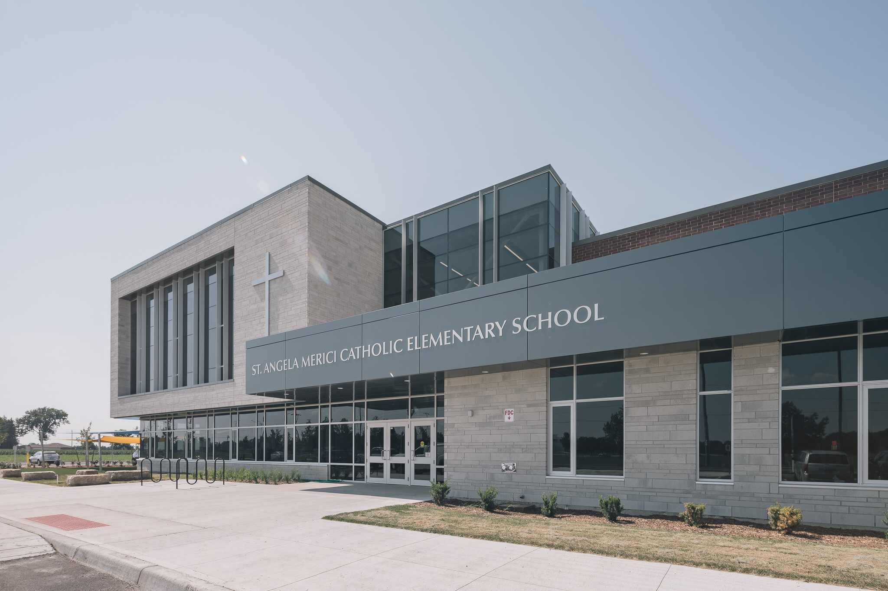

 
 Many times, you aren’t privy to a photographer’s scout photos. They’re like some initial thumbnail sketches within an artist’s journal. The photos in this blog post (just like a journal) are some test photos I took at St. Angela Merici Catholic Elementary School, a beautiful new school project of Cornerstone Architecture. 

But why even bother with some test photos? Why share this part of my [process](/process) as a [photographer](/about)?

  
  <figcaption>Scout photo at school in Chatham, ON with unmovable truck</figcaption>

## Why Bother with Scouting Photos?

The time I was able to arrive at the site wasn’t optimal. The position of the sun wasn’t the best when considering the orientation of the building and its front elevation. As well, the site was busy as the school works to be September ready. Trucks and vans parked out front of the building were compromising almost any photos. I could have opted to not bother taking some photos at the time because I knew I’d prefer to come back to shoot in the early morning. 

  

I decided to take some photos while scouting the building because I wanted to test out some angles and ideas that could be tried at the more optimal time. But, sometimes scouting photos can turn into more and I keep that in mind too. 

Scouting photos or test shots also provide me with the opportunity to play with some quick editing and be experimental. It is a way to flex some creativity for the day - something I try to do daily in some way. For instance, these photos shown here are more stylized that I’d typically create.

  
  <figcaption>Scouting by way of cropping other photos for future frames</figcaption>

The above photo is a crop from a much wider shot. When looking at the original image, I saw a tighter crop with potential. Since the photos I shoot are extremely large and high-resolution, I can crop to something like above and still retain a great resolution; however, I’d much rather frame this shot up again when returning at a better time. 

Due to the time, you might notice the sun is shining on the left side and making it brighter that the front of the building. It’s also causing a few weird shadows. I’d much rather the front elevation to not be in shadow, even if it’s so minimal.

  

With a truck parked directly in front of the school, I could have attempted to get it moved; however, I already knew I was coming back at a time where there should be no one around. If you’re wondering what the problem with the truck is, it’s creating an awkward reflection in the windows. I’d much rather see if I can get a cleaner reflection or get some colour from a sunrise. 

Look even closer and you’ll notice the garden hose that I would have typically moved for the shot. And, I didn’t bother to try to edit it out or edit out the bottom of my tripod legs reflecting too.

  

  

## Building a relationship by scouting

Lastly, I believe scouting a project helps to create a better relationship with it. A better relationship with the built project always brings about stronger final images. I’ve been able to show this with past work, such as photos of StarTech.com, where the evening photos show that it was the optimal time to photograph the building based on its orientation too.

Stay tuned for future images of St. Angela Merici Catholic Elementary School. You can be the judge if you find those photos more interesting than these scouting images.

---

Feel free to let me know any thoughts on the styling too. Normally, scout photos aren't styled.