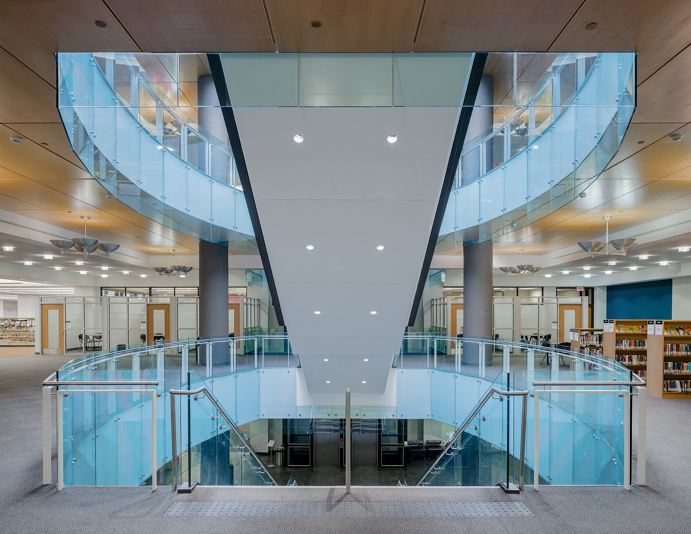
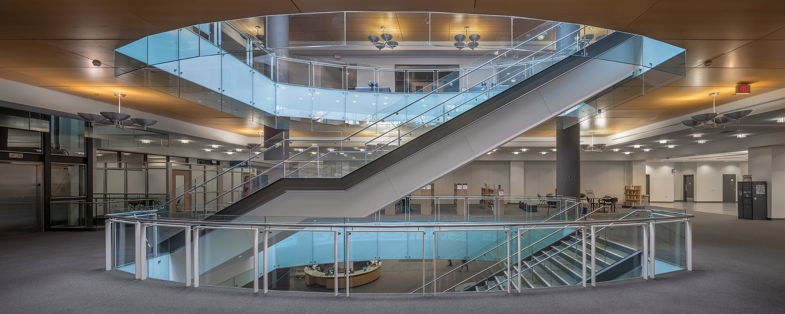
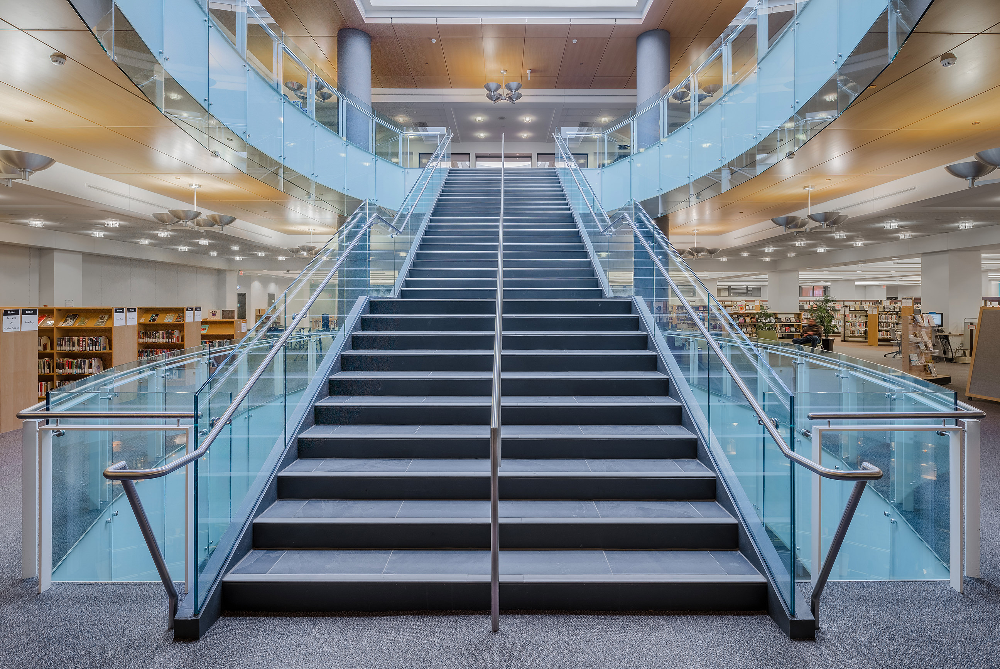
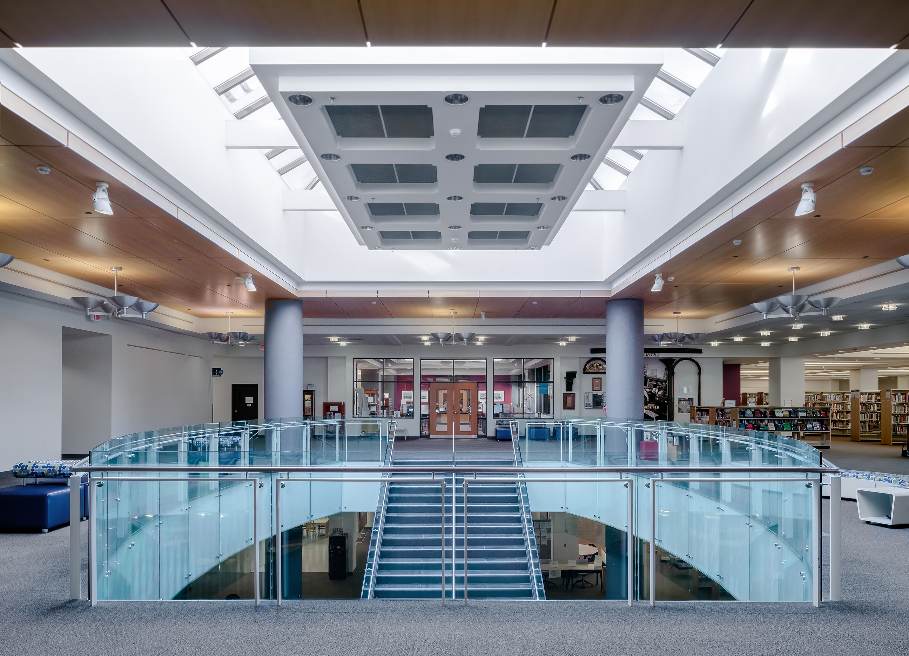

Working closely with [Nicholson Sheffield Architects Inc.](https://nicholsonsheffield.ca/), there came a need for [interior photography](/interiors-photography) of their London Public Library Revitalization. I wanted to create clear imagery that was as close to reality as possible and had flexibility for them to use throughout any business need. The shoot took longer than anticipated due to the need to do as much stylizing as possible before taking the photo. In the first floor image, there was simply too much going on to move everything to the left of the scene. There is something special about that photo to me, though. I find that those items to the left are far overshadowed by the beauty of the staircase design. Of course, it would have been great to shoot it when the library was empty, but it could also end up feeling lifeless. 

Overall, it was a tough call to leave it or move it. There were a number of other challenges to shooting and editing these library images, but that's the nature of [architectural photography](/). I'd love to share a bit of an amusing story.

Making the images, I was moving items around. I was moving items like garbage cans, blocks, books, carts and signs. I'd move something out of the frame for the photo and before I could take the photo, someone from the library was fixing it. It happened a bunch of times. There was a yellow caution sign on the stairs that I moved just out the picture and by the time I got to the camera for the shot, it was being stood back up. So, I had to leave that to be removed in editing later. It felt like a game, but I was glad to see employees cared a lot and fixed thing as they came across them.

## More Library Revitalization Images

  
  <figcaption>Looking back at the design after reaching the 2nd floor of the London Public Library</figcaption>

  
  <figcaption>Large panorama side view of the staircase going from 2nd Floor to 3rd floor</figcaption>

  
  <figcaption>Looking up the staircase from the 2nd floor to the 3rd floor of the library</figcaption>

  
  <figcaption>view of the project from the top floor</figcaption>

What an amazing update to the central branch of the London Public Library that receives a huge amount of attendees every year. 

The project is clear evidence of work making London a more attractive place. 

The work won a 2018 Project Excellence Award too!

---