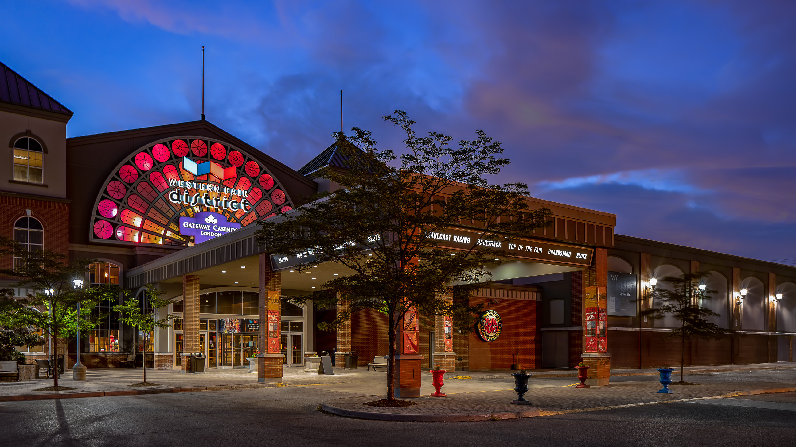
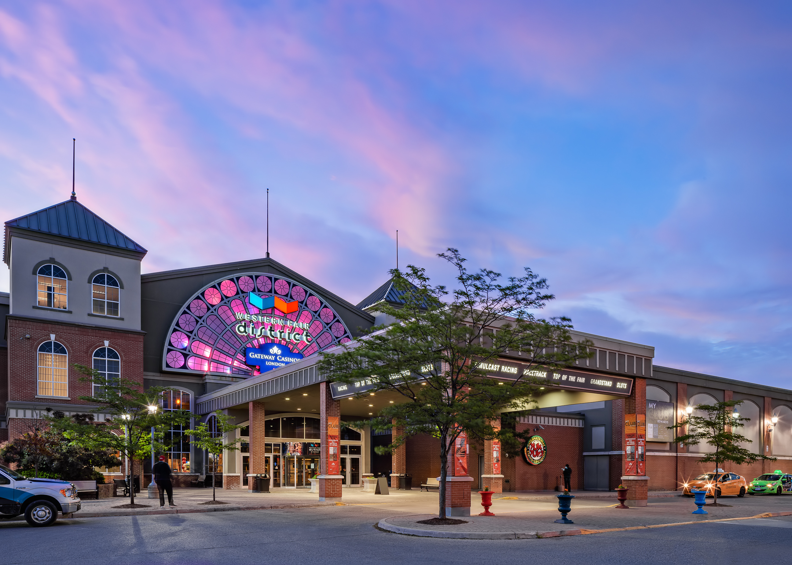
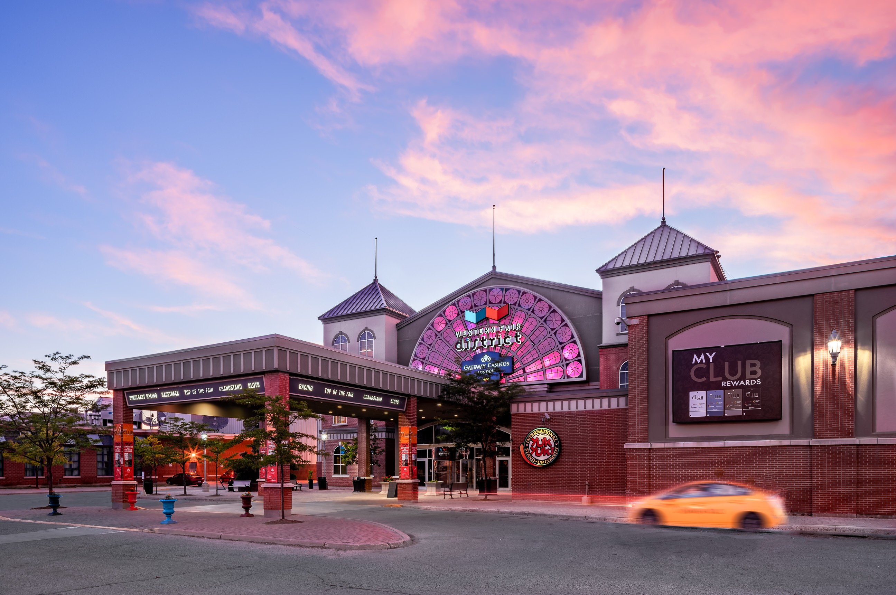

In this article, I'm going to show you fresh and [modern architecture photography](/) of the Western Fair Raceway and Casino at around sunrise within the Western Fair District. Along with these 3 images, I'll share my thoughts on them and my approach or [process](/process). These photos are for an architectural photography assignment. I assume, like me, you see the Western Fair Raceway and Casino one of London's attractions and entertainment destination. I feel like I'm playing double duty as I want to make the building look as eye-catching as possible for my client, while also helping in showcasing buildings and places in the City of London, Ontario. To accomplish this job as the [architectural photographer](/), I felt there was one optimal time to take the photos. 

## Optimal Time to Photograph the Western Fair Raceway & Casino

Yes, I believe there is an optimal time to photograph the entrance to the Western Fair Raceway and for a number of reasons. I had to plan and think this time out because I don't have the time to return at multiple times in the day right now due to being so busy. I like to provide clients with more options, but this building will just have to wait for my return some other time in the future. So, what did I plan out? I came to the conclusion that the optimal time to shoot the entrance of the casino is at sunrise. For me, right now in London, that means photographing at around 5 am until 6:00 am.Let me tell you why I chose sunrise as I show you the photos! 

## Western Fair Raceway and Casino at Blue Hour

  
  <figcaption>Blue-Hour at the Western Fair Raceway and Casino in London, Ontario</figcaption>

Wait, didn't I just say the optimal time for me to shoot is sunrise? Why am I now saying "blue-hour." Well, there is [blue-hour magic](/twilight-photography) that happens pre-sunrise, while the sun is still below the horizon. The Western Fair Raceway and Casino entrance face west and the sunrise in the east. This is actually great for shooting at morning twilight or pre-sunrise. The sun is rising behind the architecture and creates a nice blue glow in the sky as the sun is still below the horizon. The photo below was shot at 5:13 am. I know, I should have tried to shoot at 5:19, but the light was changing quickly. With some clouds, we get additional colour and interest to the scene! Man, everything was looking to be epic over the Western Fair District on this morning. 

This first image is cropped at 16x9. One of the other photos is also from this angle and I feel the crop helps to differentiate.

  
  <figcaption>London Casino and the Western Fair Raceway photo at sunrise with colourful sky and signage</figcaption>

Another reason for hitting up the Western Fair District around sunrise is because the colourful lighting is still on. In the case of the raceway and casino entrance, the large sign also changed colour. I wanted at least 2 of the images shot with different colours to show this different look. Sadly, you'll see in the 3rd photo, the lighting was fading out into the morning or the lights were going off. You really don't have much time to work!  I couldn't believe the scene as it was so vibrant and colourful with the sun coming up behind. If curious, this 2nd photo was shot at 5:22 am. Whoa, only 9 minutes after the first photo. I admit, I thought this photo was closer to sunrise which is around 5:47 am or something right now. So, the sun hasn't fully come up yet but it was getting brighter and pinker quickly.  

## Western Fair Casino and District at its Emptiest

The scene can change a lot at this time. The clouds are moving, everything is getting brighter, and colours are changing too. I love shooting at this time for the quietness, but it's definitely got its fair share of challenges. The quietness/emptiness of the early morning is a key factor in my decision to shoot around sunrise. You don't see it here, but there is a huge parking lot in front of the building and cars are parked there at all times. To get a great shot of the entrance, straight on, becomes next to impossible from the ground. Even with a tilt-shift lens, it wasn't going to happen. The lot is even more packed during the day and don't get me started on the number of parking signs. To get around it, I'd probably need to try getting up in the air with my Mavic Pro drone.   

### Avoiding a sea of parked cars

I knew in the morning I could be partly in the parking lot and within roadways without disturbing anything. I prayed the security truck I've always seen present would not be there. Sadly the truck was parked in its usual spot right until I packed up to leave. What can you do! I wasn't questioned by security though. That was nice. I guess I could have tried to find them to ask about moving the truck a little bit. Next time, right! You can see what I'm talking about with the truck in the 2nd photo here.Essentially, I didn't want a sea of random parked cars in the photos. I've seen those around and they aren't pretty. I did like the arrival of a couple taxi cabs, though. I thought they helped to balance out the truck issue and they are a serious part of the landscape. A couple of people came outside for a smoke which helped make things more alive. 

### Motion can still be incorporated into the photo

  
  <figcaption>Light Trails with life and activity happening outside the Western Fair Raceway</figcaption>

The 3rd photo is from the other side of the entrance and brings the sense that the Western Fair District is always alive with activity too. Architecture doesn't exist in isolation and it's always important to include in my architectural photography if possible. I got lucky around 5:30 am when the yellow taxi needed to leave. One of the great secret weapons of shooting at this time, you still get light trails and motion blur from cars without the use of an ND Filter. When it isn't possible to capture [people in architecture photography](/people-in-architectural-photography), motion blur and trails from long exposures bring in the presence of activity and a sense of time. These elements add interest and intrigue to the photo. I love when I can include it all. 

### The sky was really that pink

  
  <figcaption>Real Pink Sky Sunrise in London Ontario on June 22, 2018</figcaption>

Lastly, at sunrise, you never know what that sky is going to deliver. The sky on this morning was epic. It was really as pink as displayed.  I was in complete awe, honestly. In awe to the point that I actually took out my iPhone to snap a photo!  An epic sky came out to play. I couldn't believe how pink things were as I was waiting for that sun to fully rise. My shooting continued after these photos, but the colours started to disappear. I started trying some vertically oriented photos and getting further away, but the taxi cabs were now gone, the lights were getting less noticeable, and there were so many distractions (parking signs). The big colourful signage seemed to go off except for a few lights and it really isn't beneficial to show The Raceway entrance in that transition. The other photos would have taken a long time in photoshop and such involvement of mine wouldn't create stand out final photos, in my opinion. 

### Another Time

I'd love to go back for [twilight photography](/twilight-photography). At twilight, I see images showcasing a busier place within the [Western Fair District](http://www.westernfairdistrict.com/). The only bummer would be all the parked cars. Eh, it's a tricky time. Worth it. 

### Did You Catch the Sunrise? What do you think?

I know, 5 am is pretty darn early and it's the life of an [architecture photographer](/) in the Summer; however, did you catch the sunrise? Did you get a photo of it? Feel free to drop a comment and share where I could see it. As well, what do you think about my decision to shoot around sunrise? What do you think of the final images seen here to showcase one of the great entertainment destinations in London?

---

Originally posted before Covid-19. 