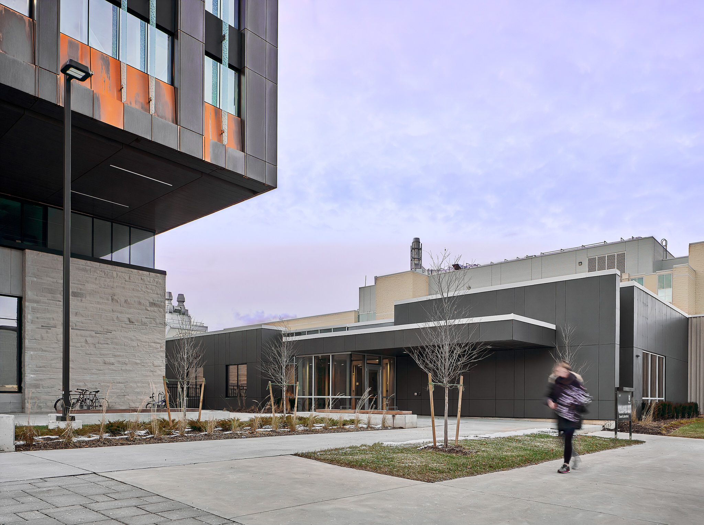
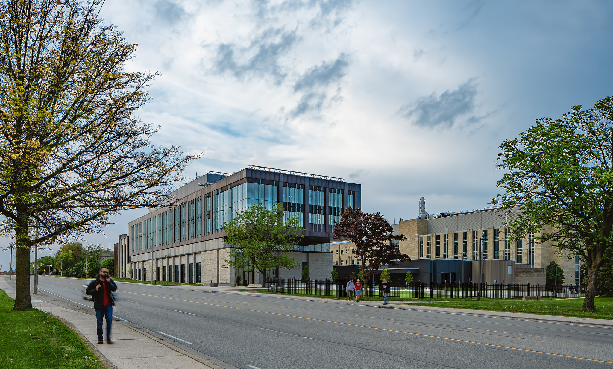
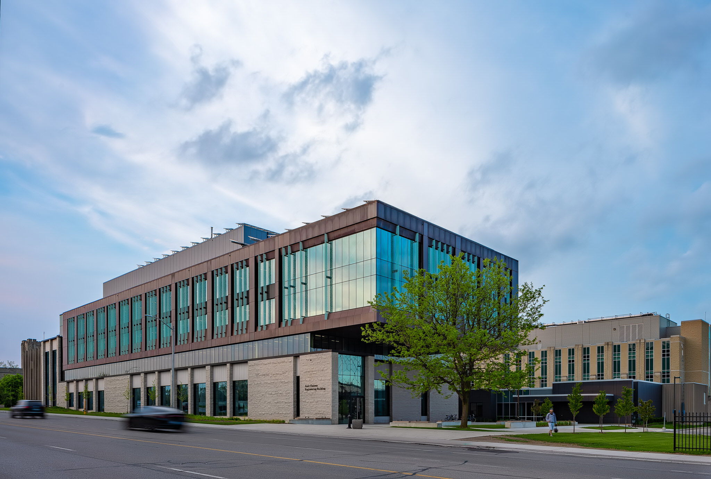
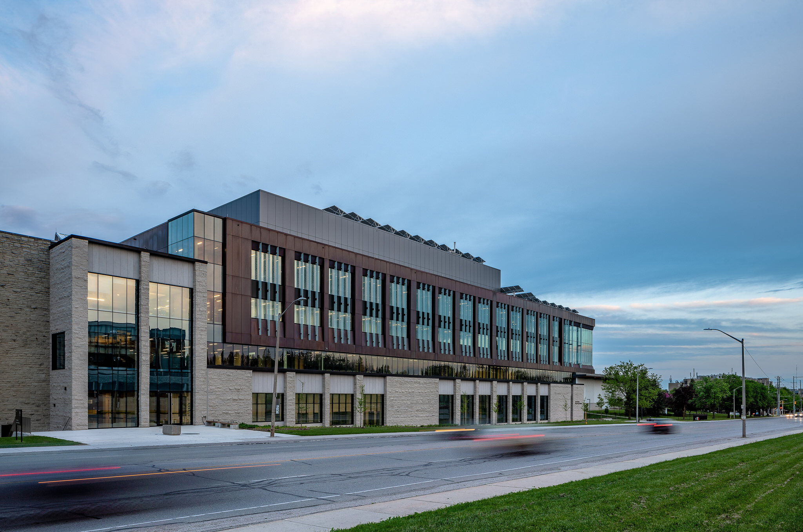
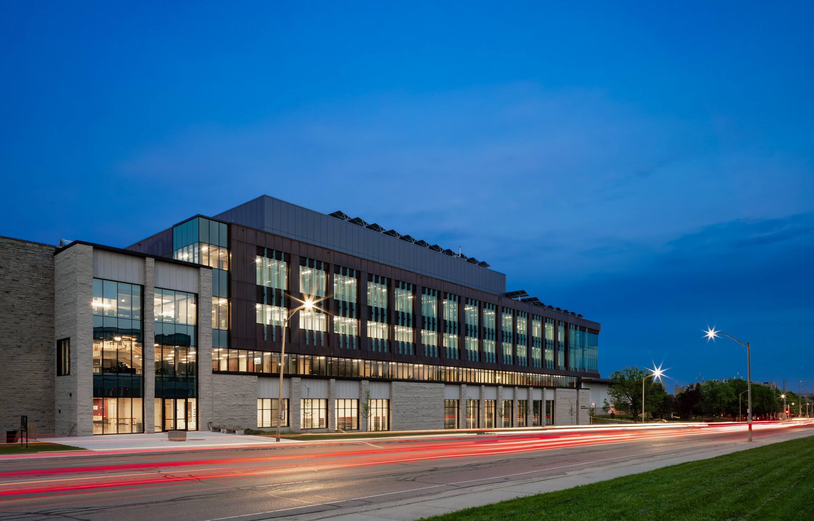

Patience. A lot of patience. That's what was needed to shoot these architectural photos of the Amit Chakma Engineering Building (originally named ThreeC+ Engineering Building) at Western University here in London. **A 36 million dollar building!**

I've been wanting to photograph this building since I saw the design. Since it takes a few years to be finished, I started out with getting a few [in-progress construction photos](/construction-photography) early on (If interested, [here are two to check the out](/extracting-value-architectural-projects)).

Even when it seemed like the engineering building was complete and it was opened up, on October 12, 2018, it really wasn't in my eyes. Read about the opening on the Western Gazette [here](https://westerngazette.ca/news/new-engineering-building-renamed-to-amit-chakma-engineering-building/article_e0f51eca-ce6e-11e8-855b-6b992cf64936.html).

## Amit Chakma Engineering Building Awkward Phase

That's right, the copper cladding needed time to oxidize and show the building as designed. The copper went on totally orange and confused a lot of people. I wanted to shoot because I personally love to showcase architecture in London to the world; however, I considered this oxidation period to be the awkward phase. It needed to mature.

Applying so much patience was tough. I did, eventually, need to include some of the building into my work while photographing the renovated Boundary Layer Wind Tunnel. See the image below as an example:

  
  <figcaption>Photo of the renovated Boundary Layer Wind Tunnel Building and portion of the Amit Chakma Engineering building during an awkward phase.</figcaption>

The toughest part for me was actually seeing photos of the building by other people. Especially photos within this awkward phase. I understood photos could be needed for companies involved in the architectural project. 

If I was shooting, I would include reshooting once the building truly became the matured Amit Chakma Engineering Building. The images of it with orange were confusing people on Reddit, Instagram, and Facebook. People didn't understand that it wasn't done yet and would softly rip on the design.

We all needed patience.

### No More Patience

I needed to check out the status of another Western University architecture project shoot. Since I was out that way and the sky was seemingly opening up, I also checked out the Amit Chakma Engineering Building to see how it looked.

It looked like the new engineering building was so close. Full maturity might not be there yet still, but the copper was looking oxidized enough for me to shoot some scout type photos. It was an opportunity to flex the creative muscles. 

So, I spent an hour and a half exploring to create a few photos and risked my life in the process. 

I approached the Amit Chakma Engineering Building from the south. This is one heck of a [vantage point](/london-ontario-vantage-points) for the building. When it came to these approach images, I tried to include the Boundary Layer Wind Tunnel as well (blog post with photos in the works).

  
  <figcaption>Amit Chakma Engineering Building - Western University</figcaption>

In the above photo, the sky was technically overcast to me. It was behind me that the sky was opened up and blue. Since, I live in the south end of London, I thought all of London had gone clear(er) skies. Oh well, I still stuck around to see what could happen.

### Attract the Best Engineers

One of the reasons the Amit Chakma Engineering Building exists is to attract and accommodate the best engineers from all over the world.

> Could high-quality Architectural Photography could be worth 1000 more applicants?

A beautiful facility sure does help!

But to attract international engineering students, I believe it is important to showcase the new hub they'll spend a lot of time learning through media like photography. 

  
  <figcaption>Amit Chakma Engineering Building and Boundary Layer Wind Tunnel Building</figcaption>

To showcase the building, there need to be images available. I know for a fact, I'd be searching the internet to see and learn more before considering Western University as a candidate. 

The Amit Chakma Engineering Building is a standout building and hub for the growing number of engineering students. 

The photography of the building is worth more than 1000 words. Could [high-quality Architectural Photography](/) be worth 1000 more applicants?

Since people believe the image, it's important to match all the wonderful copy that talks about it so magnificently. A poor image could completely negate all the accompanying copy trying to attract them. Images should reflect the beautiful modern architecture (and engineering) found on the campus of Western University.

  
  <figcaption>New Engineering Building as the sun went down – looking southeast</figcaption>

### Just a beginning with the new engineering building

These impromptu photos of the Amit Chakma Engineering Building are just a beginning for me. I want to shoot more on another day with a different sky and include different angles during different timeframes.

For example, the below twilight photo ([if you love twilight photos, check out my portfolio here](/twilight-photography)) is shot looking southeast and the far end of the building doesn’t have interior lights on. Upon returning, I’d try to get those lights on and reshoot. As well, I’d make sure to walk back to the other end and shoot looking northeast.

  
  <figcaption>New Engineering Building at twilight</figcaption>

As a local [photographer](/about), I love the ability to go back to locations and not only reshoot but look at additional ways you didn't see initially or due to your camera battery dies (GUILTY). After this twilight photo, my battery shut down and I couldn't shoot another twilight from the other end. That's how unplanned this really was for me.

What do you think of these images? Even though they are being considered scout images, they're still high-quality and some of the most representative of the building I can find online.

- architect: [Perkins + Will](https://perkinswill.com/) and [Cornerstone Architecture Inc.](http://www.cornerstonearchitecture.ca/)
- builder: [Norlon Builders](https://www.norlon.ca/)

---

Originally posted June 1, 2019.