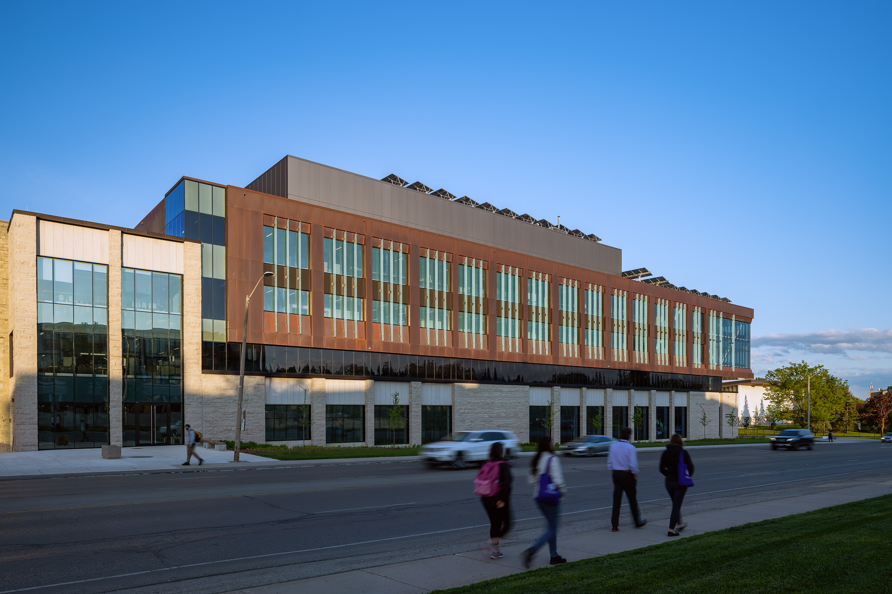
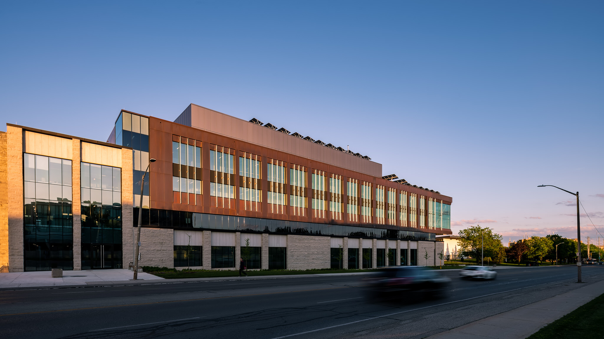
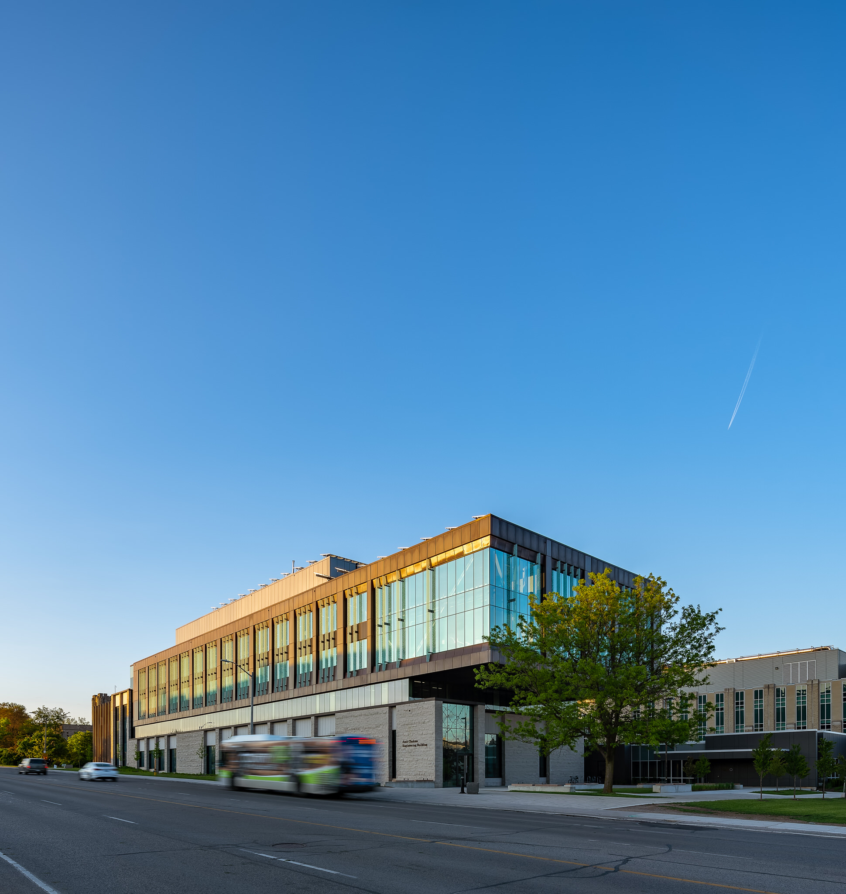
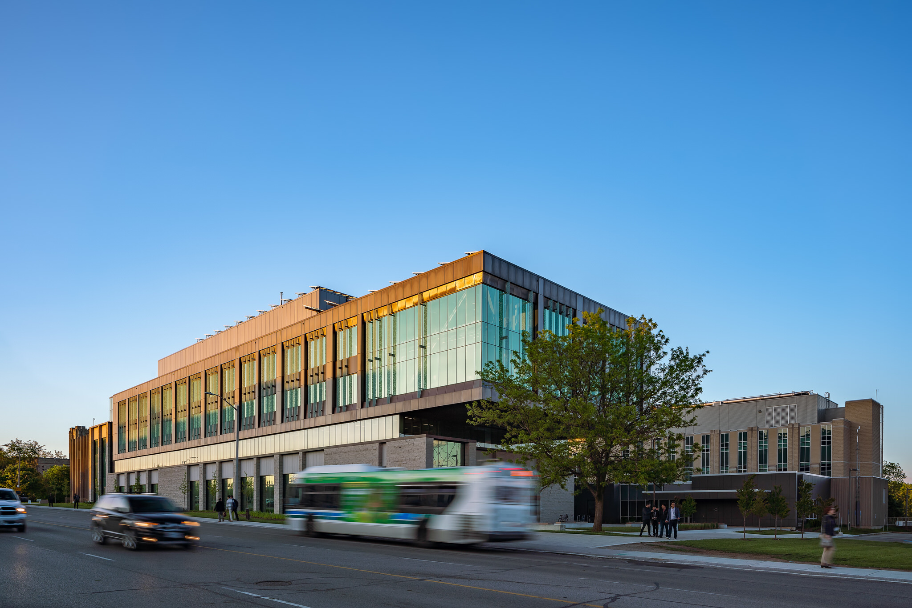
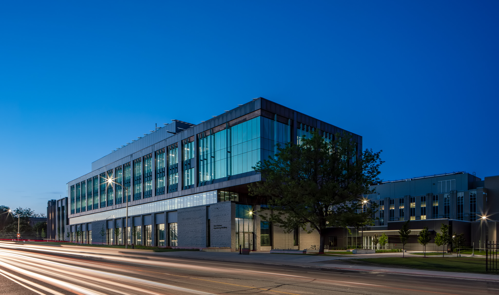

The day is ending quickly and the A7RIII batteries are fully charged. There is a blue sky with minimal clouds. This is an opportunity to make a 2nd visit to the Western Engineering Building: Amit Chakma Engineering Building. ([see my first impromptu visit here](/amit-chakma-engineering-building))

  
  <figcaption>Students walking across from the engineering building</figcaption>

  
  <figcaption>Building Photo by Scott Webb Architectural Photography</figcaption>

We got to Western's campus a bit later than I'd have wanted; however, we didn't miss any of the great light. The only issue was seeing some of the orange copper come out with the warm golden sun shining on it. The oxidation process isn't completely done. Oh well. 

Since my first visit to take photos of the building included a twilight from the same angle as you see in the photo above, my focus was on viewing the building from the opposite end. The images may seem repetitive, but my intent is to show differing levels of activity happening outside of the building. 

  
  <figcaption>Engineering building and Boundary Layer Wind Tunnel building</figcaption>

Above and below you find the same angle and the inclusion of an LTC Bus. This area was "bus rich" and it was almost tough to not include a bus moving through. Just almost though. Including life outside of the building sure can take a lot of patience and images that hit the cutting room floor. 

These 2 photos are good to compare how they make you feel. In the bottom image, you might get a better feeling of being on campus with the [greater activity of people](/people-in-architectural-photography) and vehicles zooming by.

  
  <figcaption>Cars and People outside of the Amit Chakma Engineering Building on Western Campus</figcaption>

> The engineering building looks like a totally different building today and in this light

I'll admit, I didn't plan on a clear blue sky. In south London, there were some great clouds happening and we assumed this would be the case in north London too. Nope. 

Sometimes it seem like I'm cloud kryptonite. At least on nice days. The sky feels like it always clears up. I know this isn't true. You can find photos in my [exterior photography](/exterior-photography) work otherwise. 

I was only partially bummed out, but totally grateful for an opportunity to photograph the Amit Chakma Engineering Building with a blue sky. The building looked like a completely different building on this day and in this light. Even though I was a little disappointed, there was never a thought to just [replace the sky in post-processing](/sky-replacement). I ain't about that life.

Then, we were awaiting until the sun was completely beyond the horizon and cars decide to turn on all their lights. I know that the light streaks were going to be dominated by car headlights and result in more white/yellow colours than red. In part 1, you saw everything opposite. Facing thee other way, we got those eye-catching red light streaks from car tailights. 

My question when it came to a twilight photo was if lights could be on in the front corner area of the building. 

In the above picture, you can see there are lights on inside. 

And then it happened...

Lights went off in that area. We didn't want to just accept this so we tried to go in the building to turn those lights on. Sadly, we couldn't access that space to even try. This kind of issue is dealt with on client work when possible. 

  
  <figcaption>Dusk or Blue Hour Architectural Photo of the Amit Chakma Engineering Building at Western University</figcaption>

Western's new Engineering Building still looked great at twilight. I ran into a challenge though. Where I was, a street light was causing massive flare into the photo. Unfortunate luck, but the photo turned out pretty cool. Can you see how much it might change if the interior lights were on inside that corner? 

I also love how the Boundary Layer Wind Tunnel building looks with the campus lights on (it's in the bottom right corner). This was intentional, but I'm glad it turned out. ([see a gallery full of my twilight photography](/twilight-photography))

Something else intentional is a twilight photo that is dynamic but not super distracting. I believe the light streaks only are just that. Those streaks combined with the blue sky really puts focus the engineering building. The streaks work to move your eye through the image.

### Finishing Up

As mentioned in [part 1's set of photos](/amit-chakma-engineering-building), I still want to photograph the engineering building more. I see some exciting details that would be great to isolate. Aside from that, I want to catch it with a dynamic sky and maybe get those interior lights on!? Feel free to drop a comment or what you feel about the photos. Or just shout out on Twitter or Instagram.

- architect: [Perkins + Will](https://perkinswill.com/) and [Cornerstone Architecture Inc.](http://www.cornerstonearchitecture.ca/)
- builder: [Norlon Builders](https://www.norlon.ca/)

---

Originally posted June 5th, 2019.