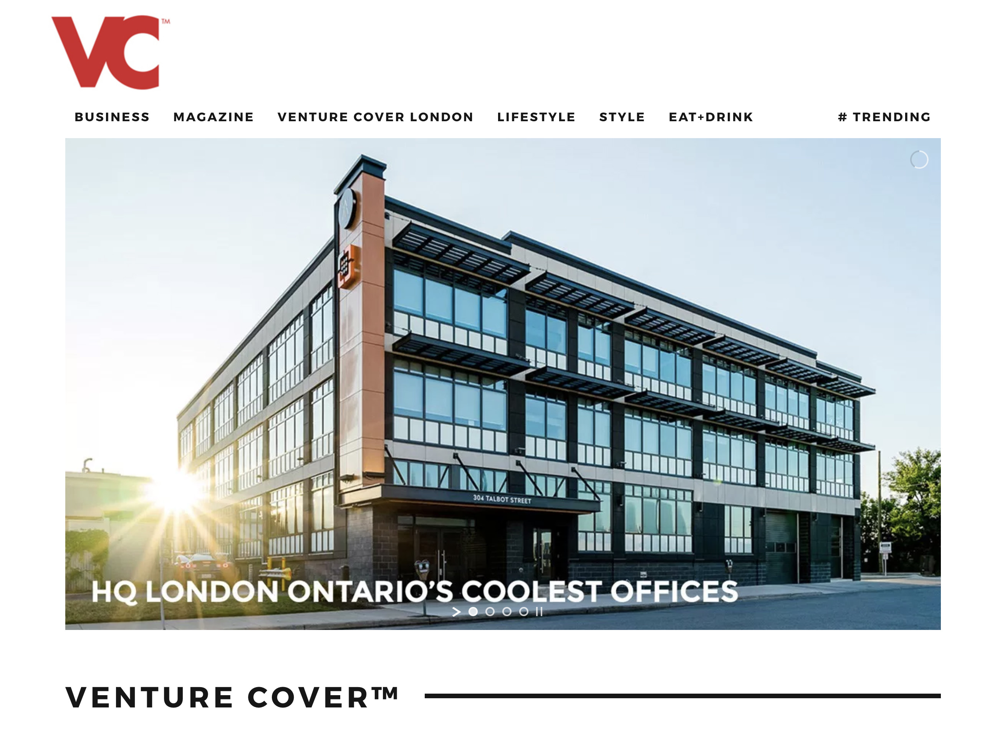

When it comes to how [beautiful architectural photography](/) can help gain more attention for your company, it's hard to quantify overnight. Depending on the situation, you could see a return on your investment in photography rather quickly, but most of the time attention builds over time.  It builds and builds until suddenly you realize your work is being seen all over the place.You don't have to look any further than my own photos uploaded to [Unsplash](/unsplash) for free. 

When I first started sharing my photos, the amount of attention and exposure I was receiving was relatively low compared to what some other people were experiencing. Since first sharing, I consistently shared more of my photography and eventually saw photo views and download statistics grow. With each photo, I was building momentum; slowly gaining more attention. 

With a little bit more time and consistency, more people discovered my photos and I started to notice my photos all over the internet. People were able to create content with my photography, freely. Every single day I see my work somewhere else on the web and people are constantly connecting. This is what I want for the clients I photograph for.Now, I'm not specifically saying to upload the photography I shoot for you to Unsplash. What I'm trying to say with that story is there is power in having high-quality photos of your projects. Having these visuals out in the world allows you and others to create content around them and new connections will be made. Easily.

- More likely to be featured on Instagram Feature Accounts. For Example, [519London](https://www.instagram.com/519london/)
- More likely to be featured on other websites and their social media networks.
- More likely to be contacted and see real engagement.
- More likely to be a finalist in award galas

## Arcane Gaining More Attention on Venture Cover

I'm here to help you become impossible to ignore. When I went out to photograph The Cube, the name of the building for which you find Arcane operating within, my goal was to capture the building to create intrigue.

I wanted people to engage with the images and learn more. I shot these photos on my own as a challenge as there were very few if any photos of this building completed or found online.  If anyone is going to talk about you,  I believe having beautiful photos of your work increases such likely hood. Just last night, I discovered one of my photos of The Cube being shared on Instagram by Venture Cover. With the image, they referenced an article on their website that was about the coolest offices in London Ontario. 

I decided to check out [venturecover.com](https://venturecover.com) to find the [article](http://venturecover.com/2017/12/18/hq-london-ontarios-coolest-offices/) and there was my image front and centre:

  
  <figcaption>The Cube - Scott Webb Photography on Venture Cover Homepage for Cool Offices</figcaption>

If you think this isn't much of a big deal, go search for some photos of the building and see if something else might work for the article. Perhaps their article would have still been written, but I don't think it would have received the level of attention it's getting above and below the fold. Now, if only there were some [interior photos](/interiors-photography) to go along with this [exterior](/exterior-photography). On the inside, you find gorgeous spaces that Arcane has carefully planned out and continues to tweak with respect to their culture. 

## Building Photos Worth More Than 1000 Words

I'm not writing this as a way to pat myself on the back for this photo. I'm writing this to show you how much a photo can help create content leading to more attention for you. I am most happy for the attention the building and Arcane receive! Not only is Arcane receiving more exposure, so is [Zedd Architecture](http://www.zeddarchitecture.com/) and [architects Tillmann Ruth Robinson](http://www.atrr.ca/). Zedd Architecture was responsible for the exterior design and aTRR was responsible for the interior work. 

There will be people asking who designed the building or who did this renovation. People looking for work will search for the coolest offices in London, Ontario and find visual proof. Sure beats a [crooked stock photo of unrelated buildings](http://www.canadianbusiness.com/lists-and-rankings/profit-500/2017-london-ontario-fastest-growing-companies/). Imagine how much better this piece of content could have been. Today, you never know what can come from a single piece of content or when it may happen. It's taken a few months for this photo to get around. I believe if you're going to write about anything that includes Arcane (as long as they're in this building), these photos help make them impossible to ignore. 

Plus, I feel all these recent [accolades for Arcane](http://www.canadianbusiness.com/lists-and-rankings/profit-500/2017-london-ontario-fastest-growing-companies/), the content should be accompanied by intriguing visual content too. 

## Absolutely do not steal photos

As I say all of this, it's not an invite or considered permission to take any interesting photo you find online. You can't search Google images and simple download and use any photo you like. You do have to look into how you can potentially use the photo you find. Is it copyright? Well, you need to contact the photographer becasue if you use the photo without permission or a license, you're stealing it. 

The amount of times this scenario of someone using my photos without permission or license or even providing photo credit happens is crazy. Providing credit doesn't mean you can use it either. I'm just amazed that when a photo is taken without permission, even credit is excluded.

If you find a photo you'd like to use, please contact the photographer for how it can be used. I actually upload a lot of [free london images](/free-london-ontario-photos) to Unsplash for anyone to use and I still have issues with my other photos.

Absolutely do not take any photo you find online for your own.

---